# UWr

[\[English\]](README.en.md)

## [Semestr 4](Sem4/)

    
 Plan 

* **A**lgorytmy **i** **s**truktury **d**anych
* **R**achunek **p**rawdopodobieństwa **i** **s**tatystyka
* **Sy**stemy **K**omputerowe
* Kurs: React

## [Semestr 3](Sem3/)

```mermaid
gantt
    title Zimowy 23/24
    dateFormat HH
    axisFormat %H:%M

    section Monday
        Matematyka Dyskretna M          : active, 14, 17
        KPA z bazami danych             : active, 16, 18

        Algebra 1                       : active, 12, 14

    section Tuesday
        WEPPO                           : active, 10, 12
        Ekonomia                        : active, 14, 16

        AN (Woźny)                      : 10, 12
        WEPPO (Zychla)                  : 08, 10

        Algebra 1                       : active, 08, 10

    section Wednesday
        Analiza numeryczna              : active, 10, 13

        KPABD (Abbasi)                  : 18, 20

    section Thursday
        Analiza numeryczna (repe)       : active, 12, 14

        MDM (Stachowiak)              : 16, 19
        PY (Młotkowski)                 : 10, 12

    section Friday
        Rozszerzony Python              : active, 10, 12

        Algebra 1                       : 08, 10
```

    
 Plan 

* Algebra 1
* **M**atematyka **D**yskretna **M**
* [**A**naliza **N**umeryczna](Sem3/AN/)
* [**W**ybrane **E**lementy **P**raktyki **P**rojektowania **O**programowania](Sem3/WEPPO/)
* [**K**urs **P**rojektowania **A**plikacji z **B**azami **D**anych](Sem3/KPABD/)
* [Kurs rozszerzony języka **Python**](Sem3/PY/)
* O ekonomii i gospodarce inaczej

## [Semestr 2](Sem2/)

```mermaid
gantt
    title Letni 22/23
    dateFormat HH
    axisFormat %H:%M

    section Monday
        Algebra liniowa 2   : 12, 14 

    section Tuesday
        Algebra liniowa 2   : active, 09, 12
        MP                  : 12, 15
        PARO                : 16, 19

    section Wednesday
        Analiza II          : active, 08, 10
        Sztuczna inteligencja : active, 08, 10
        Metody programowania : active, 10, 13

    section Thursday
        Algebra liniowa 2       : active, 08, 10
        Seminarium Młody Badacz : 08, 10
        Programowanie obiektowe : active, 10, 12
        AI                      : 10, 12
        Analiza II              : active, 12, 14
        PO                      : 12, 14
        Kurs C++                : 14, 16
        Analiza II              : 16, 18
        Kurs C++                : active, 16, 18

    section Friday
        Analiza II              : 08, 10
```

    
 Plan 

* Analiza matematyczna II
* Algebra liniowa 2
* [**A**rtificial **I**ntelligence](Sem2/AI)
* [**M**etody **P**rogramowania](Sem2/MP/)
* [**P**rogramowanie **O**biektowe](Sem2/PO/)
* [Kurs języka **C++**](Sem2/CPP/)
* [**P**raktyczne **A**spekty **R**ozwoju **O**programowania](Sem2/PARO/)

## [Semestr 1](Sem1/)

```mermaid
gantt
    title Zimowy 22/23
    dateFormat HH
    axisFormat %H:%M

    section Monday
        LDI : 10, 12
        Logika dla informatyków : active, 12, 14

    section Tuesday
        Analiza I : active, 08, 10
        Podstawowy warsztat informatyka: active, 11, 12

    section Wednesday
        Algebra liniowa 1R : active, 09, 11
        Algebra liniowa 1R : 11, 13
        WdpC : 14, 16
        PWI : 16, 17

    section Thursday
        Analiza I : 08, 10
        Wstęp do programowania w C : active, 10, 12
        Algebra liniowa 1R : active, 12, 14

    section Friday
        Analiza I : 08, 10
        Analiza I : active, 10, 12
        MIA : 14, 16
        Metody implementacji algorytmów : active, 16, 17

```

    
 Plan 

    

* Analiza matematyczna I
* Algebra liniowa 1R
* Logika dla informatyków
* [**W**stęp **d**o **p**rogramowania w **C**](Sem1/WdpC/)
* [**M**etody **I**mplementacji **A**lgorytmów](Sem1/MIA/)
* Podstawowy warsztat informatyka
* Język angielski poziom B2

