# UWr

    
English

## [Term 1](Sem1/)
* Mathematical analysis I
* Linear algebra 1R
* Logic for computer scientists
* [Introduction to programming in C](Sem1/WdpC/)
* [Algorithm Implementation Methods](Sem1/MIA/)
* Basic computer science workshop
* English language B2 level

## [Term 2](Sem2/)
* Mathematical analysis II
* Linear Algebra 2
* [**A**rtificial **I**ntelligence](Sem2/AI)
* [Programming Methods](Sem2/MP/)
* [Object Oriented Programming](Sem2/PO/)
* [C++ language course](Sem2/CPP/)
* [Practical Aspects of Software Development](Sem2/PARO/)

    
Polish

## [Semestr 1](Sem1/)
* Analiza matematyczna I
* Algebra liniowa 1R
* Logika dla informatyków
* [**W**stęp **d**o **p**rogramowania w **C**](Sem1/WdpC/)
* [**M**etody **I**mplementacji **A**lgorytmów](Sem1/MIA/)
* Podstawowy warsztat informatyka
* Język angielski poziom B2

## [Semestr 2](Sem2/)
* Analiza matematyczna II
* Algebra liniowa 2
* [**A**rtificial **I**ntelligence](Sem2/AI)
* [**M**etody **P**rogramowania](Sem2/MP/)
* [**P**rogramowanie **O**biektowe](Sem2/PO/)
* [Kurs języka **C++**](Sem2/CPP/)
* [**P**raktyczne **A**spekty **R**ozwoju **O**programowania](Sem2/PARO/)

```mermaid
gantt
    title Zimowy 23/24
    dateFormat HH
    axisFormat %H:%M

    section Monday
        Matematyka Dyskretna M          : active, 14, 17
        Machine Learning                : active, 14, 16
        KPA z bazami danych             : active, 16, 18

        OWI                             : active, 15, 16
        OWI                             : active, 14, 15
        
        ML (Adamczyk)                   : 16, 18
        KPABD (Rajba)                   : 18, 20

        Algebra 1                       : active, 12, 14

    section Tuesday
        WEPPO                           : active, 10, 12
        Ekonomia                        : active, 14, 16

        ML (Słupiński)                  : 08, 10
        ML (Balcer)                     : 08, 10
        AN (Karczewski)                 : 14, 16
        AN (Karczewski)                 : 16, 18
        AN (Nowak)                      : 10, 12
        AN (Nowak)                      : 12, 14
        AN (Woźny)                      : 14, 16
        AN (Woźny)                      : 10, 12
        KPABD (Abbasi)                  : 18, 20
        PY (Piróg)                      : 12, 14
        PY (Balcer)                     : 10, 12
        WEPPO (Zychla)                  : 12, 14
        WEPPO (Zychla)                  : 08, 10
        WEPPO (Gańczorz)                : 14, 16
        Ekonomia                        : 16, 18

        Algebra 1                       : active, 08, 10
        Analiza III                     : active, 16, 18
        Analiza III                     : 14, 16


    section Wednesday
        Analiza numeryczna              : active, 10, 13
        Analiza III                     : active, 08, 10

        MDM (Jeż)                       : 14, 17
        ML (Biernacka)                  : 14, 16
        ML (Stypułkowski)               : 10, 12
        KPABD (Abbasi)                  : 18, 20
        PY (Adamczyk)                   : 08, 10
        WEPPO (Wieczorek)               : 14, 16


    section Thursday
        MDM (Stachowiak/Dudek)          : 16, 19
        PY (Młotkowski)                 : 10, 12
        PY (Młotkowski)                 : 08, 10
        PY (Słupiński)                  : 18, 20
        WEPPO (Wieczorek)               : 14, 16

        Analiza III                     : 12, 14

    section Friday
        Rozszerzony Python              : active, 10, 12

        PY (Młotkowski)                 : 08, 10
        WEPPO (Gańczorz)                : 10, 12

        Algebra 1                       : 08, 10



```

    
 Planer 

