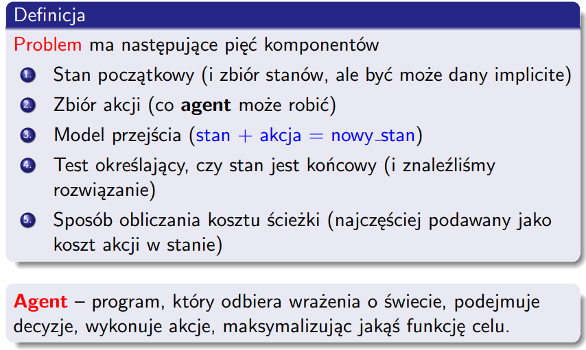

# List 1.5
| 1 | 2 | 3 | 4 | 5 | 6 | 7 | 8 | 9 | 10 | 11 |
|---|---|---|---|---|---|---|---|---|---|---|
| X | X |   |   |   | X |   |   |   |   |   |

## Problem 1
### a) Exactly 2 solutions
|   | 1 | 1 |
|---|---|---|
| 1 | 1 | 0 |
| 1 | 0 | 1 |

### b) More than n solutions
|   | 1 | 1 | 1 |
|---|---|---|---|
| 1 | 1 | 0 | 0 |
| 1 | 0 | 1 | 0 |
| 1 | 0 | 0 | 1 |
3! solutions

## Problem 2
Dla 0 oczywiste, dla dużych liczb wiemy że na pewno kwadraty w środku będą zakolorowane.\
Dla linijki z zakolorowanym kwadratem przy granicy możemy zakolorowoać do minimalnej długości z podpowiedzi.\
_______
Po każdym ruchu szukamy trywalnych rozwiązań typu:
* Cała/prawie cała linijka (z prawie całej możemy wydedukować część linijki)
* Linijka z oczywistą odopowiedzią - np częściowo już zakolorowana

W pozostałych przypadkach zgadujemy i sprawdzamy czy poprawnie zgadliśmy rozwiązując dalej.

## Problem 3

## Problem 4
To solve that problem explicitly we can directly calculate with how many cofigurations can blotter win.   

## Problem 5

## Problem 6
\
Graph with one route through infinite number of edges with cost 0 and one route through one edge with cost 1.

## Problem 8

## Problem 9

### a)
State: amount of fuel in tank, actual location/city\
Cost of action: amount of fuel needed to traverse the edge/road\
Transit model: change of city\
Starting state: starting city\
Ending state: ending city

### b)
State: location, set of cities to visit\
Cost of action: cost for traversing the edge/road\
Transit model: change of city\
Starting state: starting city and all the cities to visit\
Ending state: ending city and no more cities to visit

## Problem 10

## Problem 11
### c)
DLS sam w sobie nie jest kompletny - nie przechodzi całego grafu, przez co nie daje nam pewności że znajdziemy rozwiązanie. Natomiast iterative deepening przechdodzi koniec końców cały graf.
### d)

+1,2,4,6,9,11,12
-10,8,7,5,3
