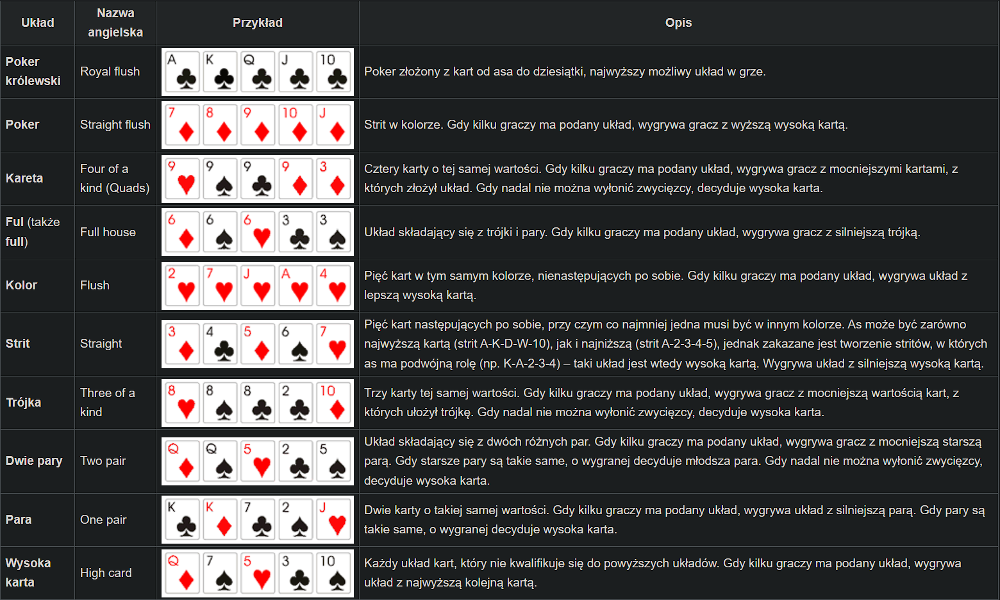
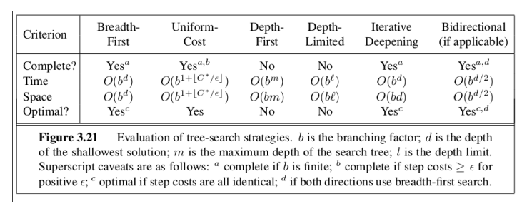

[(back)](../)
# List 1.5
| 1 | 2 | 3 | 4 | 5 | 6 | 7 | 8 | 9 | 10 | 11 |
|---|---|---|---|---|---|---|---|---|----|----|
| X | X | X | X | X | X | X | X | X | X  | X  |

## Problem 1
### a) Exactly 2 solutions
|   | 1 | 1 |
|---|---|---|
| 1 | 1 | 0 |
| 1 | 0 | 1 |

### b) More than n solutions
|   | 1 | 1 | 1 |
|---|---|---|---|
| 1 | 1 | 0 | 0 |
| 1 | 0 | 1 | 0 |
| 1 | 0 | 0 | 1 |
3! solutions

## Problem 2
Dla 0 oczywiste, dla dużych liczb wiemy że na pewno kwadraty w środku będą zakolorowane.\
Dla linijki z zakolorowanym kwadratem przy granicy możemy zakolorowoać do minimalnej długości z podpowiedzi.\
_______
Po każdym ruchu szukamy trywalnych rozwiązań typu:
* Cała/prawie cała linijka (z prawie całej możemy wydedukować część linijki)
* Linijka z oczywistą odopowiedzią - np częściowo już zakolorowana

W pozostałych przypadkach zgadujemy i sprawdzamy czy poprawnie zgadliśmy rozwiązując dalej.

## Problem 3
//code//

## Problem 4

To solve that problem explicitly we can directly calculate with how many cofigurations can blotter win.\
That is:
* Straight flush
* Four of a kind
* Full house
* Flush
* Straight
* Three of a kind
* Two pair
* One pair
* High card

And we just have to count all card configurations that represent those configurations (both for botter and figurant).

## Problem 5
//code//

## Problem 6
\
Graph with one route through infinite number of edges with cost 0 and one route through one edge with cost 1.

```
  ->0->0->...->0-> 
S -->     1    --> F
```
## Problem 7
We have to create a labirynth, which
* contains a lot of enemies who walk in different cycles
* its size would allow to search thru the phase space using typical computer

The important aspect of such a labirynth is that **L**owest **C**ommon **M**ultiple of all enemies paths should be adequately low. Thanks to that, we minimize our phase space, becouse we limit out time-space (lets call it $t$) and with limited labirynth size ($n*m$) we end up with $O(n*m*t)$ states.\
Thats how we can define our **<ins>state</ins>**:
* position of the player
* [_total steps_ == _time_] % LCM(_lenghts of enemies paths_)

## Problem 8
To optimize suggested _Sokoban_ solution we can change the way, in which we find new states. Instead of going in every possible direction we can **find all the blocks that we can push** and **from which side**, and gerenate new states from that.\
Precisely - to find new states we run BFS from the player position, and save all blocks that we encounter with side from which we can push them.

## Problem 9

### a)
State: amount of fuel in tank, actual location/city\
Cost of action: amount of fuel needed to traverse the edge/road\
Transit model: change of city\
Starting state: starting city\
Ending state: ending city

### b)
State: location, set of cities to visit (to deliver the package) <=> set of packages to deliver with their destinations \
Cost of action: cost for traversing the edge/road\
Transit model: change of city\
Starting state: starting city and all the cities to visit\
Ending state: no more cities to visit

## Problem 10
Amount of states: as every player (_k_) can be in every node (_n_), state-space has size $n^k$.

### a) without stops
To solve this variant we can use iterative deepening.\
In main loop we iterate by _depth_ and we run **DLS** for every player and save all last visited nodes (those with depth _depth_). We compare them and determine if there exists any node, which every player has acces to in depth _depth_ <=> in _depth_ moves. If we didn't find any, we continue iteration.\
To determine that there is no solution we can se _max depth_ to for example &n^2&, to ensure that there is no cycles that could help to solve the problem (that would be kin of a brute force method).\
Another, a bit less brutal way, would be to find the longest cycle in the graph and determine from it the maximal steps (for egzample $c*[longest cycle]$).

### b) players can wait in a node
Firstly we look for node, which can be accessed by everyone (it exists, as graph is connected).\
Then we just have to trace path for everyone. As players can wait in any node, length of path does not matter, as everyone can wait in the final node.

## Problem 11

### a)
Optimal cost of path to target, of optimal solution, $\epsilon$ is minimal (worst) cost of every step. So $1 + C^* / \epsilon$ is amount of steps taken, to reach the destination, as we have one additional step while starting from $0$ and ending at $C^*$.

### b)
In other functions we use _b_ and _d_, which are branching factor and maximal depth, but in UCS we are interested in aggregate cost, so we need function that depends on it. That will be $C^* / \epsilon$

### c)
DLS is not complete - it does not iterate over whole graph, thus we don't have certainty that it will find a solution.\
Whereas iterative deepening in the end iterates over whole graph, so it can find the answer, eventually.

### d)
Yes, becouse we can use any other complete algorithm instead of BFS.

### e)
Yes, becouse we can use instead of BFS any other algorithm, for egzample UCS.
