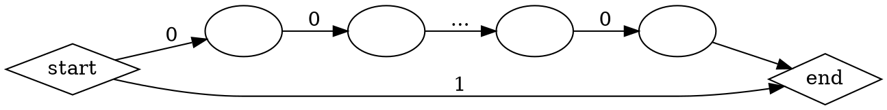

# Sztuczna inteligencja (C1, grupa JKo)
###### tags: `AI`
## Ćwiczenia

Wtorek 16-18


---

```python=
# można wpisywać kod z formatowaniem python
for i in range(10):
    print (22)
```
Wzory wyglądają ładnie: $f(N) = \sum_1^N \frac{1}{n^2+1} + \min(a_1, \dots, a_N)$

---

[TOC]

---


## Deklaracje


| kto?                  |$\sum$| 1 | 2 | 3*| 4 | 5*| 6 | 7 | 8 | 9 | 10| 11|
|:--------------------- |:-    |:-:|:-:|:-:|:-:|:-:|:-:|:-:|:-:|:-:|:-:|:-:|
| Marcin Binkowski      |      |   |   |   |   |   |   |   |   |   |   |   |
| Maksymilian Czudziak  |**10**| 1 | 1 |   | 1 | 2 | 1 | 1 |   | 1 | 1 | 1 |
| Antoni Dąbrowski      |**10**| 1 | 1 | 2 | 1 | 2 | 1 |   | 1 |   |   | 1 |
| Mateusz Gil           |**7** | 1 | 1 |   |   |   | 1 | 1 |   | 1 | 1 | 1 |
| Paweł Głowacki        |**9** | 1 | 1 |   | 1 |   | 1 | 1 | 1 | 1 | 1 | 1 |
| Przemysław Grochal    |**7** | 1 | 1 |   | 1 | 2 |   |   |   | 1 |   | 1 |
| Paweł Jasiak          |      |   |   |   |   |   |   |   |   |   |   |   |
| Bartosz Jaśkiewicz    |**11**| 1 | 1 | 2 | 1 | 2 | 1 | 1 | 1 |   |   | 1 | 
| Karolina Jeziorska    |**12**| 1 | 1 | 2 | 1 | 2 | 1 | 1 |   | 1 | 1 | 1 |
| Filip Knefel          |**12**| 1 | 1 | 2 | 1 | 2 | 1 | 1 |   | 1 | 1 | 1 |
| Samuel Li             |**13**| 1 | 1 | 2 | 1 | 2 | 1 | 1 | 1 | 1 | 1 | 1 |
| Karol Machoś          |      |   |   |   |   |   |   |   |   |   |   |   |
| Joanna Mielniczuk     |**7** | 1 | 1 |   |   |   | 1 | 1 |   | 1 | 1 | 1 |
| Karol Mirek           |**7** | 1 | 1 |   | 1 |   | 1 |   | 1 | 1 | 1 |   |
| Maksymilian Polarczyk |**13**| 1 | 1 | 2 | 1 | 2 | 1 | 1 | 1 | 1 | 1 | 1 |
| Kacper Puchalski      | **9**|  1| 1 |   | 1 |   |1  | 1 |1  | 1 |1  | 1 |
| Aleksandra Rozkrut    |      |   |   |   |   |   |   |   |   |   |   |   |
| Karol Stuła           |**11**| 1 | 1 |   | 1 | 2 | 1 | 1 | 1 | 1 | 1 | 1 |
| Andrzej Tkaczyk       |**12**| 1 | 1 | 2 | 1 | 2 | 1 | 1 |   | 1 | 1 | 1 |
| Dawid Żywczak         |**10**| 1 |   | 2 | 1 | 2 | 1 |   |   | 1 | 1 | 1 |

> ^ lepiej nie wklejajcie tej tabelki w formatter markdowna, bo potem jest tak rozstrzelona, że ciężko cokolwiek wpisywać na split screenie

```jsx=
// robienie tabelki - wklejta se w F12 a będzie wam dane
t = ["Marcin Binkowski", "Maksymilian Czudziak", "Antoni Dąbrowski", "Mateusz Gil", "Paweł Głowacki", "Przemysław Grochal", "Paweł Jasiak", "Bartosz Jaśkiewicz", "Karolina Jeziorska", "Filip Knefel", "Samuel Li", "Karol Machoś", "Joanna Mielniczuk", "Karol Mirek", "Maksymilian Polarczyk", "Kacper Puchalski", "Aleksandra Rozkrut", "Karol Stuła", "Andrzej Tkaczyk", "Dawid Żywczak"];
function mdtable(users, tasksCnt){
    let pad = Math.max(...users.map(it => it.length))
    let header = ['kto?'.padEnd(pad), '$\\sum$', ...[...Array(tasksCnt+1).keys()].slice(1).map(it => `${it}`.padEnd(2))]
    let second = header.map((_, idx) => idx < 2 ? ':-' : ':-:');
    let decls  = users.map(name => [name.padEnd(pad), '      ' ,...[...new Array(tasksCnt).keys()].map(it => '  ')]);
    return '\n'+[header, second, ...decls].map(it => `|${it.join('|')}|`).join('\n')+'\n';
}
mdtable(t, 11)
```

Spotkanie po przerwie o 16:45 (^^)

## Rozwiązania

### Zadanie 1: 
:::info 
autor: Karolina Jeziorska
:::
#### a) 
Przykład obrazka który ma dokładnie dwa rozwiązania:

Minimalny taki obrazek dla $n = 2$:
| |1 |1 |
|-|-|-|
|**1** |0 | 1|
|**1** | 1| 0|

Dla większego $n$ dopisujemy dalej zera:
| |1 |1 |0|...|0|
|-|-|-|-|-|-|
|**1** |0 | 1|0 |0 |0 |
|**1** | 1| 0|0 |0 |0 | 
|**0**|0 |0 |0 |0 |0 | 
|**...**|0 |0 |0 |0 |0 |
|**0**|0 |0 |0 |0 |0 |

#### b) 
Przykład obrazka, który ma więcej niż n rowiązań:


Minimalnie dla $n = 3$:
| |1 |1 |1|
|-|-|-|-|
|**1** |1 | 0|0|
|**1** | 0| 1|0|
|**1**|0|0|1|

$n!$ rozwiązań

### Zadanie 2: 
:::info 
autor: Paweł Głowacki
:::

Na początku w przypadku jak jest 0 to zakreślamy brak możliwości ruchu w całym wierszu/kolumnie. Gdy mamy liczbę odpowiadającą liczbie kratek, wtedy zakreślamy wszystkie. W innym przypadku chcemy zakreślić jak najwięcej kratek jak to tylko możliwe. Chcemy zaznaczać kratki, co do których mamy 100% pewność, że są poprawne. Przykładowo, jak mamy w wierszu 6-kratkowym, zaznaczyć 4 kratki, to wiemy, że środkowe pola na pewno będą w każdym z 3 możliwych rozwiązań, więc możemy je zamalować. Upraszczając, jeśli pole jest zaznaczone w każdym możliwym rozkładzie, to je zamalowujemy. Podobnie postępujemy w przypadku, gdy pole nie jest nigdy zaznaczone w rozkładzie, wtedy mamy pewność, że w tej kratki nigdy nie będziemy zamalowywać. Dalej, lekko modyfikując tą technikę, jeśli mamy odstęp między zaznaczonymi kratkami lub wiemy, że tam nic nie będzie i nie jesteśmy w stanie zmieścić pomiędzy je naszych zaznaczeń, to je również możemy wykreślić z możliwych odpowiedzi.

### Zadanie 3: ...
:::info 
autor: Andrzej Tkaczyk
:::
```python=
def det(line):
  if line not in dp.keys():
    act = -1
    actd = []
    for i in range(1, len(line) + 1):
      word = line[:i]
      rest = line[i:]
      if isIn(word, words):
        tmp = foo(rest)
        if tmp:  
          (tmpd, tmps) = tmp
        else:
          continue
        if len(word)**2 + tmps > act:
          actd = [word] + tmpd
          act = len(word)**2 + tmps
    dp[line] = actd
    sums[line] = act
  if sums[line] > -1:
    return (dp[line], sums[line])
  else:
    return False
    
def rand(line):
  if line not in dp.keys():
    act = -1
    actd = []
    for i in range(1, len(line) + 1):
      word = line[:i]
      rest = line[i:]
      if isIn(word, words):
        tmp = foo(rest)
        if tmp:
          (tmpd, tmps) = tmp
        else:
          continue
        tmp = random.randint(0, 100) #tylko tu się różni
        tmp = (tmp+tmps) % 53        #i tu
        if tmp > act:                #i tu
          actd = [word] + tmpd       #i tu
          act = tmp                  #i tu
    dp[line] = actd
    sums[line] = act
  if sums[line] > -1:
    return (dp[line], sums[line])
  else:
      return False
```
> po wrót panicza spotkanie się pi er w szew pokoiku drugie u stołu ważna sędzie go nauka o grzeczności podkomorze go uwag i po lityczne nad modami początek sporu o kuse goi sokoła żal ew oj skiego ostatni woźny trybunał u rzut ok a na ówczesny stan po lityczny lit wy i europ y

random error rate = 8877 / 9944 $\approx$ 89%
det error rate = 2116 / 9944 $\approx$ 21%


### Zadanie 4 i 5: ...
:::info 
autor: Dawid Żywczak
:::
W tym zadaniu chcemy dokładnie policzyć prawdopodobieństwo wygranej talii blotkarza. Możemy to zrobić licząć odpowiednie symbole Newtona, aby zdobyć liczbę możliwych zestawów z danymi układami (nie jest to jakieś trudne). Ale po to mamy komputery, żeby powierzać im żmudne liczenie. Wszystkich możliwych sytuacji, które możemy napotkać w grach między figurantem a blotkarzem, jest 1646701056 (sic!). Możemy oczywiście wygenerować wszystkie możliwe układy jakie może mieć blotkarz i sprawdzać je z każdym możliwym układem dla figuranta (co przy moich próbach zajęłoby jakieś 10h). Możemy też chwilę pomyśleć i skorzystać z prostego zliczania.
Algorytm jest taki:
- generujemy wszystkie możliwe kombinacje 5 kart dla blotkarza i figuranta
- przechodzimy wszystkie zestawy 5 kart i klasyfikujemy je do danego układu (wysoka karta, para, podwójna para itd.)
- mając te informacje, zauważam że aby blotkarz wygrał z danym układem na ręce, figurant musi mieć układ o niższej wartości. Dla przykładu:
    Blotkarz posiada trójkę, więc wygra tylko jeśli figurant będzie posiadał wysoką kartę, parę lub podwójną parę.
    Wystarczy zatem wymnożyć liczbę możliwych trójek u blotkarza z sumą liczb niższych układów w talii figuranta i dodać to do liczby sytuacji, w których wygrywa blotkarz, czyli
    $wygraneBlotkarza += ileTrojekBlotkarz*(ileWysokichFig + ileParFig + ilePodwojnychParFig)$
- na końcu liczbę sytuacji, w których wygrywa blotkarz dzielimy przez liczbę wszystkich sytuacji i mamy ładne prawdopodobieństwo
(Adnotacja: Jeżeli jesteśmy przerażeni dużymi liczbami, możemy je łatwo zamienić w prawdopodobieństwa poprzez dzielenie)
Kodzik:
```python=
possible_hands = [('p', is_poker, 10), ('c', is_caret, 9), ('f', is_full, 8), ('col', is_color, 7), ('s', is_streigh, 6), ('t', is_triple, 5), ('dp', is_double_pair, 4), ('sp', is_pair, 3)]
import itertools
from collections import defaultdict as dd

allHands_lowCards = list(itertools.combinations(lowCards_deck, 5))
allHands_highCards = list(itertools.combinations(highCards_deck, 5))

fig_hands = dd(int)
low_hands = dd(int)

ALL_FIG_HANDS_LEN = len(allHands_highCards)
ALL_LOW_HANDS_LEN = len(allHands_lowCards)

for i in allHands_lowCards:
  isFound = False
  i = list(i)
  for hand_eval in possible_hands:
    if hand_eval[1](i) and not isFound:
      low_hands[hand_eval[2]]+=1
      isFound = True 
  if not isFound:
    low_hands[2]+=1

for i in allHands_highCards:
  isFound = False
  i = list(i)
  for hand_eval in possible_hands:
    if hand_eval[1](i) and not isFound:
      fig_hands[hand_eval[2]]+=1
      isFound = True 
  if not isFound:
    fig_hands[2]+=1

low_win_possibility = 0

for i in range(2, 11):
  sum_of_high_hands = 0
  for j in range(2, i):
    sum_of_high_hands += fig_hands[j]
  low_win_possibility += low_hands[i] * sum_of_high_hands

print(low_win_possibility / (ALL_FIG_HANDS_LEN*ALL_LOW_HANDS_LEN))
#8,452879986493432%
```

### Zadanie 6: ...
:::info 
autor: Bartosz Jaśkiewicz
:::
#### Polecenie:
Przedstaw graf dla problemu przeszukiwania, w którym istnieje ścieżka z punktu startowego do docelowego, a algorytm Uniform Cost Search nie jest w stanie jej znaleźć.
#### Rozwiązanie:
Przykładowy graf dla którego Uniform Cost Search nie jest w stanie znaleźć ścieżki mimo, że ona istnieje prezentuje się następująco:

Algorytm będzie wybierał zawsze bardziej korzystną wagowo ścieżkę, czyli w tym przypadku nieskończoną, w której każda krawędź ma wagę 0. \'Idąc\' nieskończoną ścieżką nigdy nie dojdziemy do rozwiązania, mimo, że ono istnieje.

### Zadanie 7: ...
:::info 
autor: Filip Knefel
:::
**Polecenie**
Twoim celem jest takie zaprojektowanie labiryntu (ścian oraz tras wrogów), żeby:
a) wrogów było dość dużo i poruszali się po zróżnicowanych trasach,
b) rozmiar przestrzeni stanów umożliwiał wykonanie przeszukiwania wszerz na zwykłym kompute-rze
Jak to osiągnąć? Jak będzie wyglądać przestrzeń stanów i ruchy w niej?
**Rozwiązanie**
Stan:
- pozycja gracza
- liczba wykonanych kroków % NWW długości tras

Ruchy w przestrzeni zmieniają pozycję gracza na jedną z (conajwyżej) 4 sąsiadujących i zwiększają liczbę wykonanych kroków o 1.

Na postawie drugiego punktu można wyliczyć pozycję każdego z przeciwników, ponieważ co NWW kroków znajdą się z powrotem na startowych pozycjach.

Aby stworzyć dosyć duży labirynt możemy więc przyznać przeciwnikom sieżki takiej długości by ich NWW było dosyć małe.

### Zadanie 8: Sokoban
:::info 
autor: Max Polarczyk
:::

Sokoban to taka zagadka, w której w labiryncie 2d chcemy przepchać pudełka na miejsca docelowe. Ruch to krok i ew. pchnięcie jednej skrzynki - więc jeśli pudełko jest przy ścianie to nie można go od tej ściany odciągnąć, tak samo nie można pchać >1 pudełka. Celem jest ustawienie pudełek na miejscach docelowych.


(czerwone kropki to miejsca docelowe pudełek, cyfry to spójne składowe)

Naiwnie sokoban można reprezentować jako pozycje pudełek i pozycję gracza. No ale przejście ze stanu A do B to to samo co krok ludzika, więc przestrzeń byłaby duża.

To co znalazłem [gdzieś w odmętach internetu](https://baldur.iti.kit.edu/theses/SokobanPortfolio.pdf), to podział planszy na spólne składowe wyznaczone przez ściany, i pudła. Wtedy stan jest reprezentowany jako 
```(spójna składowa gracza, posortowany wektor pozycji pudełek)```

Krawędź między stanem (S1, P1) a (S2, P2) istnieje, jeśli istnieje takie pole w naszej spójnej składowej, że stojąc w nim i przepychając sąsiednie pudełko ileś razy dojdziemy do stanu (S2, P2).

Stan końcowy to taki, w których pozycje pudełek pokrywają pozycje docelowe.

Spójną składową można trzymać pamiętając jej reprezentanta jako np. najmniejsze wzgl. x i y pole tej składowej.

### Zadanie 9: ...
:::info 
autor: Przemysław Grochal
:::
a)
Stan: Ilość paliwa w baku, lokalizacja (miasto)
Koszt akcji: koszt krawędzi za przejście
Model: Zmiana miasta
Stan początkowy: Miasto startowe, ilość paliwa w baku
Stan końcowy: Miasto docelowe

b)
Stan: lokalizacja (miasto), zbiór miast do odwiedzenia
Koszt akcji: koszt krawędzi za przejście
Model: Zmiana miasta
Stany początkowy: Miasto startowe, zbiór miast do odwiedzenia
Stań końcowy: Miasto końcowe, brak miast do odwiedzenia

### Zadanie 10: ...
:::info 
autor: Mateusz Gil
:::
> Poprzednie zadanie z paliwem jest oczywiście inną otoczką dla zadania z pocztą konną z Quizu (wyjaśnij dlaczego). Dla zadania z pocztą konną odpowiedz na pytania: jaka jest minimalna liczba stanów opisująca przestrzeń, jeżeli koń może przejechać bez odpoczynku 3 krawędzie, mamy 100 stancji z tego 10 ma własne stajnie (stajnie są też w punkcie startowym i docelowym).

Koń, który może przejść 3 stancje jest analogią do samochodu z bakiem paliwa o pojemności 3.

Interpretuję w ten sposób, że punkt początkowy i końcowy są dodatkowymi 2 stacjami z nowym koniem.

Stanem jest położenie na stancji wraz z "energią" konia.

A więc:

1. Punkt startowy - **1** stan

2. Mamy 10 stajni, na każdej z nich opłaca się wymienić konia(tankujemy na każdej stacji) więc, jest to **10** ustalonych stanów.
3. Pozostało nam 90 stancji bez stajni, na których mamy 3 możliwe poziomy energii konia {0,1,2}: **90*3=270** stanów
4. Punkt końcowy - **1** stan

Sumarycznie: 1 + 10 + 270 + 1 = **282** stany


### Zadanie 11: ...
:::info 
autor: Asia Mielniczuk
:::

Wybrałam wariant b), w którym każdy z przyjaciół może "spasować ruch".
W takim przypadku przestrzeń stanów jest duża - każdy przyjaciel może się znajdować w każdym wierzchołku grafu, co daje nam $n^K$.
Zamiast poruszać się po tej przestrzeni szybciej będzie najpierw znaleźć wierzchołek, w którym mogą znaleźć się wszyscy przyjaciele, a potem już ustalić dla każdego z nich trasę do tego miejsca.

Żeby znaleźć miejsce spotkania:
1. za pomocą algorytmu BFS dla każdego przyjaciela wyznaczamy, do których wierzchołków może dojść
2. wybieramy wierzchołek, do którego dotarli wszyscy przyjaciele - jeśli takiego nie ma, to spotkanie będzie niemożliwe
3. wyznaczenie trasy każdego z przyjaciół do wybranego wierzchołka jest już formalnością

	


