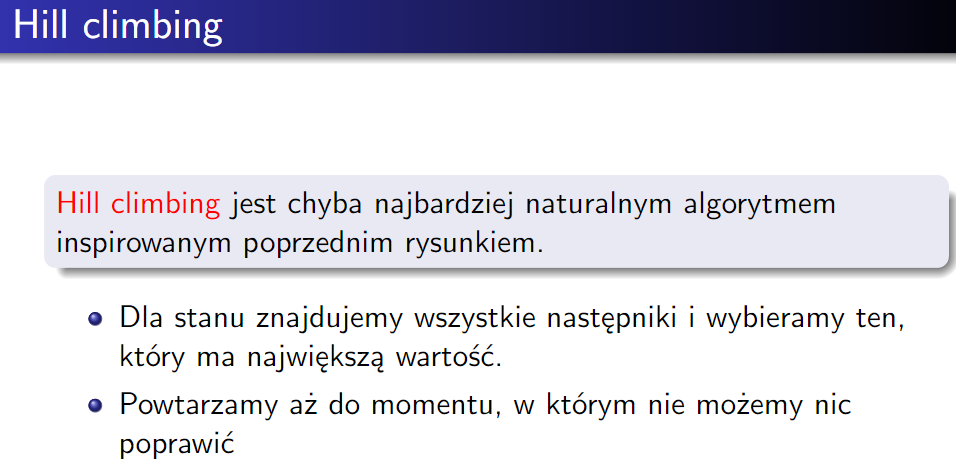
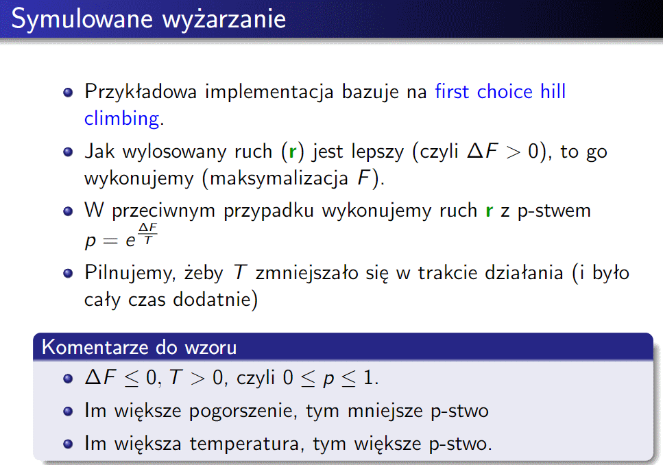
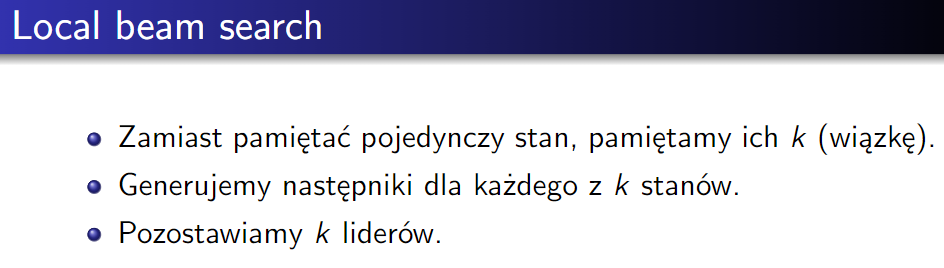
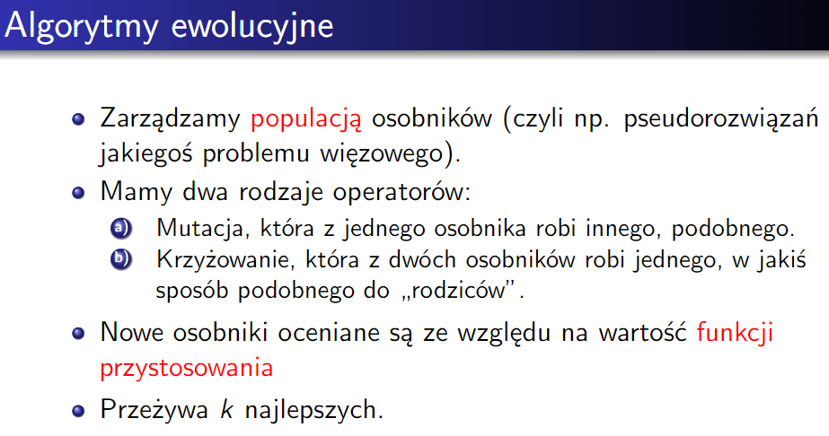
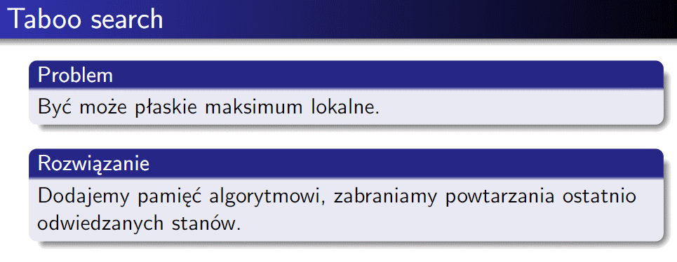
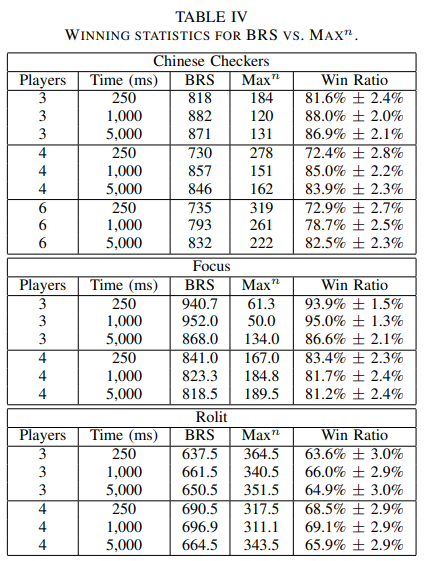

[(back)](../)
# List 3.5
| 1 | 2 | 3*| 4 | 5 | 6 | 7 | 8*| 9 | 10|11*|
|---|---|---|---|---|---|---|---|---|---|---|
| X | X | X | X |   |   | X | X | X | X | X |

## Exercise 1

    
recap

    
    
    

#### a) Local beam search _for k = 1_ (lect 6)
Since _local beam search_ is search algorithm that keeps _k_ best nodes and recursively looks for next _k_ best nodes from them, then for _k = 1_ it will keep only one best node.\ 
So _local beam search_ for _k = 1_ is the same as _hill climbing_.

#### b) Local beam search _with one state and no limit for saved states_
Having only one starting state and no limit for saved states, _local beam search_ will behave exactly like _BFS_.

#### c) Simulated annealing with T = 0 for the entire running time of the algorithm
Lets take _T = ε_, now $p=e^{\frac{ΔF}{T}}=e^{\frac{ΔF}{ε}} \xrightarrow ε 0$.\
So we have no chance of accepting worse solutions, which means that _simulated annealing_ will behave exactly like _hill climbing_.

#### d) Simulated annealing with T = ∞ for the entire running time of the algorithm
$p=e^{\frac{ΔF}{T}} \xrightarrow {T \xRightarrow{} \infty} \infty$\
Thus we will always accept worse solutions, which means that _simulated annealing_ will behave exactly like _random walk_.

#### e) Genetic algorithm with a population of size 1
Since we have only one individual, we can't perform crossover, so we can only mutate it.\
When we mutate an individual, we get his neighbour, and if it's better than him, we replace him with it.\
So _genetic algorithm_ with a population of size 1 is the same as _hill climbing_.\
(having population size _k_ is the same as _local beam search_ with _k_ saved nodes)

## Exercise 2

    
recap

    
    
    

#### a) Evolution algorithms + hill climbing
We can help our mutation process by using _hill climbing_ to find the best neighbour of our individual.\
That will speed up our search, and will be different from _hill climbing_ because we will still have some randomness in our search, thanks to crossover.

#### b) $A^*$ + local beam search
Basing from typical $A^*$, we will keep only _k_ best nodes and choose from them new _k_ best nodes. We gain time efficiency, but we lose optimality.

#### c) Simulated annealing (rough idea) + evolution algorithms
Simply we can decrease probability of mutation with time, which in some situations may help - after some time we should generate quite good individuals, so mutations won't be very effective (their changes are very subtle, in contrary to crossovers).

#### d) Taboo search + evolution algorithms
We can increase our search space, using _taboo search_ to save places that we already visited and generate new individuals further from them. Thus we will have quite broad exploration, thanks to whick better chance to get closer to global maxima - using evolution algorithm.

## Exercise 3*
Ant colony algorithm is probablistic method inspired by ants behaviour, that looks for 'better' paths to find the solution.\
Ants travel randomly, but when food is found they take it back to the nest, leaving pheromones on their way. Thanks to that it is more probable that other ants will follow the same path. Pheromones intensity matters, and it decreases with time. Thus shorter paths are more probable to be chosen.  
Travelling salesman problem:
* we have n cities
* we want to visit each city only once
* we want to minimize total distance travelled

Solution:
We spawn an ant in random city and let it travel randomly (each city only once), with probability to travel to city _n_ dependant on its weights.   
After travel we judge the score (total distance) and based on it and ants path we update pheromones on our graph.  
After _k_ iterations we end up with most probably shortest path.

## Exercise 4
Our variables are given blocks - *B_idx_len*\
Our domains are all possible blocks positions\
Our constraints are: for block - for _len_ steps ahead from its position there can't be any wall or block = for every block (in that row/col) its starting position is different

## Exercise 5
Our lessons have assigned classes and teachers, we have to assign them appropriate date (1-50)\
Our variables are lessons - *L_class_time*\
Our domains are all possible teachers\
Our constraints are:
* for every lesson in given class its starting time is different <=> L_C1_T != L_C2_T
* c

## Exercise 6

## Exercise 7, 8*
Jumpers  
Goal: get all jumpers to the other side of the board, we can only walk on generated roads (ours and opponents)  
Heuristics:  
* sum of distances of our pieces from the other side of the board (minimalize)  
* sum of distances of opponents pieces from the other side of the board (maximize)  

Pentago  
Goal: get 5 in a row (horizontally, vertically or diagonally)  
Heuristics: weighted sum of number of 4 in a row, number of 3 in a row, number of 2 in a row, number of 1 in a row - sums of opponent

## Exercise 9
Why first player has major advantage? Becouse he can choose hist first move, so can place 3 marks before second player, also he can choose best move, since all moves are available at the begining.  
If we start first it is better to start in the middle, becouse it is best position with highest chance of winning. The we can pick any of the 4 corners. If corner is occupied we know that enemy probably took same strategy so we can suppose which cells he took.  
Next we try to finish our 3 in a row, if enemy blocked us we choose another corner (one should be free).  
Then we again try to finish 3 in a row, if both solutions are blocked we won't win, so we try to block enemy.  
To block enemy, knowing his position we follow best strategy in tic tac toe to predict which cells he also took, and block him.  

If we start second we still try to take the middle. If we couldn't do that we go for random corner. If we find enemys cell we have more information, so we can try to block him (following the best strategy).

## Exercise 10
#### a) How can the time spent calculating the best previous move be used to calculate the best current move (we assume that only one game is played).
* Alpha-Beta-Search
In previous move we have already calculated branches to depth _d_, so now our depth increased to _d + 1_. So we simply have to calculate one next move for every branch, instead of _d_ moves for every branch.

* MCTS
If we have already calculated some moves, we have some information about the game, and we can use it in our next move - few paths are already explored, so we can use them to explore further or treat them as result for given choice and have more simulations for more precision.

#### b) How to use the possibility of parallel code execution to improve the quality of the game?
* Alpha-Beta-Search
We can calculate result of each branch in parallel, and then choose the best one. Thanks to that we can go deeper in our search tree, having more precise results.

* MCTS
We can run multiple simulations in parallel, and then choose the best move. Thanks to that we can run more simulations, having more precise results.

## Exercise 11*
#### a) What is the $\textrm{max}^n$ algorithm?
The $\textrm{max}^n$ can be used for game with any number of players.   
At leaf nodes tuple with _n_ values is returned, where each value is the score of _i-th_ player. At internal nodes player chooses the child with the highest score.   
In case of tie we can choose randomly or prefer nodes with lower score for the root player.

#### b) What is _paranoid assumption_?
The paranoid algorithm assumes that all the players have formed coalition, thus reducing the multi-player game to a two-player game. Thanks to that regular αβ pruning can be used.  
In this algorithm whole game is played from the perspective of the root player, who tries to maximize his score, while other players try to minimize it (their scores are simply substracted from the main score).

#### c) What are the problems associated with these two algorithms?
* $\textrm{max}^n$
Compared to αβ search less pruning is possible, since we can prune only if there is a lower bound on each player's score and upper bound on the sum of scores.  
Furthermore, $\textrm{max}^n$ assumes that there is no coalition between players, which is not true in many games. The result is that the algorithm may be too optimistic.

* Paranoid
Becouse of the paranoid assumption, result may be suboptimal. Furthermore if an infinite amount of time would be available, the root player might assume that all moves are loosing, leading to poor play.

#### d) How does the Best Reply Search algorithm work, what are its strengths and weaknesses?
The idea is pretty simple - instead of calculating all possible moves, we calculate only the best reply to the opponents move. That means that in the MIN node we search thru all opponents moves and choose one that minimizes score most. In the MAX node we have typical root node situation.  

* strengths
More MAX nodes are visited along the search path, so the algorithm achieves long-term planning.  
It softens the unrealistic $\textrm{max}^n$ and paranoid assumptions making it more balanced.

* weaknesses
Not all players are allowed to make a move, leading to illegal positions.  
Opponent moves which are beneficial for the root player might not be considered.

#### e) What is the Rolit game?
In _Othello_ The board is a 8x8 grid, where each cell can be empty or occupied by a piece of one of the players. We have black and white players and their objective is to maximize their number of pieces on the board. Player can only place his piece if it results in flipping at least one of the opponent's pieces. To flip opponents piece we have to place our piece on the other side of the line of opponent's pieces, such that on both ends of the line there will be our piece (those opponent's pieces will be flipped).   
_Rolit_ is a multiplayer (2-4 players) version of _Othello_, with 4 colors of pieces: Red Green Blue Yellow. There is possibility of immidiate eliminating player from the game, if he has no pieces on the board, so in order to prevent that when no flipping move is available player can place his piece on any empty cell. This empty cell has to be adjecent to one of pieces on board. If there is no such cell, player is eliminated from the game.

#### f) Present in more detail the selected experiment from the paper and describe its results.
BRS against $\textrm{max}^n$ experiment:  
We simply benchmark those 2 strategies against each other. For draws (if possible) we simply equally split the points between players (not necessairly all players, only the 'more' winning ones).   
  
We can see that BRS outperformes $\textrm{max}^n$ in all cases.
