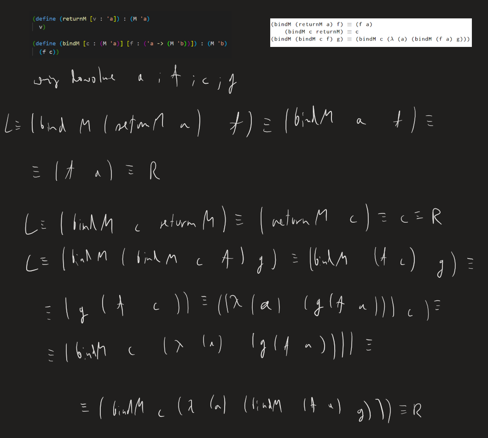

[(wróć)](../)

<details>
    <summary> Co to jest monada w programowaniu funkcyjnym? </summary>

https://youtu.be/VgA4wCaxp-Q

## [Co to jest monada w programowaniu funkcyjnym?](https://4programmers.net/Forum/Newbie/232253-co_to_jest_monada_w_programowaniu_funkcyjnym)

Cytując klasyka: _A monad is just a monoid in the category of endofunctors._ ([źródło](https://stackoverflow.com/questions/3870088/a-monad-is-just-a-monoid-in-the-category-of-endofunctors-whats-the-problem))

Monady mogą być użyte do symulacji IO w językach funkcyjnych, ale wcale tak być nie musi. Monada to coś dużo bardziej ogólnego i wcale nie związanego jakoś specjalnie z IO. Monadę tworzą dwie operacje:

1. `unit :: a -> m a` - opakowanie "czystej" wartości w swoiste monadyczne pudełko.
2. `bind :: m a -> (a -> m b) -> m b` - otwieramy monadyczne pudełko, manipulujemy wartością, zamykamy pudełko (otrzymując nową wartość monadyczną).
Które spełniają prawa monad
3. `unit(a).bind(f) == f(a)`
4. `m.bind(unit) == m`
5. `m.bind(f).bind(g) == m.bind(λx -> f(x).bind(g))`  
W praktyce prawa te zapewniają intuicyjne zachowanie. Dużo łatwiej zobaczyć dlaczego powinny być spełnione w haskellowej notacji do, która po kompilacji korzysta z `return (unit)` oraz `>>= (bind)`.
6. 
```js
do { y <- return x; f y } == do { f x } 
```
7. 
```js
do { x <- m; return x } == do { m } 
```
8. 
```js
do { y <- do { x <- m
               f x
             }
     g y
   }
==
do { x <- m
     do { y <- f x
          g y
        }
   }
==
do { x <- m
     y <- f x
     g y
   }
```

Z praktycznego punktu widzenia monady pozwalają na wygodne odseparowanie sposobu łączenia wyników w jedno od samych operacji, które chcemy przeprowadzić.

Przykład: monada Maybe; reprezentuje obliczenia, które mogą się nie powieść. Jest przydatna do kodu w rodzaju:

```js
var x = findSomething(); // Może zwrócić null, jeśli nic nie znajdzie!
if (x === null) return null;
var y = findSomethingElse(x); // Znów może zwrócić null, gdy nie znajdzie.
if (y === null) return null;
var z = lookup(x,y); // Same story...
if (z === null) return null;
return z;
```

Taki kod jest nieelegancki. Cały czas musimy się powtarzać. Chcemy po prostu napisać:

```js
var x = findSomething();
var y = findSomethingElse(x);
return lookup(x,y);
```

bez martwienia się o ciągłe sprawdzanie czy coś nie jest przypadkiem `null`-em. Monadycznie można by to zapisać jako:

```js
var Maybe = function(x) {
    return {
        bind: function(f) {
            return (x === null) ? null : f(x);
        }
    };
};

var findSomething = function() { return Maybe(3); };
var someFailure = function() { return Maybe(null); };
var findSomethingElse = function(x) { return Maybe(x+5); };
var lookup = function(x,y) { return Maybe(x*y); };

findSomething().bind(function(x) {
    return findSomethingElse(x).bind(function(y) {
        return someFailure().bind(function() {
            return lookup(x,y).bind(function(z) {
                print('To sie nie wykona');
            });
        });
    });
});

findSomething().bind(function(x) {
    return findSomethingElse(x).bind(function(y) {
        return lookup(x,y).bind(function(z) {
            print('val = ' + z);
        });
    });
});
```

([ideone](https://ideone.com/cuUVuj))  
Oczywiście wygląda to okropnie, ale już np. w Haskellu wygląda dużo lepiej, dzięki notacji `do`, która pod spodem robi mniej więcej to samo co ten kod Javascript.

```hs
import Prelude hiding(Maybe(..), lookup)


data Maybe a = Just a | Nothing deriving (Show)
instance Monad Maybe where
  return x = Just x
  (Just x) >>= f = f x
  Nothing >>= _  = Nothing

findSomething :: Maybe Int
findSomething = return 3

findSomethingElse :: Int -> Maybe Int
findSomethingElse x = return (x+5)

lookup :: Int -> Int -> Maybe Int
lookup x y = return (x*y)

someFailure :: Maybe a
someFailure = Nothing

findThemAll :: Maybe Int
findThemAll = do
  x <- findSomething
  y <- findSomethingElse x
  lookup x y

findThemAllFail :: Maybe Int
findThemAllFail = do
  x <- findSomething
  someFailure
  y <- findSomethingElse x
  lookup x y
  
main = print findThemAll >> print findThemAllFail
```
([ideone](https://ideone.com/A40Z5X))

</details>


# Lista 14
| 1 | 2 | 3 | 4 | 5 | 6 |
|---|---|---|---|---|---|
| X | X | X | ~ | X | X |

## Zadanie 1

