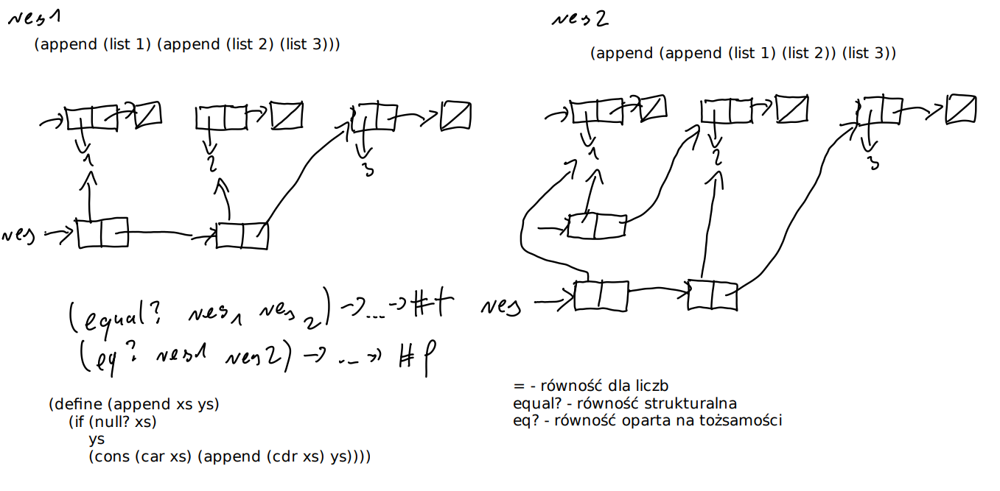

[(wróć)](../)
# Lista 3
| 1 | 2 | 3 | 4 | 5 | 6 | 7 | 8 |
|---|---|---|---|---|---|---|---|
| X | X | X | X | X | X | X | X |

## Zadanie 1
```
'((car (a . b)) (* 2))
(list (list 'car (cons 'a 'b)) (list '* 2))
```
```
`(,( car '(a . b)) ,(* 2))
(list (car (cons 'a 'b)) (* 2))
```
```
'((+ 1 2 3) ( cons ) ( cons a b))
(list (list '+ 1 2 3) (list 'cons) (list 'cons 'a 'b))
```

## Zadanie 2
```
(define (mult-list xs)
    (foldl * 1 xs))
```
Dla pustej zwraca 1 - element neutralny mnożenia

## Zadanie 3
```
(( lambda (x y) (+ x (* x y))) 1 2)
```
Zwraca 1 + (1 * 2) czyli **3**
```
(( lambda (x) x) ( lambda (x) x))
```
(lambda (x) x) jest funkcją identyczności - procedurą (bo nie dostała argumentu i nie została wywołana)\
następnie podajemy jej argument, będący procedurą i wywołujemy, czyli otrzymujemy procedurę (lambda (x) x)
```
(( lambda (x) (x x)) ( lambda (x) x))
```
pierwsza lambda bierze x, a następnie go wywołuje wraz z argumentem x\
wywołana funkcja jest funkcją identyczności - w efekcie otrzymujemy procedurę
```
(( lambda (x) (x x)) (lambda (x) (x x)))
```
pierwsza lambda bierze x oraz go wywołuje z argumentem x\
jako x otrzymujemy taką samą funkcję\
w efekcie otrzymujemy funkcję wywołującą siebie samą w nieskończoność

## Zadanie 4
```
(define (my-compose f g)
    (lambda (x) (f (g x))))
```
```
(( my-compose square inc ) 5)
```
zwraca pierwiastek z (5+1) czyli 2.449489742783178
```
(( my-compose inc square ) 5)
```
zwraca (pierwiastek z 5) + 1 czyli 3.23606797749979

## Zadanie 5
```
(define (negatives n)
    (build-list n (lambda (x) (- (* x -1) 1))))
```
```
(define (reciprocals n)
    (build-list n (lambda (x) (/ 1 (+ x 1)))))
```
```
(define (evens n)
    (build-list n (lambda (x) (* x 2))))
```
```
(define (identityM n)
    (build-list n
        (lambda (col) (build-list n
            (lambda (row)
                (if (= col row) 1 0))))))
```

## Zadanie 7
Jak działa append?
```
(define (append xs ys)
    (if (null? xs) ys
    (cons ((car xs) (append (cdr xs) ys)))))
```
Czyli w rezultacie kopiuje on pierwszą listę, aby dokleić do niej drugą (w formie referencji, nie kopiuje jej już).


```
(define ( foldr-reverse xs )
    (foldr ( lambda (y ys ) ( append ys ( list y))) null xs ))

(length (foldr-reverse (build-list 10000 identity)))
```
```
xs [0]->[1]->...->[n]->null
                  [n]->null
           [n]->[n-1]->null
          ...
        [n]->...->[0]->null
```
Dla listy o długości n funkcja ta tworzy $\frac{n(n+1)}{2} \approx O(n^2)$ consów, z czego $\frac{n(n-1)}{2} \approx O(n^2)$ jest zbędnych.

## Zadanie 8
Wydajność jest lepsza, ponieważ w przeciwieństwie do $O(n^2)$ mamy złożoność czasową $O(n)&, ponieważ nasze nowe _llist-append_ działa w czasie stałym.
