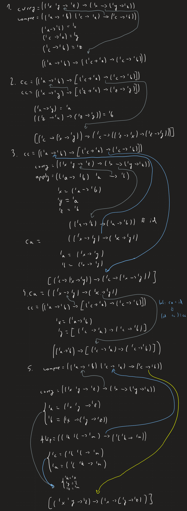

[(wróć)](../)
# Lista 5
| 1 | 2 | 3 | 4 | 5 | 6 | 7 | 8 | 9 |
|---|---|---|---|---|---|---|---|---|
| X | X | X | X | X | X | X | X | X |

## Zadanie 2
```
(define (apply f x) (f x))
(('a -> 'b) 'a -> 'b)
```
Apply aplikuje element x do funkcji f, więc funkcja ta musi przyjmować ten sam typ co x, a zwracać może cokolwiek
```
(define (compose f g) (lambda (x) (f (g x))))
(('a -> 'b) ('c -> 'a) -> ('c -> 'b))
```
Compose jest złożeniem funkcji f oraz g, więc f musi przyjmować ten sam typ jaki zwraca g, pozostałe typy są dowolne
```
(define (flip f) (lambda (x y) (f y x)))
(('a 'b -> 'c) -> ('b 'a -> 'c))
```
Flip odwraca kolejność argumentów przyjmowanych przez funkcję, więc i kolejność typów
```
(define (curry f) (lambda (x) (lambda (y) (f x y))))
(('a 'b -> 'c) -> ('a -> ('b -> 'c)))
```
Curry rozbija funkcję 2 argumentową na złożenie 2 funkcji 1 argumentowych, które muszą przyjmować te same typy co oryginalne funkcje

## Zadanie 3 
Dlaczego zwracane są *'_a* zamiast *'a*?\
Po 'wykonaniu' funkcji ze zmienną polimorficzną otrzymujemy zmienną monomorficzną, ponieważ przyjmuje już ona jakiś ustalony (ale nadal dowolny) typ, wybrany wcześniej.
```
( curry compose )
(('_a -> '_b) -> (('_c -> '_a) -> ('_c -> '_b)))
```
```
(( curry compose ) ( curry compose ))
(('_a -> ('_b -> '_c)) -> ('_a -> (('_d -> '_b) -> ('_d -> '_c))))
```
```
(( curry compose ) ( curry apply ))
(('_a -> ('_b -> '_c)) -> ('_a -> ('_b -> '_c)))
```
```
(( curry apply ) ( curry compose ))
(('_a -> '_b) -> (('_c -> '_a) -> ('_c -> '_b)))
```
```
( compose curry flip )
(('_a '_b -> '_c) -> ('_b -> ('_a -> '_c)))
```
