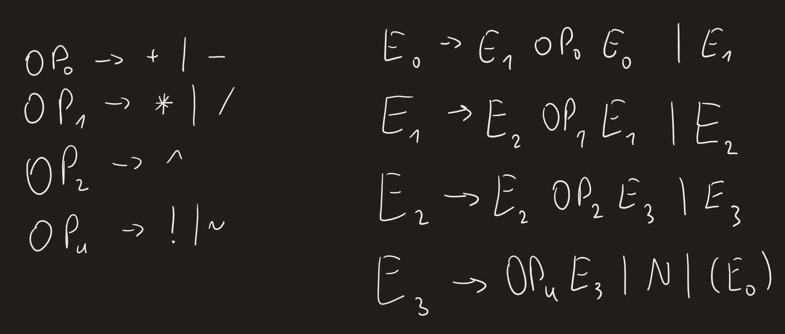
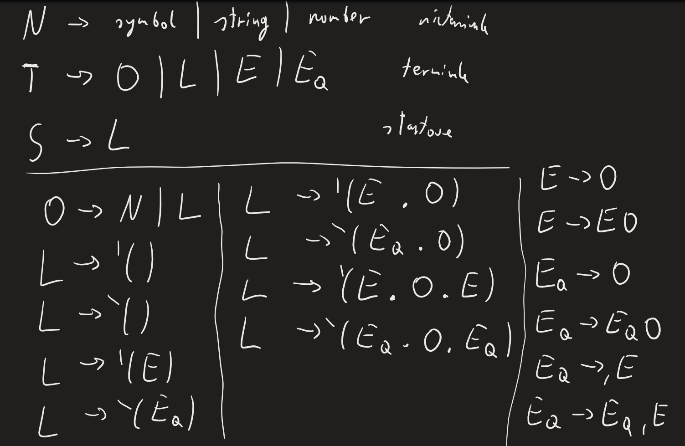
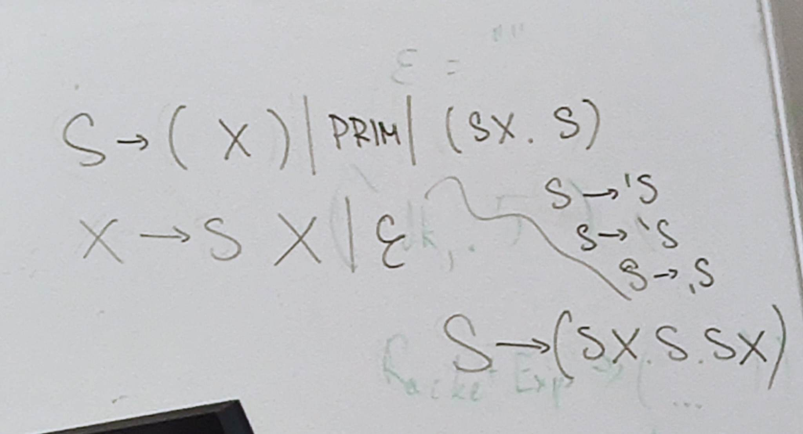

[(wróć)](../)

    
Podsumowanie wykładu

1. Gramatyki bezkontekstowe
2. Parsowanie

# Lista 9
| 1 | 2 | 3 | 4 | 5 | 6 | 7 |
|---|---|---|---|---|---|---|
| X | X | X | X | X |   |   |

# Zadanie 1

# Zadanie 2

