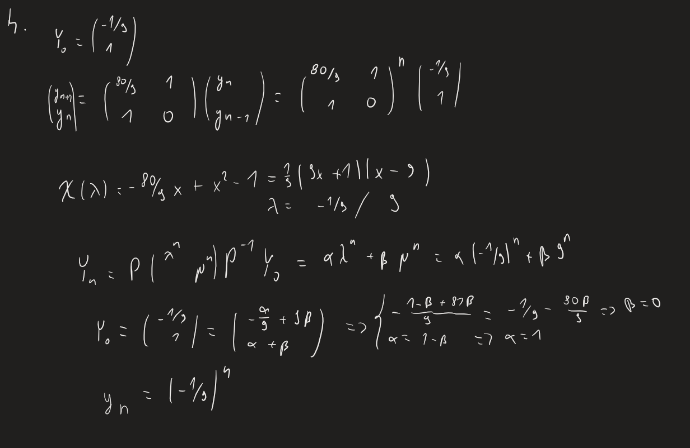

[(wróć)](../)

# Lista 1
| 1 | 2 | 3 | 4 | 5 | 6 | 7 | 8 |
|---|---|---|---|---|---|---|---|
| X | X | X | X | X | X | X | X |

## Zadanie 1
Jakieśtam oszustwo, że program na liczenie sinusa nie działał, bo za dużo bitów (30), więc poprawili program do liczenia sinusów licząc sinusy manualnie i podając je do programu, który liczył sinusy, których nie umiał liczyć. Prawie nikt nie wiedział i nikt się nie domyślił że coś jest nie tak, pieniądze dali.

## Zadanie 2
Wynik nie jest wiarygodny, $x^{14}$ dla małych argumentów będzie wymagać dużej precyzji, natomiast po dodaniu 1 do niego, zmniejszymy precyzje aby moc skorzystac z liczby > 1.

## Zadanie 3
Dla małych x wynik $\cos(x)$ będzie zbyt bliski 1, nawet dla podwójnej precyzji, więc zostaje zaokrąglony.

## Zadanie 4


## Zadanie 5
$I_n := \int_0^1 \frac{x^n}{x+2023}dx$  
$I_n := \frac{1}{n} - 2023 I_{n-1}$; gdzie $I_0 = \ln(\frac{2024}{2023})$  
d-d że rekurencja działa (indukcja):  
$I_0 = \int_0^1 \frac{x^0}{x+2023}dx=\ln(x+2023)|_0^1=\ln(\frac{2024}{2023})$  
$I_n = \frac{1}{n} - 2023I_{n-1}$  
$\frac{1}{n} = I_n + 2023I_{n-1}$  
$\frac{1}{n} = \int_0^1 \frac{x^n}{x+2023}dx + 2023 \int_0^1 \frac{x^{n-1}}{x+2023}dx =
 \int_0^1 \frac{x^n + 2023 x^{n-1}}{x+2023}dx = \int_0^1 x^{n-1}dx =
 \frac{x^n}{n}|_0^1 = \frac{1}{n}$  
wynik programu dla całek od _n = 1_ co _2_ jest niepoprawny, poniważ zwraca ujemne wyniki podczas gdy funkcja pod całką jest dodatnia na _[0, 1]_  
natomiast dla całek od _n = 2_ co _2_ też jest niepoprawny, bo funkcja maleje po _n_ na _[0, 1]_ a wyniki są coraz większe

## Zadanie 6
$\pi = 4 \sum_{k=0}^{\infty} \frac{(-1)^k}{2k+1}$  
monotoniczne, szereg naprzemienny, więc szukamy takiego k, że $\frac{4}{2k+1} < 10^{-6}$  
$\frac{4}{2k+1} < 10^{-6}$  
$2k+1 > 4 * 10^6$  
$k > 2 * 10^6 - 1$  
więc najmniejsze $k = 2 * 10^6$  
nie mniej jednak _float_ ma zbyt małą precyzję aby to policzyć natomiast _double_ już tak

## Zadanie 7
$\ln(x) = \sum_{k=1}^{\infty} (-1)^{k-1} \frac{(x-1)^k}{k}$  
$\ln(2) = \sum_{k=1}^{\infty} (-1)^{k-1} \frac{1^k}{k} = \sum_{k=1}^{\infty} (-1)^{k-1} \frac{1}{k}$  
$\frac{1}{k}$ monotoniczne, szereg naprzemienny, więc szukamy takiego k, że $\frac{1}{k} < [błąd]$  
$\frac{1}{k} < \frac{1}{2} * 10^{-6}$  
$k < 2 * 10^6$  

natomiast korzystając z $\ln 2 = \ln(e(\frac{2}{e}))$  
$\ln 2 = \ln(e(\frac{2}{e})) = \ln(e) + \ln(\frac{2}{e}) = 1 - \sum_{k=1}^{\infty} (-1)^{k} \frac{(\frac{2}{e}-1)^k}{k}$  
$\sum_{k=1}^{\infty} (-1)^{k} \frac{(\frac{2}{e}-1)^k}{k} = \sum_{k=1}^{\infty} \frac{(1-\frac{2}{e})^k}{k}$  
$\frac{(1-\frac{2}{e})^k}{k} < \frac{1}{k}$  
czyli dla danej iteracji _k_ drugi szereg będzie mniejszy od pierwszego, 
zarazem maleje on szybciej oraz jest monotoniczny, dodatni i ograniczony, 
więc szybciej osiągnie mały błąd   
ewentualnie $\sum_{k=1}^{\infty} (-1)^{k} \frac{(\frac{2}{e}-1)^k}{k}$ jest bliżej promienia zbieżności szeregu (który wynosi (0; 2]) więc szybciej osiągnie mały błąd

## Zadanie 8
Mamy funkcję $\arctan$, która zwraca dokładny wynik tylko dla $x \in [-1, 1]$, 
skorzystamy z własności   
$\arctan(x) + \arctan(\frac{1}{x}) = \frac{\pi}{2}$; $x\in\mathbb{R_+}$  
$\arctan(x) + \arctan(\frac{1}{x}) = -\frac{\pi}{2}$; $x\in\mathbb{R_-}$  
czyli dla $x \in \mathbb{R}$  
```py
def arctan(x):
    if x > 1:
        return pi/2 - PWOpp_arctan(1/x)
    elif x < -1:
        return -pi/2 - PWOpp_arctan(1/x)
    else:
        return PWOpp_arctan(x)
```
