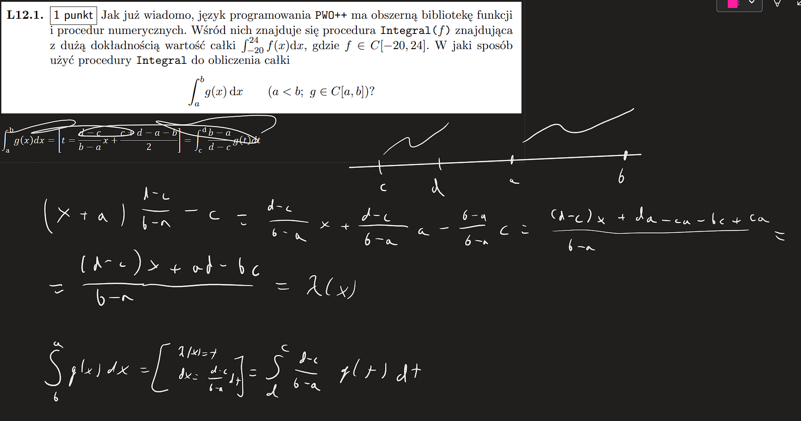
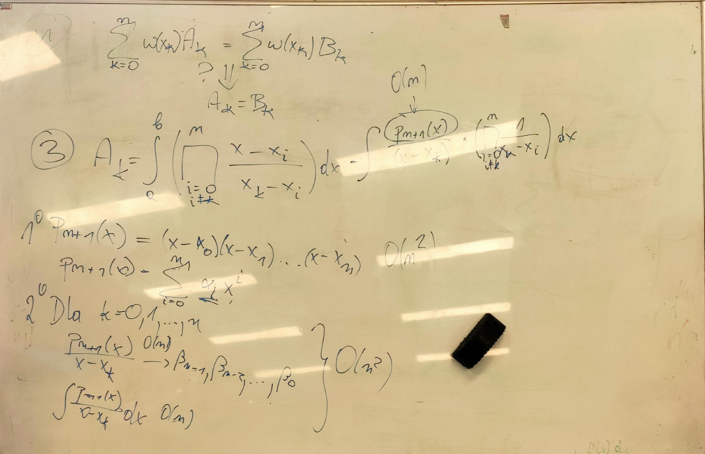
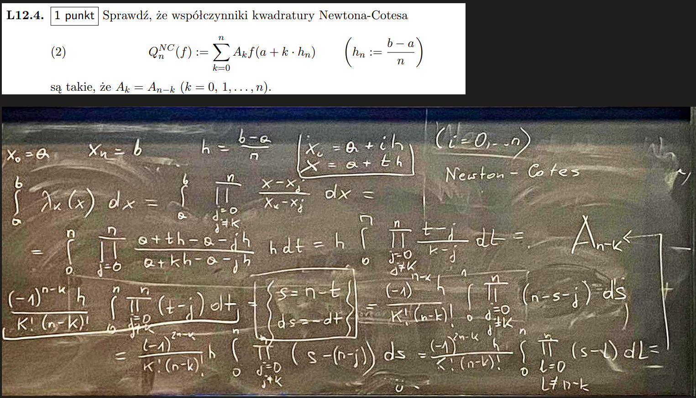
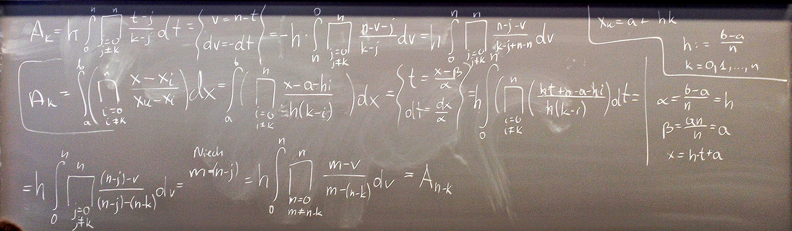

[(wróć)](../)

# Lista 12a
### Zadanie 1

### Zadanie 2
##### => zał że $Q_n$ jest interpolacyjna
wiemy że $\forall w \in \prod_n deg(w) \leq n$   
więc $\forall w \in \prod_n w(x)=\sum_{k=0}^n w(x_k)\lambda_k(x) \implies \forall w \in \prod_n \int_a^b w(x)dx = \int_a^b \sum_{k=0}^n w(x_k) \lambda_k(x) dx = \sum_{k=0}^n w(x_k) \int_a^b \lambda_k(x) dx = \sum_{k=0}^n w(x_k) A_k = Q_n(w)$

##### <= zał że $\forall w \in \prod_n \int_a^b w(x)dx = Q_n(w)$
wiemy że $\forall w \in \prod_n deg(w) \leq n$   
więc $\forall w \in \prod_n w(x)=\sum_{k=0}^n w(x_k)\lambda_k(x) \implies deg(\lambda_k) \leq n$    
wtedy $\forall \lambda_i \in \prod_n \int_a^b \lambda_i(x) = Q_n(\lambda_i) = \sum_{k=0}^n \lambda_i(x_k) A_k = A_i$  
bo $\lambda_i(x_k) = \begin{cases} 1 & i=k \\ 0 & i \neq k \end{cases}$

### Zadanie 3

### Zadanie 4

