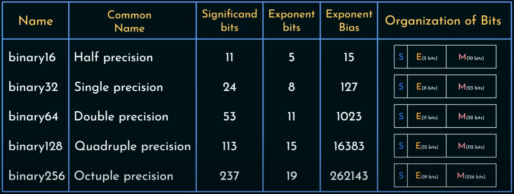

[(wróć)](../)

# Lista 1
| 1 | 2 | 3 | 4 | 5 | 6 | 7 | 8 | 9 |
|---|---|---|---|---|---|---|---|---|
| X | X | X | X | X | X | X | X | X |

## Zadanie 1

## Zadanie 2

## Zadanie 3
Najmniejszy przedział zawierający te liczby to $[0b0.10000*2^{-1}, 0b0.11111*2^1] = [1/4, 31/16]$  

## Zadanie 4
25 lutego 1991 r. wojsko amerykańskie wystrzeliło rakietę Patiot w kierunku Dharany w Arabii Saudyjskiej. Po błędzie numerycznym pocisk zamiast we wroga trafił w amerykańskie koszary, zabijając 28 żołnierzy i raniąc około 100 innych. Ten błąd jest wielokrotnym powtórzeniem błędu rzędu 0,000000095, wynikającym z użycia 24-bitowego systemu zmiennych, więc 1/10 sekundy jest obcinana. Błąd końcowy wyniósł 0,34 sekundy, ale ze względu na dużą prędkość pocisku wystarczył, aby minąć cel o pół kilometra. 

## Zadanie 5
Standard IEEE 754 dzieli liczbę na 3 części: znak, wykładnik i mantysę   
mantysa jest zawsze zapisana w postaci 1,xxxxx... gdzie pierwsza 1 nie jest zapisywana    
Długość wykładnika i mantysy zależy od liczby bitów przeznaczonej na liczbę:  

## Zadanie 6

## Zadanie 7
Oblicazanie _f(0.001)_ daje niewiarygodny wynik, ponieważ $x^{14}$ dla małych _x_ wymaga dużej precyzji, a po dodaniu do tak małej liczby _1_ wynik jest zaokrąglany do _1_  
Aby policzyć wynik precyzyjnie wystarczy przekształcić wzór:  
$f(x) = 4046 \frac{\sqrt{x^{14}+1}-1}{x^{14}} = 4046 \frac{x^{14}}{x^{14}(\sqrt{x^{14}+1}+1)} = \frac{4046}{\sqrt{x^{14}+1}+1}$  
wtedy osiągamy lepszą precyzję dla małych x, ponieważ wtedy zaokrąglenie pierwiastka nie doprowadza do powstania 0 w liczniku, dodatkowo wykonujemy w nim mniej operacji zmniejszając końcowy błąd.  

## Zadanie 8
$14\frac{1-\cos(17x)}{x^2}$ daje niewiarygodne wyniki, ponieważ dla małych x wynik $cos(x)$ jest na tyle bliski 1, że braknie precyzji i komputer zwraca 1   
aby tego uniknąć, dla x bliskich 1 możemy zastosować przybliżenie (za pomocą szeregu Maclaurina):  
$14\frac{1-\cos(17x)}{x^2} = 14\frac{1-1+\frac{(17x)^2}{2}-\frac{(17x)^4}{4!}}{x^2} = 14\frac{\frac{(17x)^2}{2}-\frac{(17x)^4}{24}}{x^2} = 14(\frac{17^2}{2}-\frac{17^4x^2}{24})$  

## Zadanie 9

W pierwszym wzorze mamy dużo operacji wymagających dużej precyzji na liczbach bliskich 1, co powoduje utratę cyfr znaczących.  
W drugim wzorze mamy operacje na liczbach bliskich 0, co zmniejsza błąd.