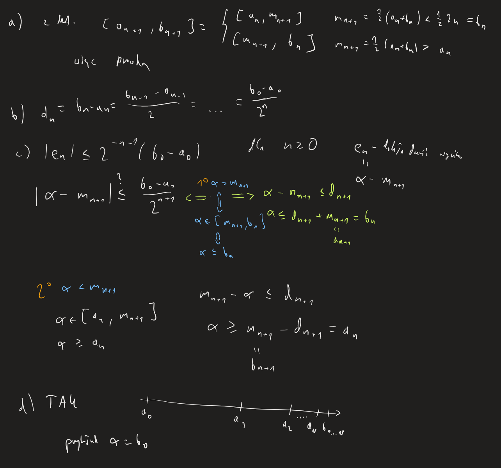
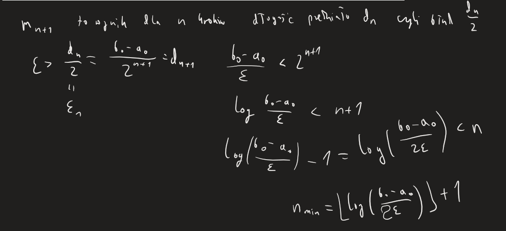
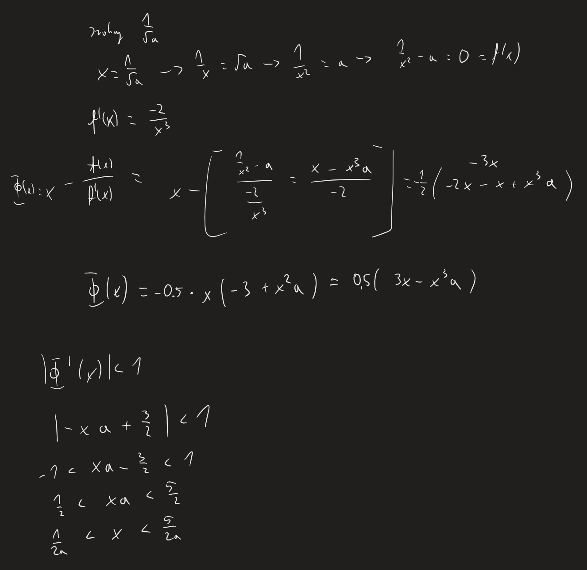
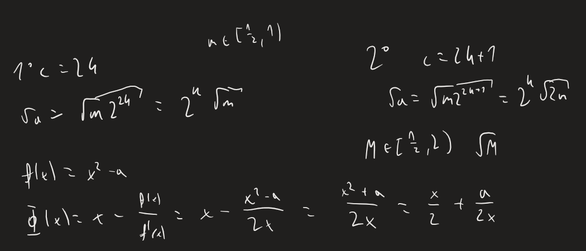

[(wróć)](../)

# Lista 4
| 1 | 2 | 3 | 4 | 5 | 6 | 7 | 8 | 9 |
|---|---|---|---|---|---|---|---|---|
| X | X | X | X |   | X | X |   |   |

# Zadanie 1

# Zadanie 2

# Zadanie 3
Wynik bisekcji jest mniejszy od błędu, oraz coraz mniej się od niego różni

# Zadanie 4
Miejsca zerowe będą w punktach przecięcia się funkcji _g(x)_ z _h(x)_

# Zadanie 5

# Zadanie 6

# Zadanie 7

# Zadanie 8

# Zadanie 9

