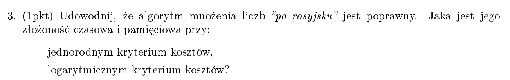
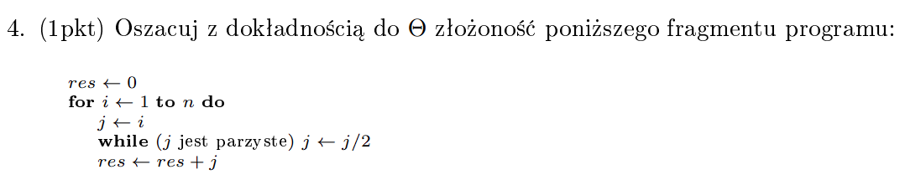
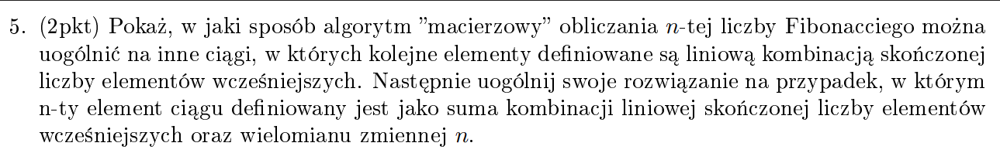
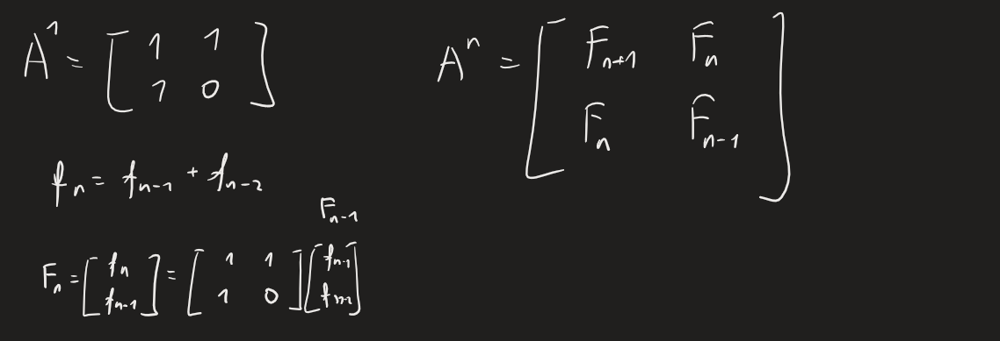
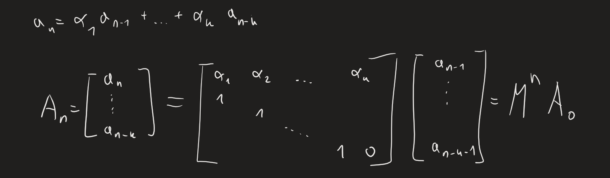
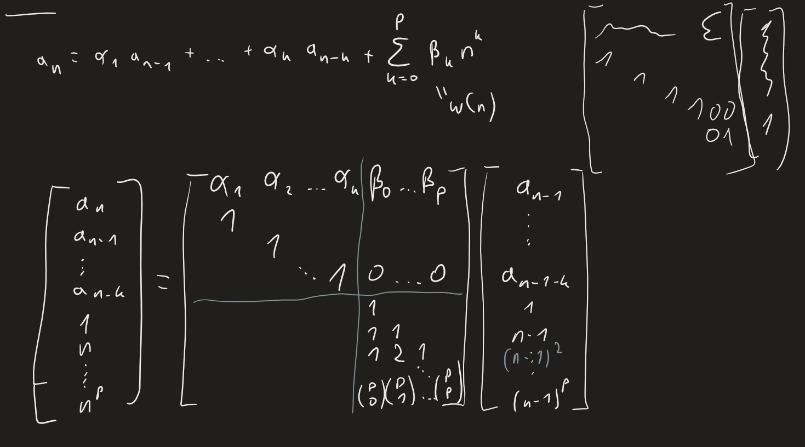

[(wróć)](../)

# Lista 1
## Zadanie 3

d-d  
weźmy dowolne _a_ i _b_  
jeżeli 2|b to a * b = (2a) * (b/2)  
wpp a*b = (2a) * ((b-1)/2) + a  

lub przez zapis binarny  
a * b = a * \sum 2^{c_i} = \sum a * 2^{c_i}  

___
jendorodny:  
T = O(log (b))   
M = O(1)    

logarytmiczny:   
T = [while *  (res+=a + a*=2 + b/=2)] = log(b)(log(ab) + log(ab + log(b))) = O(log(b) log(ab))  
M = O(log (ab))  

## Zadanie 4

z dołu n, z góry \sum n/2^i = n - 1, więc O(n)

## Zadanie 5

