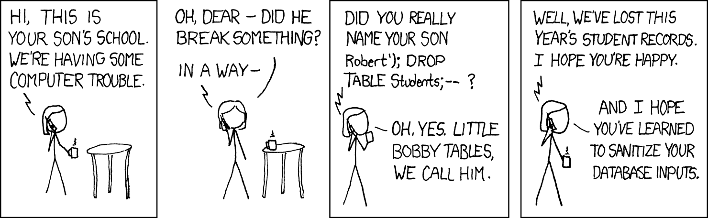

[wróć](../)

# TOC
- [TOC](#toc)
- [Wykład 3](#wykład-3)
  - [Klasy i obiekty, eventy i delegaty](#klasy-i-obiekty-eventy-i-delegaty)
  - [Mechanizm refleksji i atrybutów](#mechanizm-refleksji-i-atrybutów)
- [Wykład 4](#wykład-4)
  - [Typy generyczne](#typy-generyczne)
      - [Listy](#listy)
  - [Enumeratory](#enumeratory)
  - [Rozszerzenia enumeratorów](#rozszerzenia-enumeratorów)
  - [Metody rozszerzające](#metody-rozszerzające)
    - [EnumerableExtensions](#enumerableextensions)
      - [GroupBy i var](#groupby-i-var)
  - [Klasy anonimowe](#klasy-anonimowe)
- [Wykład 6 - aplikacje okienkowe](#wykład-6---aplikacje-okienkowe)
  - [Struktura plików - koncept designera](#struktura-plików---koncept-designera)
  - [Właściwości i zdarzenia komponentów](#właściwości-i-zdarzenia-komponentów)
  - [Konwencje nazw](#konwencje-nazw)
  - [Rozmieszczanie elementów w formularzu](#rozmieszczanie-elementów-w-formularzu)
- [Wykład 7](#wykład-7)
  - [Plik konfiguracyjny aplikacji dotnet - App config](#plik-konfiguracyjny-aplikacji-dotnet---app-config)
    - [App settings](#app-settings)
    - [App manifest](#app-manifest)
  - [Multiple Document Interface](#multiple-document-interface)
    - [Jak uzyskać architekturę MDI](#jak-uzyskać-architekturę-mdi)
  - [Komponenty do prezentacji zbiorów danych](#komponenty-do-prezentacji-zbiorów-danych)
    - [ComboBox](#combobox)
  - [GDI](#gdi)
    - [Custom Control](#custom-control)
- [WPF .NET (Windows Presentation Foundation)](#wpf-net-windows-presentation-foundation)
  - [WPF](#wpf)
    - [Binding](#binding)
- [SQL Server](#sql-server)
  - [SQL Server Management Studio](#sql-server-management-studio)
  - [SQL Server Profiler](#sql-server-profiler)
    - [tworzenie nowej tabeli](#tworzenie-nowej-tabeli)
    - [Przykład](#przykład)
    - [Zagrożenie SQL Injection](#zagrożenie-sql-injection)
  - [ORMy](#ormy)
    - [Linq2SQL](#linq2sql)
      - [Read](#read)
      - [Create](#create)
      - [Update](#update)
      - [Delete](#delete)
      - [Relacje](#relacje)
    - [Entity Framework](#entity-framework)
- [Win32API](#win32api)
  - [Podstawy](#podstawy)
  - [Obsługa komunikatów](#obsługa-komunikatów)
- [Wytwarzanie bibliotek](#wytwarzanie-bibliotek)
    - [Skąd system wie gdzie jest nasza biblioteka?](#skąd-system-wie-gdzie-jest-nasza-biblioteka)
    - [Technologia Component Object Model (COM)](#technologia-component-object-model-com)
      - [Pliki rejestru systemu Windows](#pliki-rejestru-systemu-windows)
      - [Czy rozwiązano ten problem?](#czy-rozwiązano-ten-problem)
      - [Jak tworzyć biblioteki COM](#jak-tworzyć-biblioteki-com)
    - [HPA](#hpa)
      - [przykład wykorzystania naszej biblioteki com](#przykład-wykorzystania-naszej-biblioteki-com)
    - [Rust](#rust)


# Wykład 3
## Klasy i obiekty, eventy i delegaty
* getters, setters
* interface

* `delegate` - wzorzec dla funkcji
* `event` - lista zdarzeń (wywoływanych funkcji danego typu)

```cs
class Person {
    // defaultowe gettery i settery:
    public string Name { get; set; }

    // są równoważne z
    private string _name;
    public string Name {
        get { return _name; }
        set { _name = value; }
    }
}
```

## Mechanizm refleksji i atrybutów
metoda `InvokeMember`

```cs
// zał że mamy klasę Person
Person p;

// weźmy typ Person
Type t = p.GetType();
t.InvokeMember("Fun", BindingFlags.InvokeMethod, null, p, new object[] { 1, 2 });
t.InvokeMember("Fun", BindingFlags.InvokeMethod, null, p, new object[0]);   // bez argumentów
```

Przykładowe zastosowanie - chcemy napisać funkcję przekształcającą dowolny obiekt na plik JSON  

inne refleksje i przykłady:
* `GetProperties`


```cs
Type ot = object.GetType();
foreach(PropertyInfo info in ot.GetProperties(...)){
    info.Name;
    info.GetValue...
}
```

atrybuty:  
[Omit], OmitAttribute, typeof(OmitAttribute), if(info.OmitAttribute...), [AtturbuteUsage(AttributeTargets.Property())]


# Wykład 4
## Typy generyczne
Typy generyczne w cs różnią się od cpp - w samym kompilacie nadal są one typami generycznymi (cpp w trakcie kompilacji generuje wszystkie potrzebne optypowane funkcje)  
tworzy to pewien problem - cs nie wie jakie metody są dozwolone dla typu generycznego (gdzie cpp 'sprawdza' czy metody istnieją dopiero po wykorzystaniu ich z konkretnym typem)  

```cs
class C<T> {
    T x;

    public T func(T a){
        return x+a;     // error
    }
}
```

aby rozwiązać ten problem możemy korzystać z ogranicznika `where`  
```cs
class C<T> where T : IInterface {       // T musi implementować IInterface, więc wiemy że posiada jakieś metody
    T x;
}
// poprawne tez jest
class C<T> where T : class {       // T musi być klasą
    T x;
}
```

#### Listy
`ArrayList` - lista obiektów, nie jest typowana, więc możemy wrzucić tam wszystko  
`List<T>` - typowana lista

## Enumeratory
```cs
public interface IEnumerableObject {      // domyślnie ten interfejs jest już zaimplementowany w cs (IEnumerable)
    object GetCurrentValue();
    void MoveToNext();
    bool IsFinished();      // teoretycznie można to zmergowac z MoveToNext
    void Reset();
}

public class EnumerableClass : IEnumerable, IEnumerator {
    public int i;

    public EnumerableClass(){
        i = 0;
    }

    // metoda 1
    public IEnumerator GetEnumerator(){
        return this;
    }

    // metoda 2
    public IEnumerator GetEnumerator(){
        yield return 1;

        while (i < 10){
            yield return i;
            i++;
        }
    }

    public object Current {
        get{
            return i;
        }
    }

    public bool MoveNext() {
        i++;
        return i < 10;
    }

    public void Reset(){
        i = 0;
    }
}

EnumerableClass ec = new EnumerableClass();

// korzystanie z foreach
foreach(object i in ec){
    Console.WriteLine(i);
}

// jest równoważne temu
IEnumerator e = ec.GetEnumerator();
while(e.MoveNext()){
    Console.WriteLine(e.Current);
}
```

## Rozszerzenia enumeratorów
```cs
public class EnumerableExtensions {
    public static T Find<T>(this IEnumerable<T> e, Predicate<T> p){
        foreach(T i in e){
            if(p(i)){
                return i;
            }
        }
        return default(T);      // zwraca domyślną wartość dla danego typu, wymagane bo musimy zwórić ten sam typ
    }

    public static IEnumerable<T> FindAll<T>(this IEnumerable<T> e, Predicate<T> p){
        foreach(T i in e){
            if(p(i)){
                yield return i;
            }
        }
    }
}

// taka implementacja dodatkowych funkcji do enumeratorów nie pozwala na łańcuchowe wywoływanie kodu, i to nas smuci
EnumerableClass ec = new EnumerableClass();

EnumerableExtensions.FindAll(
    EnumerableExtensions.FindAll(
        EnumerableExtensions.FindAll(ec, x => x > 5),
        x => x < 10
    ),
    x => x > 7
);

// a chcielibyśmy
ec
    .FindAll(x => x > 5)
    .FindAll(x => x < 10)
    .FindAll(x => x > 7);

// jak to naprawić?
```

## Metody rozszerzające 
Aby stworzyć metodę rozszerzającą musimy: 
* stworzyć statyczną klasę
* w tej klasie stworzyć statyczną metodę, która jako pierwszy argument ma słowo kluczowe `this` i typ, który chcemy rozszerzyć

```cs
// problem - chcemy ładnie wywoływać metody z innych klas na obiektach 
string s = "ala ma kota";
s = StringExtensions.ToUpperCustom(s);
// chcielibyśmy
s = s.ToUpperCustom().ToUpperCustom();

public static class StringExtensions {
    public static string ToUpperCustom(this string s){
        return s.ToUpper();
    }

    // możemy też dodawać inne arguemnty, po pierwszym przyjmującym obiekt
    public static string ToUpperCustom(this string s, int a){
        return s.ToUpper() + a;
    }
}
```
### EnumerableExtensions
Przy dodaniu do cs metody rozszerzającej dodano cały zestaw wbudowanych funkcji rozszerzających enumeratory  
zostały one zaimplementowane w bibliotece `System.Linq`  
w VStudio możemy rozróżnić metody pochodzące z zewnętrznej klasy od tych zaimplementowanych w naszym obiekcie (mają one strzałkę w dół przy nazwie metody)  

#### GroupBy i var
tutaj przydatne będzie `var` (które inferuje typ wnikowy), bo group by zwraca bardzo skomplikowany typ, więc zapisanie go (np po 3-krotnym group by) byłoby bardzo skomplikowane
```cs
public class Person {
    public string name;
    public string surname;
    public int age;
}

List<Person> = ...;

var res =
    list
        .GroupBy(x => x.surname)
        .GroupBy(x => x.age)
        .GroupBy(x => x.name);
```

kilka ciekawych przykładów
```cs
var res = 
    list
        .Where(x => x.age > 18)
        .OrderByDescending(x => x.age)
        .ThenBy(x => x.surname)
        .ThenBy(x => x.name);
```

operacje te mają bardzo sql'owy charakter, co spowodowało wprowadzenie do cs takiej składni (która jest brzydka i nie daje żadnej przewagi - i to nas smuci)
```cs
List<int> t = new List<int> {1, 2, 3, 4, 5, 6, 7, 8, 9, 10};
var res =
    from e in t
    where e > 5
    orderby e descending
    select e;
```

## Klasy anonimowe
```cs
blah blah blah 
i => new {i = i, f = i+2}
```

# Wykład 6 - aplikacje okienkowe
podczas tworzenia nowego projektu w VStudio możemy wybrać między aplikacją okienkową opartą o klasyczny framework .NET lub nowe środowisko .NET Core   

główna pętla aplikacji jest ukryta pod wbudowaną funkcją `Application.Run` która może przyjąć formularz główny (wtedy obsłuży ona automatycznie podstawowe funkcje, np zamykanie) lub bez argumentu, wtedy musimy manualnie skończyć aplikację (np przez `Application.Exit`)   

## Struktura plików - koncept designera
w edytorze mamy 2 tryby - designera oraz kodu  
w edytorze wizualnym możemy dodawać nowe elementy przeciągając je z toolboxa i ustawiając je w oknie aplikacji  
główna klasa aplikacji jest rozbita na 2 pliki - jeden z kodem, drugi z opisem okna (designer) zawieracjący design aplikacji, strukturę klasy i podklasami  
designer jest dwukierunkowy - generowany automatycznie z widoku kodu, ale zmiany w designerze są zapisywane w kodzie  
efektem ubocznym jest ryzyko zepsucia designera, a w efekcie aplikacji  

## Właściwości i zdarzenia komponentów
zawiera ono 2 ważne zakładki - właściwości oraz zdarzenia  
(po dwukliknięciu elementu tworzy się powiązane z nim zdarzenie, aby się go pozbyć musimy usunąć powiązaną z nim funkcję oraz w designerze przypisanie tej funkcji do elementu)  
dwukliknięcie wybranego zdarzenia utworzy adekwatną funkcję w kodzie i nas do niej przeniesie, możemy też wybrać napisaną już funkcję do zdarzenia. Aby rozróżnić jaki komponent wywołał funkcję korzystamy z pierwszego argumentu przekazanego do funkcji (sender). Drugi argument to `EventArgs` - klasa zawierająca dodatkowe informacje o zdarzeniu (np. pozycja myszki)

## Konwencje nazw
typ obiektu na prefix, akcja na suffix  (buttonRefresh)  
skrócenie nazwy typu obiektu na prefix, akcja na suffix (btnRefresh)  

## Rozmieszczanie elementów w formularzu
* umieszczane elementów w komponencie `group by`
* w oknie `properties` elementu, sekcji `layout`
dock, anchor, etc
* element `panel`
panel jest niewidocznym elementem, który pozwala na rozmieszczanie jego podelementów po analogiczny sposób (taki div w html)

# Wykład 7
## Plik konfiguracyjny aplikacji dotnet - App config
w tym pliku mamy np wersję framworku (jeżeli nie mamy pliku to tworzymy App.config)  
Po zbudowaniu aplikacji plik konfiguracyjny ma nazwę odpowiadającą kompilatowi z dodatkowym rozszrzeniem .config  
> Nazwę kompilatu możemy zmienić w ustawieniach projektu (prawym na projekt -> ustawienia)  

### App settings
Aby korzystać z niego w kodzie, do referencji (bibliotek) musimy dodać System.Configuration  

klucze:
```xml
<appSettings>
  <add key="k1" value="v1"/>
  <add key="k2" value="v2"/>
</appSettings>
```
```cs
MessageBox.Show(ConfigurationManager.AppSettings["k1"])
```

Możemy tworzyć nowe pliki konfiguracyjne: 
w głównym pliku konfiguracyjnym:
```xml
<appSettinggs configSource="./path" />
```
tworzymy nowy (zaznaczamy że ma on być przenoszony do kompilatu):
```xml
version...

<appSettings>
  <add key="k1" value="v1"/>
  <add key="k2" value="v2"/>
</appSettings>
```

### App manifest
linia `requestedExecutionLevel` mamy poziom uprawnień aplikacji (jak w systemie)  `asInvoker`/`requireAdministrator`  
jako użytkownik możemy np wymusić uruchomienie jako administrator - po to m.in. jest ten plik  

## Multiple Document Interface 
Nasza aplikacja może mieć różne architektury: główne okno to dostarczyciel funkcji / dodatkowe okna pełnią główne funkcje lub MDI  
Komponenty typu menuStrip lub timer są o tyle specjalne że nie będą wyświetlane w samej aplikacji, więc sposób ich edycji się trochę różni  
### Jak uzyskać architekturę MDI
w samym formularzu możemy zmienić właściwość `isMdiContainer`   
stwórzmy nowy formularz `var frmChild = new frmMdiChild()` i ustawmy mu właściwość `frmChild.MdiParent(oknoGlowne)`   

> Jak teraz przykazywać informacje między formularzami?

stworzymy 'globalny' event do którego wszystkie formularze będą publikować, nawet lepiej - powołamy jakąś (naszą) klasę jako kanał komunikacyjny (będziemy suffixować klasy 'EventArgs')

```cs
public class DataStore {
    // dokładnie jedno wystąpienie - tworzymy teraz jedyną instancję
    public static DataStore Instance = new DataStore();

    public event DataStoreChangeDelegate DataStoreChangeEvent;

    // metoda służąca do emisji zdarzeń nazwa od Emit/Raise
    public void RaiseDataStoreChange(object sender, DataStoreChangeEventArgs e) {
        if(this.DataStoreChangeEvent != null) {
            this.DataStoreChangeEvent();
        }
    }
}

public delegate void DataStoreChangeDelegate(object sender ,DataStoreChangeEventArgs);


public class DataStoreChangeEventArgs : EventArgs {
  public string Data {get; set; }
}
```

w frmChild
```cs
private void frmMdiCgild_Load(object sender, EventArgs e) {
    DataStore.Instance.DataStoreCgangeEvent += Instance_DataStoreChangeEvent;
}

// emitujemy zdarzenie
private void Instance_DataStoreChangeEvent (object sender, EventArgs e) {
    if(sender != this) {
        this.textBox.Text = e.Data;
    }
}

private void frmMdiChild_FormClosing(object sender, FormClosingEventArgs e) {
    // e.Cancel = true;     // aby anulować zamknięcie
}

```


## Komponenty do prezentacji zbiorów danych
ComboBox, ListView, TreeView  
### ComboBox
dropdownStyle: dropdownList => użytkownik nie może dodać własnej pozycji  
`SelectedIndex` (index wybranego elementu), `SelectedText` (text na wybraneym elemencie)  
model który wspiera tekst i odpowiadającą wartość nie jest domyślnie zaimplementowany  
tworzymy więc własną implementację klasy `ComboItem`, która ma przeciążoną metodę `toString` (bo metoda toString jest ustawiana na tekst elementu) oraz jakieś ID 
teraz możemy skorzystać z `SelectedItem` (zwraca wybrany element), rzutujemy, wyciągamy ID

## GDI
czasem chcemy manualnie narysować coś na naszym oknie, służzy do tego właściwość Apparance->Paint

możemy tworzyć własne szczotki którymi będziemy rysować `Brush b = new SolidBrush(Color.Black / SystemColors...)` 
rysowanie: `e.Graphics.DrawString("abc", this.Font, b, new Point(10, 10));`

uwaga - obiekt ten będzie zajmował jeden ze skończonej liczby slotów, trzeba go więc sprzątnąć za pomocą using i scopami

```cs
using(Brush b)
using(Font f)
{
    e.Graphics.DrawString("abc", f, b, new Point(10, 10));
}
```

aby manualnie strować częstotliwością rysowania korzystamy z `this.Invalidate();`, które wywołujemy względem własnych ticków

### Custom Control
możemy tworzyć własne elementy do wrzucenia na formularz, np custombutton
```cs
public class CustomButton : Button {
    protected override void onClick(EventArgs e) {
        MessageBoxShow("abc");
        base.OnClick(e);        // wywołanie funkcji z klasy dziedziczonej
    }
}
```

nasz custombutton powininen się po kompilacji pojawić w toolboxie, w pp musimy manualnie dopisać formant

aby nie dziedziczyć po żadnym obiekcie, możemy dziedziczyć po klasie `Control`

na wykłądzie był jeszcze przykład komponentu combo z przyciskiem i combo box, rozmiary i pozycje podkomponentów ustawialiśmy w kodzie w zależności od rozmiarów combo (za pomocą zdarzenia `Resize`)  
dodatkowo żeby z poziomu naszego customowego combo mieć dostęp do combo box w środku
```cs
public ComboBox.ObjectCollection Items {
    get ...
    set ...
}
```

# WPF .NET (Windows Presentation Foundation)
microsoft stworzył jeszcze WCF i WWF  
WPF nie jest super wygodny w użytkowaniu (design piszemy w microsoftowej modyfikacji XML - XAML), a do tworzenia aplikacji na Windows mamy oprócz WinForms też **Electron** (np VScode), **Tauri**; więc WPF nie jest polecany do aplikacji desktopowych i nikt go zbytnio nie chce używać   
Nowym wymysłem microsoft było **UWP** (universal windows platform), które pozwalało na pisanie aplikacji zarówno na windowsa jak i xboxa

> Xamarin  
Framework do tworzenia aplikacji mobilnych, pozwala pisać w C#, korzysta z WPF. Też był dość problematyczny, aż microsoft wchłonął go do siebie i zrobił z niego **MAUI** (multi-platform app UI), które pozwala na pisanie aplikacji na platformy (windows, mac, linux, android, ios)  

> Avalonia  
**Avalonia** UI to framework do tworzenia aplikacji na windows, mac, linux, android, ios, *webassembly*  
wydaje się być bardzo przyszłościowa (ale nie wiadomo co się z nią stanie)

## WPF
zamiast pliku głównego Main.cs mamy App.xaml   
masakracja - wszystkie właściwości podajemy jak string, nie wiadomo jaki więc jest oczekiwany typ/zawartość stringa (np 4 liczyby po przecinku)  
WPF rozróżnia kontenery i elementy (każdy element musi mieć jakiś kontener):  
* StackPanel (rozkłada elementy w pionie)
* Canvas (pozwala na rysowanie elementów w dowolnym miejscu, za pomocą np `Canvas.Left="80"`)
* Grid (posiada właściwość `ShowGridLines`)
  * do definicji kolumn i wierszy korzsytamy z <Grid.ColumnDefinition> a w środku dla każdej kolmnt <ColumnDefinition Width="*"> gdzie `*` to równomierny rozkład (możemy dać `2*`) 
  * do elementów mamy udostępnione właściwości `Grid.Column="0"` i `Grid.Row="0"`
ciekawą własnością WPF jest atrybut `Content` dla każdego elementu, który pozwala wrzucić do niego inne elementy jako zawartość, np elipsa w przycisku:  

```xml
<Button Name="Button1" Click="Button_Click">
    <Button.ContentTemplate>
        <DataTemplate>
            <StackPanel>
                <Ellipse Fill="Red" Width="100" Height="100"/>
            </StackPanel>
        </DataTemplate>
    </Button.ContentTemplate>
</Button>
```

do elemtów możemy dodać content <ELEMENT.LayoutTransform>  
mamy też animacja, które mogą być wywołane triggerem i modyfikowane timerem `Storyboard`

### Binding
> tworzymy nowy model (osobny plik nowa klasa), z właściwością Name
w głównym pliku:
```cs
this._model = new Klasa();
this._model.Name = "abc";
this.DataContext = this._model;
```

teraz mamy dostęp do pól wewnątrz tej klasy w XAMLu (np `Text="{Binding Path=Imie}"`)  
za pomocą binding przypisujemy wartość poprzez refleksę (referencję)

problem: jeżeli w kodzie, już po utworzeniu obiektu w interfejsie użytkownika, zmienimy wartość pola, to nie zostanie ona zaktualizowana w interfejsie użytkownika (nie ma odświeżania)  
naprawiamy to za pomocą modelu zdarzeń `INotifyPropertyChanged`  
```cs
public class Klasa : INotifyPropertyChanged {
    private string _name;
    public string Name {
        get { return this._name; }
        set {
            this._name = value;
            this.OnPropertyChanged1("Name");            // staryszy sposób
            this.OnPropertyChanged1(nameof(Name));      // start sposób
            this.OnPropertyChanged2();                  // najlepiej
        }
    }

    public event PropertyChangedEventHandler PropertyChanged;

    protected void OnPropertyChanged1(string propertyName) {
        if(this.PropertyChanged != null) {
            this.PropertyChanged(this, new PropertyChangedEventArgs(propertyName));
        }
    }

    protected void OnPropertyChanged2(
        [CallerMemberName]
        string propertyName
    ) {
        
        if(this.PropertyChanged != null) {
            this.PropertyChanged(this, new PropertyChangedEventArgs(propertyName));
        }
    }
}
```


# SQL Server
[dokumentacja](https://learn.microsoft.com/en-us/sql/sql-server/editions-and-components-of-sql-server-2019?view=sql-server-ver16#sql-server-editions)  
SQL Server Developer edition - darmowa wersja do celów testowych i developerskich (z tego będziemy korzystać)  
SQL Server Express - darmowa wersja do małych aplikacji, do 10GB bazy danych  
SQL Server Management Studio - narzędzie do zarządzania bazą danych (z tego będziemy korzytać)  

## SQL Server Management Studio  
-> W trakcie tworzenia bazy danych możemy wybrać:
* różne typy baz danych (które możemy wybrać tworząd nową db w SSMS)   
* wersję localdb, która sama zatrzyma naszą bazę danych przy dłuższym braku   aktywności (nie zżera zasobów)  
* sposób uwierzytelniania  
  * Windows Authentication - korzystamy z konta windowsowego (system kerberos)  
  
-> Właściwości instalacji samego serwera (zakładka properties, po zmianie ustawień trzeba zerstartować serwer)  

> 'pliki' bazy danych    
server->logins - użytkownicy  
databases->system databases - domyślne serwerowe bazy danych (domyślnie łączymy się z bazą danych master)  
databases->[ nazwa ]->tables - zbiory danych  
databases->[ nazwa ]->security->users - użytkownicy przypisani do bazy danych (możemy nimi zarządzać w oknie properties)  
databases->[ nazwa ]->diagrams - diagramy bazy danych  

> wyróżniamy 2 typy kwerend: administracyjne oraz zapytania (np `SELECT * FROM sys.tables`)   

## SQL Server Profiler
narzędzie do monitorowania zapytań do bazy danych (np do debugowania)

### tworzenie nowej tabeli
typy danych:
* char(n) - stała długość n znaków, zapisana bezpośrednio we wierszu (zawsze zajmuje dokładnie n znaków)
* varchar(n) - zmienna długość n znaków, zapisana w osobnym miejscu, przez referencję

typy dla identyfikatorów:
* int - 4 bajty
* long - 8 bajtów
* uniqueidentifier - GUID (128 bitów)  
w zakładce properties możemy nadać automatyczne tworzenie identyfikatora

pułapka: dla identyfikatora _int_ - za mało np dla tranzakcji bankowych (bodajże allegro miało z tym problem); więc _long_ brzmi sensownie, ale gdybyśmy mieli dwie bazy danych A i B, które korzystają z _long_ i byśmy chcieli je zmergeować, istnieje spore prawdopodobieństwo że identyfikatory będą się powtarzać, i trzebaby przejść przez trudny proces remapowania identyfikatorów, które kolidują; wtedy _GUID_ brzmi tym sensowniej   

identyfikatory są klastrowane - na dysku leżą wszystkie koło siebie  

klucze obce (foreign keys) ustawiamy w databases->[ baza danych ]->tables->[ tabela ]->keys  


### Przykład
tworzymy nowy projekt _console app (.net framework)_   
[strona zbierająca referencje ciągów połączeń do baz danych](https://www.connectionstrings.com/)
nawiązanie połączenia z bazą danych:  

```cs
try {
    // korzystamy z using, aby nasze połączenie zostało zamknięte po wyjściu z bloku
    using ( SqlConnection conn = new SqlConnection (
        @"server=.\sql2019;database=dbname;integrated security=true;trust_server_certificate=true;")
    ) {
        conn.Open();
        Console.WriteLine("Connected to database");
    }
} catch (Exception e) {
    Console.WriteLine(e.Message);
}
```

jednak wielokrotne łączenie się z bazą danych jest niewydajne (wielokrotne uwierzytelniane, etc)  
więc jest wbudowany proces _pooling_, który zapamiętuje ostatnie połączenie i je wykorzystuje (jeżeli nie jest zbyt stare)  
nie zawsze warto zadawać pytania do baz danych asynchronicznie, więc udostępnione są 2 typy metod zadawania zapytań  

```cs
try {
    List<Person> people = new List<Person>();

    using ( SqlConnection conn = new SqlConnection (
        @"server=.\sql2019;database=dbname;integrated security=true;trust_server_certificate=true;")
    ) {
        conn.Open();

        using (var command = new SqlCommand("..."))
        using (var reader = command.ExecuteReader()) {
            while (reader.Read()) {
                Console.WriteLine(reader.GetString(0)); // indeks kolumny
                Console.WriteLine(reader["column_name"]);

                Person person = new Person();
                person.Name = reader["name"];       // już skonwertowane na typy platformy dotnet
                person.Surname = reader["surname"];
                person.ID = reader["ID"];
                people.Add(person);
            }
        }

        // tutaj mamy gotowe List<Person>
    }
} catch (Exception e) {
    Console.WriteLine(e.Message);
}

// .......
class Person {...}
```
(tak, kod zawsze jest tak rozległy - wielokrotnie zagnieżdżony)  


ciąg połączenia powinien być przechowywany w pliku konfiguracyjnym, a nie w kodzie (właściwość `App.config` w `<appSettings>` lub `<connecctionStrings>` wraz z _providerName_ (np SqlConnection))  

### Zagrożenie SQL Injection

niebezpieczne zapytanie:
```cs
string query = "SELECT * FROM table WHERE name = '" + name + "'";
```
bezpieczne zapytanie:
```cs
string query = "SELECT * FROM table WHERE name = @name";
using (var command = new SqlCommand(query, conn)) {
    command.Parameters.Add(new SqlParameter("@name", name));
    command.Parameters.AddWithValue("@name", name);
}
```

... w praktyce nie korzysta się z takiego interfejsu niskopoziomowego

## ORMy
* linq2sql - starsza wersja, nie jest już rozwijana
* Entity Framework - ORM (Object-Relational Mapping) - mapowanie obiektów na bazy danych
* dapper - bardzo szybkie mapowanie obiektów na bazy danych, ale nie jest ORMem (nie ma relacji między tabelami)

upraszczają one kod, ale tłumaczenie zapytań kosztuje nas czas - i ten kosz może być bardzo duży

### Linq2SQL
narzędzie commandlinowe: `sqlmetal.exe`  
add new item->c#items->data->linq2sql (trzeba doinstalować)  
tworzy się plik `.dbml` (data base markup language); nowe okno z kótrego będziemy korzystać to **Server Explorer**. aby połączyć się z bazą danych, klikamy prawym na _Data Connections_ i _Add Connection_; teraz możemy dodać nasze tabele do linqu2sql (przeciągamy je z _Server Explorer_ do okna _linq2sql_)  
teraz możemy korzystać z naszych tabel jak z klas, np `db.Persons`, w naszym kodzie

#### Read
```cs
using (var context = new DBNameDataContext) {
    // context udostępnia intefejsy IQueryable i IEnumerable
    var people = from p in context.Persons
                 where p.Name == "abc"
                 select p;
    // --------------------
    var people = context.Persons.Where(p => p.Name == "abc");

    foreach (var p in people) {
        Console.WriteLine(p.Name);
    }
}
```

jak dodamy breakpoint w linii zapytania do naszej bazy i odpalimy debugger, to po naciśnięciu _F10_ zobaczymy zapytanie SQL, które zostało wygenerowane przez nasz kod   

jakie są ograniczenia linq2sql? jak skorzystamy z funkcji która nie jest obsługiwana przez linq2sql, to nasz kod nie zadziała (np `context.Persons.Where(p => p.Name.Normalize.Contains("abc"))`) - zapytanie nie zostanie przetłumaczone

#### Create
```cs
using (var context = new DBNameDataContext) {
    Person p = new Person();
    p.Name = "abc";
    p.Surname = "def";
    context.Persons.InsertOnSubmit(p);
    context.SubmitChanges();
}
```

#### Update
```cs
using (var context = new DBNameDataContext) {
    Person p = context.Persons.First(x => x.Name == "abc");
    Person p = context.Persons.FirstOrDefault(x => x.Name == "abc");
    p.Name = "xyz";
    context.SubmitChanges();
}
```

#### Delete
```cs
using (var context = new DBNameDataContext) {
    Person p = context.Persons.First(x => x.Name == "abc");
    context.Persons.DeleteOnSubmit(p);
    context.SubmitChanges();
}
```

#### Relacje
```cs
using (var context = new DBNameDataContext) {
    var addresses = context.Addresses;

    // n+1 problem
    foreach (var a in addresses) {
        Console.WriteLine($"{a.City} {a.Person.Name}");
    }
}
```
jak to działa: wstępnie `a.Person` jest `null`, ale po zapytaniu do bazy danych zostanie on zmapowany na obiekt Person, który jest powiązany z danym adresem - zcache'owany 
**n+1 problem** - zapytanie do bazy danych za każdym razem, kiedy chcemy uzyskać powiązany obiekt (np `foreach (var a in addresses) { Console.WriteLine($"{a.City} {a.Person.Name}"); }`) <=> w tym zapytaniu mamy n zapytań o powiązane obiekty n oraz 1 zapytanie o adresy, tego problemu nie da się naprawić w linq2sql


### Entity Framework
2 wersje: 
* EF6 - starsza, nie jest już zbytnio rozwijana, możemy jej używać w aplikacjach klasycznych dotnet oraz w dotnet core
* EF Core - nowsza, aktywnie rozwijana, możemy jej używać tylko w dotnet core

nie jest to część biblioteki standardowej, więc musimy ją zainstalować za pomocą NuGet  
Entity Framework potrzebuje pustej bazy danych, którą sam sobie zainicjalizuje (tworzy tabele, klucze, etc)

tworzymy własne klasy `Person` i `Address` (które będą mapowane na tabele w bazie danych)  
korzystamy z właściowści nawigacyjnych, pytanie jak rozwiązuje się problem n+1?  
entity framework sam wygeneruje podklasy już w trakcie działania programu
```cs
class Person {
    public int ID { get; set; }
    public string Name { get; set; }
    public string Surname { get; set; }

    public virtual ICollection<Address> Addresses { get; set; }
}

class Address {
    public int ID { get; set; }
    public string City { get; set; }
    public int ID_PERSON { get; set; }
    public Person Person { get; set; }
}

class DBNameContext : DbContext {
    public DBNameContext() {}
    public DBNameContext(string connectionString) : base(connectionString) {}
    
    public IDbSet<Person> Persons { get; set; }
    public IDbSet<Address> Addresses { get; set; }
}
```

przykład zastosowania
```cs
using (var context = new DBNameContext) {
    var people = context.Persons.Where(p => p.Name == "abc");
    context.Person.Add(new Person { Name = "abc", Surname = "def" });

    foreach (var p in people) {
        Console.WriteLine(p.Name);
    }
}

// inicjalizacja bazy danych
Database.SetInitializer<DBNameContext>(new DropCreateDatabaseIfModelChanges<DBNameContext>());

// dodawanie nowych tabel
using (var context = new DBNameContext) {
    context.Database.CreateIfNotExists();
}
```

po dodaniu tabeli widizmy że 1. klasa Person została zamieniona na tabelę People 2. dodane zostały konwencje dla relacji między tabelami (np `ID_PERSON` w tabeli Address)  

konfiguracja relacji między tabelami (odpala się tylko raz, przy odpalaniu programu)
```cs
protected overrdie void OnModelCreating(
    DBModelBuilder modelBuilder
) {
    modelBuilder.Conventions.Remove<PluralizingTableNameConvention>();      // usuwa konwencję dla nazw tabel
    
    modelBuilder.Entity<Address>
        .Property(a => a.City)
        .HasMaxLength(50);

    modelBuilder.Entity<Address>()
        .HasRequired(a => a.Person)     // każdy adres ma swoją osobę
        .WithMany(p => p.Addresses)     // każda osoba ma wiele adresów
        .HasForeignKey(a => a.ID_PERSON);   // klucz obcy
}
```


> Rozwiązanie problemu n+1:  
```cs
var addresses = context.Addresses
    .Include(a => a.Person)     // ściąga od razu wszystkie powiązane obiekty
    .ToList();  // konwertuje od razu na listę, żeby zamknąć jestno połączenie i nie iterować się w pętli po nim

foreach (var a in addresses) {
    Console.WriteLine($"{a.City} {a.Person.Name}");
}
```
więc zadaliśmy jedno zapytanie do bazy danych, które ściągnęło wszystkie powiązane obiekty

kolejny problem: aktualizacja bazy danych, np chcemy dodać nową kolumną `bool isStudent` do tabeli `Person`    
(normalnie musielibyśmy wstrzymać aplikację i odpalić jakiś srypt sql który by zmodyfikował naszą bazę)  
natomiast w EF 

```cs
Database.SetInitializer<DBNameContext>(new MigrateDatabaseToLatestVersion<DBNameContext, Configuration>());

// ----------------------------
internal sealed class Configuration : DbMigrationsConfiguration<DBNameContext> {
    public Configuration() {
        AutomaticMigrationsEnabled = false;
    }
}
```
w konsoli PackageManager (powershell z exekami od naszych bibliotek) piszemy `enable-migrations`, `add-migration InitialMigration`, (jest też `update-database`)  
generują się pliki w folderze `Migrations` - klasa `InitialMigration` udostępniająca metody `Up` i `Down` (do aktualizacji i cofania zmian)  

> co jak wygenerowany kod migracji jest logicznie nieprawidłowy (np dodawanie nowej nienullowalnej kolumny bez domyślnej wartości)
możemy ten automatycznie wygenerowany kod poprawić, np  
wygeneruj nullowalną kolumnę, a następnie zamień null na domyślną wartość, i zamień ją na nienullowalną  

```cs
AddColumn("dbo.Persons", "isStudent", c => c.Boolean());
Sql("UPDATE dbo.Persons SET isStudent = 0 WHERE isStudent IS NULL");
AlterColumn("dbo.Persons", "isStudent", c => c.Boolean(nullable: false));
```

# Win32API
**archaiczny interfejs**  
wszystko oparte o funkcje C, które są wywoływane przez nasz program  
windows posiada 2 systemy referencyjne c oraz rust (rust polecony)  

wszystko jest oknem, kominikacja z systemem za pomocą komunikatów, korzystanie z uchwytów (pointerów)  

jak korzystać z Win32API w visual studio? trzeba zaistalować pakiety do c/c++  
filtrujemy c++ windows i bierzemy `[empty project "start from scratch with c++ for windows"]` albo `[windows desktop wizard (tutaj wyskoczy okienko wizardowe i tam wybieramy desktop application oraz empty project)] `  
jak w pierwszej opcji osiągnąć ten sam efekt? - w ustawieniach->linker->system->sybsystem wybieramy windows  
## Podstawy 
> przykładowa aplikacja z podręcznika (przekopiowana bo długa)

w niej mamy 2 błędy do naprawienia:
* literały domyślnie są ustawione na _16 bitowe_
configuration manger -> advnced -> character set -> use unicode character set zmieniamy na _no set_ 
* kompilatory c/c++ ciągle się zmieniają i coś co kiedyś mogło być warningiem teraz może być errorem

mamay tutaj też nowe **typy** (windowsowe) oraz pojawia się **konwencja wywołania funkcji**.
np `int WINAPI WinMain(HINSTANCE hInstance, HINSTANCE hPrevInstance, LPSTR lpCmdLine, int nCmdShow)`;
mamy co najmniej 4 różne konwencje wywoływanie funkcji: kolejnosć przekazywania argumentów (prawo-lewo lub lewo-prawo) oraz kto zapisuje dane z rejestrów, aby zwolnić miejsce dla wywoływanej funkcji (wywołująca albo wywoływana).   

typowanie tak na prawdę jest luźne, bo wszystkie windowsowe typy to pointery na inta lub inty (32/64 bity)  

nie ma przeciążania więc konwencją jest dodanie sufiksu _Ex_  
`CreateWindowEx` - funkcja tworząca okno  
najważniejszą wartością w trakcie tworzenia nowego okna jest funkcja obsługująca komunikaty (wielki switch-case). klasa okna jest pseudoobiektowa.  
główną funkcją okna jest jednowątkowa pętla komunikatów. bierze komunikat z kolejki dokonuje translacji (dla niektórych języków) znajduje okno do którego skierowany jest komnunikat i do niego go wysyła. pętla kończy się gdy wyciągnie z kolejki komunikat `WM_QUIT` (takiej pętli nie zoabczymy w winformsie, bo jest ona ukryta i korzystamy z systemu zdarzeń)  

## Obsługa komunikatów

przykład obsługi komunikatu `WM_MOVE`, sprawdzamy w dokumentacji jak odczytać  
okazuje się że musimy skorzystać z makkr 

```c
const int S = 80;
char buf[S];
//...
case WM_MOVE:
    x = LOWORD(lParam);
    y = HIWORD(lParam);

    sprintf_s(buf, S, "x = %d, y = %d", x, y);

    SetWindowText(hwnd, buf);
    break;
```

> bierzemy kolejny przykładowy program z podręcznika  
> pojawi się kilka błędów, wystarczy zrzutować stałe na (TCHAR*)  

w tym przykładzie iterujemy się po tablicy i tworzymy na jej podstawie podokna aplikacji

> kolejny przykład

systemowe klasy (np button) po wychwyceniu typowych komunikatów (np click) emitują z siebie komunikat do swojego rodzica, w któym wpada on jako `WM_COMMAND` (o czym musimy doczytać w dokumentacji)  

> kolejny przykład

okno macierzyste może wysłać komunikat do okna potomnego za pomocą `SendMessage`  
okazuje się że okna potomne obsługują dużo funkcjonalności (np `rich edit` udostępnia ~100 komunikatów)  
z tego łatwo zobaczyć że programowanie w WIN32 to tak na prawdę była **praca z dokumentacją**  

> kolejny przykład
> (dużo kodu)
> w 110 zamieniamy na (int)(-4) oraz w 111 rzutujemy na (LONG), etc patrzymy co jest po lewej i na to rzutujemy

mamy pole tekstowe w które można coś wpisać i ono na to reaguje, teraz programosta zamarzył sobie żeby móc kliknąć prawym przyciskiem na pole tekstowe, okazuje się że (wg dokumentacji) nie ma takiej funkcjonalności, więc dochodzi do **subklasowania**: pobieramy wskaźnik na funkcję obsługującą komunikaty, zapisujemy ją, a następnie podmieniamy na naszą funkcję  

> kolejny przykład

komunikat `WM_PAINT` - rysowanie okna, w którym mamy `BeginPaint` i `EndPaint` (które zwracają uchwyt do kontekstu rysowania) aby narysować coś na oknie  
jak już mamy kontekst rysowania to możemy korzystać z funkcji rysujących podsystemu GDI (ciekawostka: istniały drukarki które drukowały za pomocą systemu GDI, przez co działały tylko na windowsie) 

# Wytwarzanie bibliotek
Do tej pory wytwarzaliśmy biblioteki do platformy dotnet. Teraz chcielibyśmy łączyć kody napisane w różnych technologiach.  
żeby stworzyć bibliotekę natywną: tworzymy nowy projekt > (ponownie) c++ windows desktop wizard > empty project + applicaction type konsolidacja biblioteki wzpółdzielonej  
tworzymy pusty plik z kodem źródłowym  
> przykładowy kod z podręcznika  

```cpp
EXPORT int MojaFunkcja();   // eksportujemy naszą wynikową funkcję

BOOL WINAPI DllMain(...) {  // ta funkcja jest wywoływana tylko raz, w trakcie ładowania biblioteki
    return 1;
}

int MojaFunckja() {
    return 1;
}

```

> ciekawostka - system jest oparty na takich bibliotekach
> są one ładowane raz do pamięci np w trakcie startu systemu
> biblioteka dostaje swój kawałek wirtualnej pamięci (co zwiększa bezpieczeństwo)


co jeżeli chcemy przeciążyć naszą funkcję (język "zewnętrzny" może tego nie wspierać)?  
mamy słowo kluczowe `extern`, które aby rozwiązać takie konflikty liczy hash funkcji i dokleja go do nazwy zewnętrzej (unika w ten sposób konfliktów nazw)  

> "napiszmy teraz aplikację kliencką" - kod z podręcznika

### Skąd system wie gdzie jest nasza biblioteka?
na platformie dotnet nasze biblioteki zawsze leżały 'obok'  
teraz możemy zrobić podobnie - przenieść naszą bibliotekę do tego samego folderu co plik wykonwyalny,
funkcja ładująca naszą bibliotekę `LoadLibrary` znajdzie ją i program zadziała  
istnieją też inne sposoby: https://learn.microsoft.com/en-us/windows/win32/dlls/dynamic-link-library-search-order

np. istnieje windowsowy folder który daje globalny dostęp do bibliotek (WindowsSystem32), z czego kiedyś korzystały aplikacje i prowadziło tp do jego zaśmiecenia  

powstał więc nowy 3-ci typ tworzenia i dołączania bibliotek, która miała stowrzyć reużywalny format .dll do którego można skompilować z różnych języków programowania  

### Technologia Component Object Model (COM)
#### Pliki rejestru systemu Windows
jak znajdować i ładować biblioteki (nie System32)? Jednym współdzielonym mechanizmem jest rejestr systemu windows. Jest to prosta struktura drzewiasta (implementowana w postaci chronionego pliku, prawdopodobnie format starożystej bazy danych). Mamy jakieś klucze stałe (np ROOT) i dynamiczne (USERS).  
Postanowiono że w kluczach HKEY_CLASSES_ROOT będą informacje odnośnie typów, w konstrukcji dwusegmentowej: [nazwa aplikacji].[nazwa klasy]  
Aplikacja, żeby znaleźć sobie taką klasę, idzie sobie do rejestru do konkretnego folderu i szuka odpowiedniej klasy.  
Teraz: klasa którą znaleźliśmy ma zapisany swój GUID (z tego korzysta już program), w tym samym 'folderze' są też 'pliki' o nazwie [ GUID ] pod którymi jest zapisana ścieżka na dysku, pod którym dana biblioteka się znajduje. 

stworzono w ten sposób nowy problem: wszystkie biblioteki muszą być zarejestrowane w systemie rejestru  
rejestr jest zawsze w pamięci operacyjnej, ma on kilka megabajtów i zżera pamięć RAM (której nie mamy dużo)  
i ponownie warto było co jakiś czas zreinstalować system żeby go odśmiecić i działał on szybiej  

#### Czy rozwiązano ten problem?
na platformie dotnet tak, teraz w rejestrze zapisany jest tylko jeden global assembly cache gdzie są nasze biblioteki (zapisane w jakimś konkretnym folderze i to hierarchicznie)  

#### Jak tworzyć biblioteki COM
teraz zobaczymy jak wytworzyć takie biblioteki (COM)  
w trakcie kompilacji biblioteka będzie rejestrowana (typy przenoszone do rejestrów), do tego musimy odpalić Visual Studio w **trybie administratora** (żeby można było je zarejestrować)  
warto się upewnić że w ustawieniach projektu zaznaczona jest opcja "zarejestruj jako com"  
i tworzymy projekt ClassLibrary

### HPA
pliki z rozszerzeniem HPA to pliki HTML, tylko system windows automatycznie otwiera te pliki jako natywne aplikacje używając do tego jakiegoś hosta (domyślnego dla systemu)  
kiedyś tak tworzono aplikacje - frontend w html/hpa javascript jako logika obsługi zdarzeń, odpalający biblioteki cpp które zarządzały resztą logiki  

#### przykład wykorzystania naszej biblioteki com 
w aplikacji `word` (i innych office) alt+f11 i odpala się środowisko programistyczne, w którym w języku Visual Basic można napisać makra  
w tym środowisku możemy dodawać referencje do bibliotek com i z poziomu makra w VB możemy z niej korzystać  


### Rust
rust został niedawno dodany jako język natywny windows: 
* https://github.com/microsoft/windows-rs
* https://learn.microsoft.com/en-us/windows/dev-environment/rust/rust-for-windows
* https://doc.rust-lang.org/book/ch01-01-installation.html
* https://crates.io/crates/windows

zaletą rust'a jest to że jest on znacznie silniej typowany (w c++ był ten problem, że wszystkie typy mogły przejść na siebie, bo w zasadzie były tym samym typem)  
> wydaje mi się że jest to jakaś przyszłość programowania systemowego ~WZ


