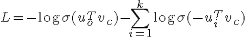

## Extra materialx
- [rnoxy nn intyo course](https://github.com/rnoxy/nn-intro-course/tree/main)

## Slajdy Justin Johnson
- [598_WI2022_lecture15.pdf](https://skos.ii.uni.wroc.pl/pluginfile.php/77148/mod_resource/content/2/598_WI2022_lecture15.pdf)

## Slajdy cs224n
- [https://web.stanford.edu/class/cs224n/slides/](https://web.stanford.edu/class/cs224n/slides/)

## FCN
- [Fully Convolutional Networks for Semantic Segmentation](https://arxiv.org/abs/1411.4038)
## UNet
- [U-Net: Convolutional Networks for Biomedical Image Segmentation](https://arxiv.org/abs/1505.04597)

## Extra resources
- [U-Nets for dummies in Pytorch & Tensorflow](https://medium.com/@chewryan0/u-nets-for-dummies-pytorch-tensorflow-dddcdb8a2759)
- [The Importance of Skip Connections in Biomedical Image Segmentation](https://arxiv.org/pdf/1608.04117)

## Loss Function in Negative Sampling
Given:

- A **center word** w_c
A **true context word** w_o
k **negative samples**: words not in the context (denoted as w_1, ..., w_k)
Word vectors:
- v_c = embedding of the center word (from input matrix)
- u_o = embedding of the context word (from output matrix)
- u_i = embeddings of negative samples

The Negative Sampling Loss:  

## Unsupservised learning with autoencoders
- Autoencoders are a type of neural network used for unsupervised learning
- They are used to learn efficient representations of data
- They are trained to learn the identity function
- They consist of two parts:
- An encoder that maps the input to a hidden representation
- A decoder that maps the hidden representation back to the input
- The hidden representation is a compressed version of the input
- The network is trained to minimize the difference between the input and the output
- The network is trained using back propagation
- The network can be used for:
- Dimensionality reduction
- Feature extraction
- Data denoising
- Data generation
## Additional resources
- Context encoders: Feature learning by inpainting, Pathak et al., 2016, https://arxiv.org/abs/1604.07379
- Segnet: A deep convolutional encoder-decoder architecture for image segmentation, Badrinarayanan et al., 2017, https://arxiv.org/abs/1511.00561

