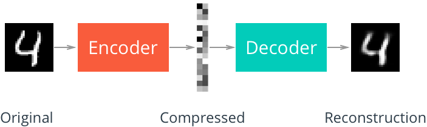
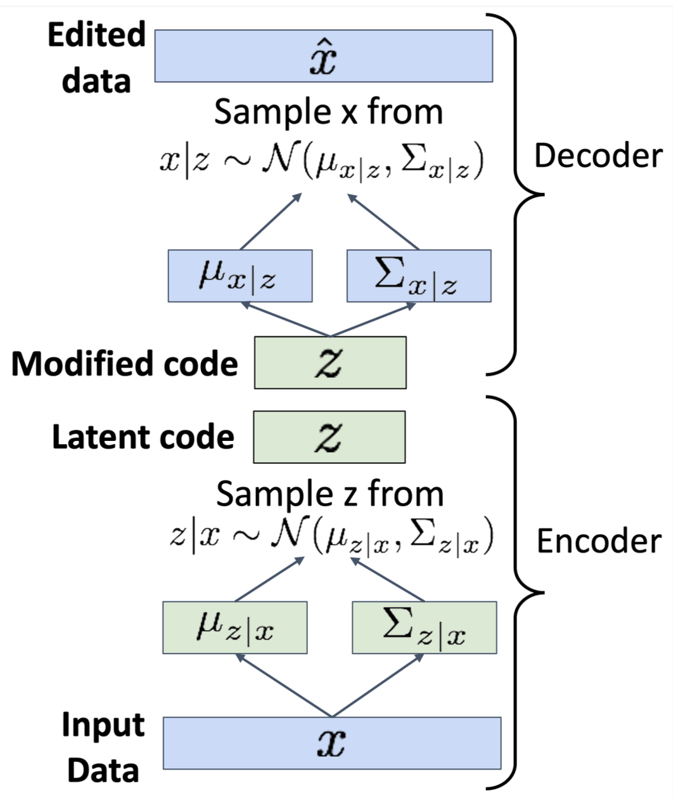
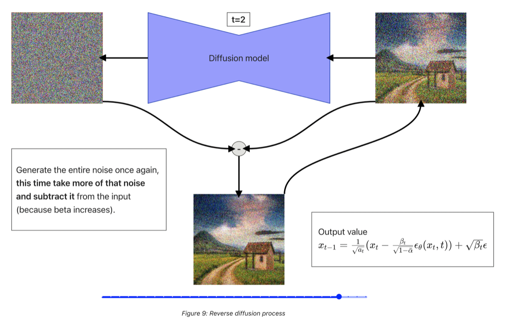
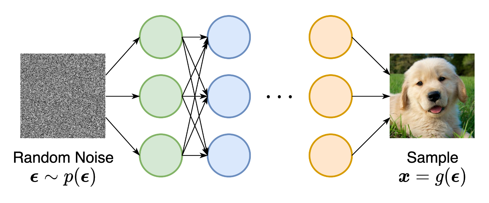

## Extra materialx
- [rnoxy nn intyo course](https://github.com/rnoxy/nn-intro-course/tree/main)

## Slajdy Justin Johnson
- [598_WI2022_lecture15.pdf](https://skos.ii.uni.wroc.pl/pluginfile.php/77148/mod_resource/content/2/598_WI2022_lecture15.pdf)

## Slajdy cs224n
- [https://web.stanford.edu/class/cs224n/slides/](https://web.stanford.edu/class/cs224n/slides/)

## FCN
- [Fully Convolutional Networks for Semantic Segmentation](https://arxiv.org/abs/1411.4038)
## UNet
- [U-Net: Convolutional Networks for Biomedical Image Segmentation](https://arxiv.org/abs/1505.04597)


## Extra resources
- [U-Nets for dummies in Pytorch & Tensorflow](https://medium.com/@chewryan0/u-nets-for-dummies-pytorch-tensorflow-dddcdb8a2759)
- [The Importance of Skip Connections in Biomedical Image Segmentation](https://arxiv.org/pdf/1608.04117)


## Loss Function in Negative Sampling
Given:

- A **center word** w_c
A **true context word** w_o
k **negative samples**: words not in the context (denoted as w_1, ..., w_k)
Word vectors:
- v_c = embedding of the center word (from input matrix)
- u_o = embedding of the context word (from output matrix)
- u_i = embeddings of negative samples

The Negative Sampling Loss:  




## Unsupservised learning with autoencoders
- Autoencoders are a type of neural network used for unsupervised learning
- They are used to learn efficient representations of data
- They are trained to learn the identity function
- They consist of two parts:
- An encoder that maps the input to a hidden representation
- A decoder that maps the hidden representation back to the input
- The hidden representation is a compressed version of the input
- The network is trained to minimize the difference between the input and the output
- The network is trained using back propagation
- The network can be used for:
- Dimensionality reduction
- Feature extraction
- Data denoising
- Data generation
## Additional resources
- Context encoders: Feature learning by inpainting, Pathak et al., 2016, https://arxiv.org/abs/1604.07379
- Segnet: A deep convolutional encoder-decoder architecture for image segmentation, Badrinarayanan et al., 2017, https://arxiv.org/abs/1511.00561


## Variational Autoencoders

### References
- Weng, Lilian, From Autoencoder to Beta-VAE, https://lilianweng.github.io/posts/2018-08-12-vae/
### Implementation
- Konstantin Sofeikov, Implementing Variational Autoencoders from scratch, https://medium.com/@sofeikov/implementing-variational-autoencoders-from-scratch-533782d8eb95

But **do not follow** this `loss_function`  
```py
# Define a loss function that combines binary cross-entropy and Kullback-Leibler divergence

def loss_function(recon_x, x, mu, logvar):

    # Compute the binary cross-entropy loss between

    #  ... the reconstructed output and the input data

    BCE = F.binary_cross_entropy(recon_x, x.view(-1, 784), reduction="sum")

    # Compute the Kullback-Leibler divergence between

    # ... the learned latent variable distribution and a standard Gaussian distribution

    KLD = -0.5 * torch.sum(1 + logvar - mu.pow(2) - logvar.exp())

    # Combine the two losses by adding them together and return the result

    return BCE + KLD
```

- see [William Falcon, Variational Autoencoder Demystified With PyTorch Implementation](https://towardsdatascience.com/variational-autoencoder-demystified-with-pytorch-implementation-3a06bee395ed) for better understaning
    - [implementation](https://github.com/williamFalcon/pytorch-lightning-vae/blob/main/vae.py)

## Additional materials:
- Kulkarni et al, “Deep Convolutional Inverse Graphics Networks”, NeurIPS 2014, https://arxiv.org/abs/1503.03167


## Conditional VAEs
- https://medium.com/data-science/understanding-conditional-variational-autoencoders-cd62b4f57bf8
- https://ijdykeman.github.io/ml/2016/12/21/cvae.html
- https://medium.com/@sofeikov/implementing-conditional-variational-auto-encoders-cvae-from-scratch-29fcbb8cb08f


### Topics
- Conditional Generative Models
- Diffusion Models

### Materials
- Mirza, Mehdi, and Simon Osindero. "[Conditional generative adversarial nets.](https://arxiv.org/abs/1411.1784)"
- Brock, Andrew, et al. "[Large scale GAN training for high fidelity natural image synthesis.](https://arxiv.org/abs/1809.11096)"
- Image-to-Image [Translation with Conditional Adversarial Networks](https://arxiv.org/abs/1611.07004), https://phillipi.github.io/pix2pix/
- Zhu, Jun-Yan, et al. "[Unpaired image-to-image translation using cycle-consistent adversarial networks.](https://arxiv.org/abs/1703.10593)"
- Radford, Alec, et al. "[Unsupervised representation learning with deep convolutional generative adversarial networks.](https://arxiv.org/abs/1511.06434)"
- Arjovsky, Martin, Soumith Chintala, and Léon Bottou. "[Wasserstein GAN.](https://arxiv.org/abs/1701.07875)"
- [WGAN, wikipedia](https://en.wikipedia.org/wiki/Wasserstein_metric), https://en.wikipedia.org/wiki/Wasserstein_GAN
- [Demystified Wasserstein GANs (WGAN)](https://towardsdatascience.com/demystified-wasserstein-gans-wgan-f835324899f4)
- Weng, Lilian. (Aug 2017), [From GAN to WGAN](https://lilianweng.github.io/posts/2017-08-20-gan/)
- [Diffusion Models](https://arxiv.org/abs/2105.05233)
- Kemal Erdem, (Nov 2023). "[Step by Step visual introduction to Diffusion Models.](https://erdem.pl/2023/11/step-by-step-visual-introduction-to-diffusion-models)"
- Weng, Lilian. (Jul 2021). "[What are diffusion models?](https://lilianweng.github.io/lil-log/2021/07/21/diffusion-models.html)"





## Extra materials: GAN + Flow based Models


### Topics:
- Generative Adversarial Networks
- Normalizing Flow models; we analyse the model RealNVP
### Materials
- Ian J. Goodfellow, et. al., Generative Adversarial Networks, https://arxiv.org/abs/1406.2661
- Michał Stypułkowski, Maciej Zięba, Maciej Zamorski, Exploration of flow-based models, [slides](https://docs.google.com/presentation/d/1sr9hCHZy1B_KQoFVbTQ7EalzvhTJlF5YjyDMka_pgbg/edit#slide=id.g31393885d5_0_94); see the part about RealNVP