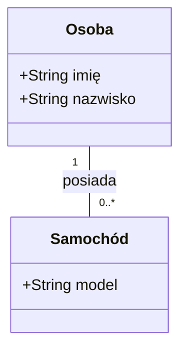
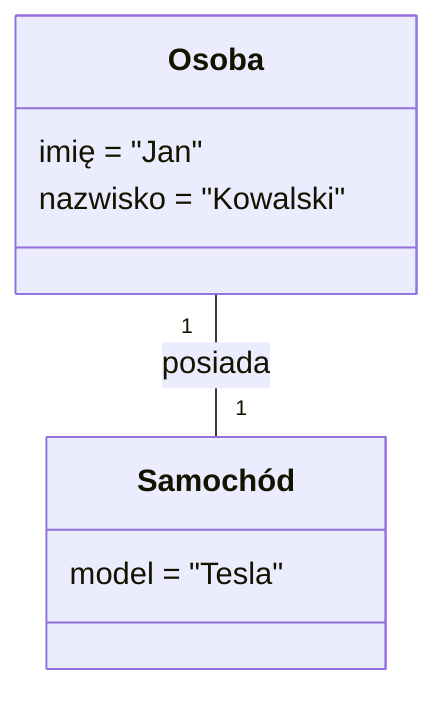
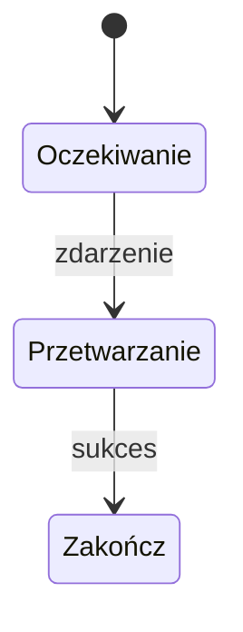
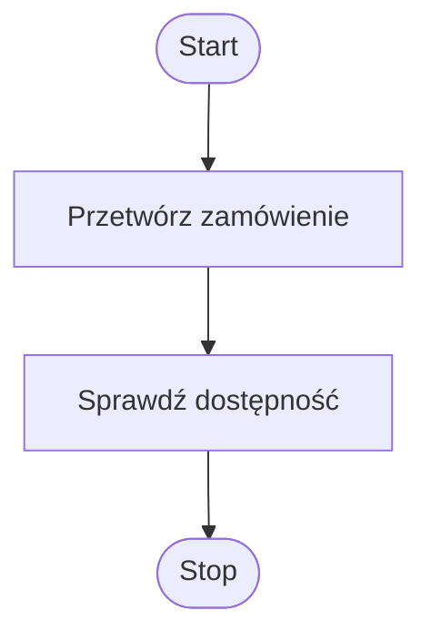
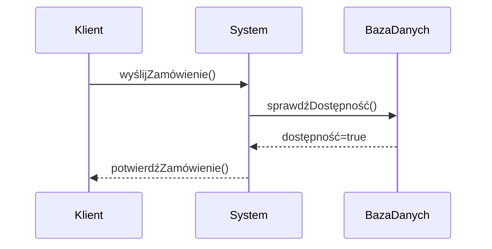
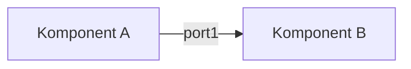

[(back)](../)

- [Wykład 1 - Unified Process](#wykład-1---unified-process)
  - [1. Unified Process (UP)](#1-unified-process-up)
  - [2. Faza Rozpoczęcia (Business Modelling)](#2-faza-rozpoczęcia-business-modelling)
  - [3. Zbieranie Wymagań (Requirements)](#3-zbieranie-wymagań-requirements)
    - [3.1 FURPS+](#31-furps)
    - [3.2 S.M.A.R.T.](#32-smart)
  - [4. Przypadki Użycia (Use Cases)](#4-przypadki-użycia-use-cases)
    - [Przykład w Gherkin (Cucumber):](#przykład-w-gherkin-cucumber)
- [Wykład 2 - UML](#wykład-2---uml)
  - [1. Wprowadzenie do UML](#1-wprowadzenie-do-uml)
  - [2. Diagramy Klas (Class Diagram)](#2-diagramy-klas-class-diagram)
    - [2.1 Hierarchia modeli](#21-hierarchia-modeli)
    - [2.2 Strategie mapowania dziedziczenia na tabele](#22-strategie-mapowania-dziedziczenia-na-tabele)
    - [2.3 Kluczowe pojęcia](#23-kluczowe-pojęcia)
      - [Przykład diagramu klas (Mermaid):](#przykład-diagramu-klas-mermaid)
  - [3. Diagramy Obiektów (Object Diagram)](#3-diagramy-obiektów-object-diagram)
      - [Przykład (Mermaid):](#przykład-mermaid)
  - [4. Diagramy Stanów (State Diagram)](#4-diagramy-stanów-state-diagram)
      - [Przykład (Mermaid):](#przykład-mermaid-1)
  - [5. Diagramy Czynności (Activity Diagram)](#5-diagramy-czynności-activity-diagram)
      - [Przykład (Mermaid):](#przykład-mermaid-2)
  - [6. Diagramy Sekwencji (Sequence Diagram)](#6-diagramy-sekwencji-sequence-diagram)
      - [Przykład (Mermaid):](#przykład-mermaid-3)
  - [7. Diagramy Komponentów (Component Diagram)](#7-diagramy-komponentów-component-diagram)
      - [Przykład (Mermaid):](#przykład-mermaid-4)
  - [8. Diagrams-as-Code](#8-diagrams-as-code)
- [Wykład 3 - SOLID GRASP](#wykład-3---solid-grasp)
  - [1. Responsibility-Driven Development (RDD)](#1-responsibility-driven-development-rdd)
  - [2. GRASP (General Responsibility Assignment Software Patterns)](#2-grasp-general-responsibility-assignment-software-patterns)
  - [3. SOLID – Pięć kluczowych zasad obiektowych](#3-solid--pięć-kluczowych-zasad-obiektowych)
  - [4. Inne zasady](#4-inne-zasady)
- [Wykład 4: Wzorce Projektowe (Podstawowe i Kreacyjne)](#wykład-4-wzorce-projektowe-podstawowe-i-kreacyjne)
  - [1. Wzorce Podstawowe](#1-wzorce-podstawowe)
    - [1.1 Interfejs vs Klasa Abstrakcyjna](#11-interfejs-vs-klasa-abstrakcyjna)
    - [1.2 Delegacja (Preferuj Delegację nad Dziedziczeniem)](#12-delegacja-preferuj-delegację-nad-dziedziczeniem)
  - [2. Wzorce Kreacyjne](#2-wzorce-kreacyjne)
    - [2.1 Singleton](#21-singleton)
    - [2.2 Monostate](#22-monostate)
    - [2.3 Fabryka (Delegate Factory)](#23-fabryka-delegate-factory)
    - [2.4 Factory Method](#24-factory-method)
    - [2.5 Abstract Factory](#25-abstract-factory)
    - [2.6 Prototype](#26-prototype)
    - [2.7 Object Pool](#27-object-pool)
    - [2.8 Builder](#28-builder)
- [Wykład 5: Wzorce Strukturalne](#wykład-5-wzorce-strukturalne)
  - [1. Fasada (Facade)](#1-fasada-facade)
  - [2. Interfejs Tylko-do-Odczytu (Read-only Interface)](#2-interfejs-tylko-do-odczytu-read-only-interface)
  - [3. Pyłek (Flyweight)](#3-pyłek-flyweight)
  - [4. Dekorator (Decorator)](#4-dekorator-decorator)
  - [5. Pełnomocnik (Proxy)](#5-pełnomocnik-proxy)
  - [6. Adapter](#6-adapter)
  - [7. Most (Bridge)](#7-most-bridge)
- [Notatka - Wzorce czynnościowe (Wykład 6)](#notatka---wzorce-czynnościowe-wykład-6)
  - [📌 1. Null Object](#-1-null-object)
  - [🔄 2. Iterator](#-2-iterator)
  - [🌳 3. Composite](#-3-composite)
  - [🧩 4. Interpreter (Little Language)](#-4-interpreter-little-language)
  - [👣 5. Visitor](#-5-visitor)
    - [🔧 Implementacje:](#-implementacje)
    - [🧪 Przykład z .NET:](#-przykład-z-net)
  - [⚙️ Double Dispatch](#️-double-dispatch)
    - [Kluczowe wnioski](#kluczowe-wnioski)
- [Notatka – Wzorce czynnościowe 2 (Wykład 7)](#notatka--wzorce-czynnościowe-2-wykład-7)
  - [🤝 1. Mediator](#-1-mediator)
  - [🔍 2. Observer](#-2-observer)
  - [📡 3. Event Aggregator](#-3-event-aggregator)
  - [⏪ 4. Memento](#-4-memento)
    - [🔄 Rozszerzenie: Undo/Redo](#-rozszerzenie-undoredo)
  - [Kluczowe wnioski](#kluczowe-wnioski-1)
- [Notatka - Wzorce czynnościowe 3 (Wykład 8)](#notatka---wzorce-czynnościowe-3-wykład-8)
  - [⛓️ 1. Chain of Responsibility](#️-1-chain-of-responsibility)
  - [📜 2. Command](#-2-command)
  - [📐 3. Template Method](#-3-template-method)
    - [3.2 Operacje](#32-operacje)
  - [Kluczowe wnioski](#kluczowe-wnioski-2)
- [Notatka - Inversion of Control / Dependency Injection (Wykład 10)](#notatka---inversion-of-control--dependency-injection-wykład-10)
  - [🔄 1. IoC vs DI](#-1-ioc-vs-di)
  - [⚖️ 2. Twarde vs miękkie zależności](#️-2-twarde-vs-miękkie-zależności)
  - [🧩 3. Kluczowe techniki DI (na przykładzie Unity)](#-3-kluczowe-techniki-di-na-przykładzie-unity)
    - [3.1 Składanie obiektów](#31-składanie-obiektów)
    - [3.2 Zarządzanie cyklem życia](#32-zarządzanie-cyklem-życia)
    - [3.3 Konfiguracja](#33-konfiguracja)
    - [3.4 Przechwytywanie (AOP)](#34-przechwytywanie-aop)
- [Notatka - Repository i Unit of Work (Wykład 11)](#notatka---repository-i-unit-of-work-wykład-11)
  - [🗄️ 1. Repository Pattern](#️-1-repository-pattern)
  - [🔗 2. Unit of Work (UoW)](#-2-unit-of-work-uow)
  - [🧩 3. Kluczowe problemy i rozwiązania](#-3-kluczowe-problemy-i-rozwiązania)
    - [3.1 Abstrakcja modeli](#31-abstrakcja-modeli)
    - [3.2 Architektura projektu](#32-architektura-projektu)
    - [3.3 Local Factory](#33-local-factory)
      - [4.1 Konfiguracja w Composition Root](#41-konfiguracja-w-composition-root)
      - [4.2 Przykład użycia w kliencie](#42-przykład-użycia-w-kliencie)
      - [4.3 Implementacja dla Linq2SQL](#43-implementacja-dla-linq2sql)
  - [⚠️ 5. Ostrzeżenia](#️-5-ostrzeżenia)
    - [Generic vs Concrete Repository](#generic-vs-concrete-repository)
    - [Uwaga na IQueryable](#uwaga-na-iqueryable)
  - [Kluczowe wnioski](#kluczowe-wnioski-3)
- [Notatka - Wzorce architektury aplikacji (Wykład 12)](#notatka---wzorce-architektury-aplikacji-wykład-12)
  - [🏗️ 1. Architektura aplikacji](#️-1-architektura-aplikacji)
    - [1.1 Stos aplikacyjny](#11-stos-aplikacyjny)
    - [1.2 Typy architektur](#12-typy-architektur)
    - [1.3 Kryteria oceny](#13-kryteria-oceny)
  - [🖥️ 2. Wzorce warstwy UI](#️-2-wzorce-warstwy-ui)
    - [2.1 Model-View-Controller (MVC)](#21-model-view-controller-mvc)
    - [2.2 Model-View-Presenter (MVP)](#22-model-view-presenter-mvp)
    - [2.3 Model-View-ViewModel (MVVM)](#23-model-view-viewmodel-mvvm)
  - [🔷 3. Architektura Heksagonalna](#-3-architektura-heksagonalna)
    - [3.1 Porty i adaptery](#31-porty-i-adaptery)
    - [3.2 Zasady](#32-zasady)
  - [🛠️ 4. Praktyczne zastosowania](#️-4-praktyczne-zastosowania)
    - [4.1 MVP w aplikacji desktopowej](#41-mvp-w-aplikacji-desktopowej)
    - [4.2 Architektura heksagonalna w web](#42-architektura-heksagonalna-w-web)
  - [Kluczowe wnioski](#kluczowe-wnioski-4)

# Wykład 1 - Unified Process
<!-- generated by aiaiai -->
## 1. Unified Process (UP)
- **Definicja**: Rama organizacji procesu wytwarzania oprogramowania z wyodrębnionymi fazami:  
  _inicjowanie, projektowanie, implementacja, testowanie, wdrażanie_.  
- **Iteracyjny rozwój**: Dostarczanie wartości biznesowej w iteracjach ograniczonych czasowo.  
- **Fazy UP**:  
  | Inicjowanie (Inception) | Rozwinięcie (Elaboration) | Konstrukcja (Construction) | Przejście (Transition) |  
  |-------------------------|----------------------------|-----------------------------|-------------------------|  
  | Modelowanie biznesowe   | E1, E2                     | C1-C4                       | T1, T2                 |  

## 2. Faza Rozpoczęcia (Business Modelling)
- **Cel**: Określenie zakresu, wizji i uwarunkowań biznesowych.  
- **Typowe artefakty**:  
  - Wizja i analiza biznesowa  
  - Słowniczek terminów  
  - Prototyp (weryfikacja rozwiązań technicznych)  
  - Plan pierwszej iteracji  
  - Specyfikacja dodatkowa  
  - Plan zarządzania ryzykiem  

## 3. Zbieranie Wymagań (Requirements)
### 3.1 FURPS+  
- **Obszary wymagań**:  
  | Kategoria          | Opis                                  |  
  |--------------------|---------------------------------------|  
  | Functional         | Funkcjonalności, bezpieczeństwo       |  
  | Usability          | Ergonomia, dokumentacja               |  
  | Reliability        | Odporność na awarie                   |  
  | Performance        | Wydajność, dostępność                 |  
  | Supportability     | Utrzymanie, konfiguracja              |  
  | Design             | Ograniczenia projektowe               |  
  | Implementation     | Narzędzia, standardy                  |  

- **Typowe problemy**:  
  1. Brak priorytetyzacji wymagań.  
  2. Wymagania niemierzalne lub niejasne.  
  3. Przykłady wymagań prawnych: RODO, WCAG 2.0.  

### 3.2 S.M.A.R.T.  
- **Kryteria oceny wymagań**:  
  - **S**zczegółowy  
  - **M**ierzalny  
  - **A**trakcyjny (osiągalny)  
  - **R**ealistyczny  
  - **T**erminowy  

**Przykład wymagania SMART**:  
> Średni czas odpowiedzi przy transakcjach bez zapisu nie może przekraczać **5 sekund**.  

---

## 4. Przypadki Użycia (Use Cases)
- **Definicja**: Sekwencja kroków opisująca interakcję między aktorem a systemem.  
- **Rodzaje dokumentacji**:  
  - **Nieformalna (brief)**: Krótki opis głównego scenariusza sukcesu.  
  - **Pełna (fully dressed)**: Wszystkie kroki, warianty, warunki początkowe/końcowe.  

### Przykład w Gherkin (Cucumber):  
```gherkin
Feature: Zarządzanie kontrahentami  
  Scenario: Dodawanie kontrahenta  
    Given: Jestem zalogowany jako ADMIN  
    When: Dodaję kontrahenta z poprawnymi danymi  
    Then: System rejestruje kontrahenta  
```


# Wykład 2 - UML

<!-- again - aiaiai -->

## 1. Wprowadzenie do UML

- **Rodzaje diagramów**:  
  - **Strukturalne** (np. diagram klas, komponentów) – dokumentują statyczne elementy systemu.  
  - **Behawioralne** (np. diagram sekwencji, stanów) – dokumentują dynamikę systemu.  
- **Narzędzia**:  
  - draw.io, yuml.me (lekkie), Enterprise Architect, Visual Paradigm (zaawansowane).

---

## 2. Diagramy Klas (Class Diagram)

### 2.1 Hierarchia modeli

| Typ modelu      | Opis                                                        | Przykłady elementów                                 |
|-----------------|-------------------------------------------------------------|-----------------------------------------------------|
| **Pojęciowy**   | Reprezentuje pojęcia i relacje w dziedzinie.                | Pojęcia, asocjacje (bez metod).                     |
| **Obiektowy**   | Refaktoryzacja modelu pojęciowego na klasy obiektowe.       | Klasy, metody, relacje (agregacja, dziedziczenie).  |
| **Relacyjny**   | Mapowanie klas na tabele w bazie danych.                    | Tabele, klucze obce, strategie mapowania dziedziczenia. |

### 2.2 Strategie mapowania dziedziczenia na tabele

| Strategia               | Opis                                                                 | Przykład                                         |
|-------------------------|----------------------------------------------------------------------|--------------------------------------------------|
| **Table per concrete**  | Każda klasa potomna ma własną tabelę.                               | `Footballer`, `Cricketer` – osobne tabele.       |
| **Table per hierarchy** | Wszystkie klasy w jednej tabeli z kolumną dyskryminującą.           | Kolumna `type` w tabeli `Players`.               |
| **Table per type**      | Tabela dla klasy bazowej + tabele dla klas potomnych z relacjami.   | Tabela `Players` + `Footballers`, `Cricketers`.  |

### 2.3 Kluczowe pojęcia

- **Agregacja vs kompozycja**:  
  - **Agregacja** (pusta kreska): Część może istnieć niezależnie od całości.  
  - **Kompozycja** (wypełniony romb): Część jest ściśle powiązana z całością (np. cykl życia).
- **Liczebność**: `1`, `*`, `0..1`, `1..*`.
- **Klasa asocjacyjna**: Używana do modelowania relacji wiele-wiele z dodatkowymi atrybutami.

#### Przykład diagramu klas (Mermaid):



---

## 3. Diagramy Obiektów (Object Diagram)

- **Cel**: Migawka stanu systemu w konkretnym momencie.
- **Elementy**: Instancje klas (obiekty) z wartościami atrybutów i powiązaniami.

#### Przykład (Mermaid):



---

## 4. Diagramy Stanów (State Diagram)

- **Cel**: Modelowanie maszyn stanowych.
- **Elementy**:
  - **Stany**: Bloczki (np. Oczekiwanie, Przetwarzanie).
  - **Przejścia**: Strzałki z warunkami/akcjami (np. `[zatwierdzone] -> Zakończ`).

#### Przykład (Mermaid):



---

## 5. Diagramy Czynności (Activity Diagram)

- **Cel**: Dokumentacja procesów biznesowych lub algorytmów.
- **Elementy**:
  - **Czynności**: Długotrwałe kroki (np. Przetwórz zamówienie).
  - **Akcje**: Krótkie operacje (np. Sprawdź dostępność).
  - **Partycje**: Podział na role (np. Klient, System).
- **Różnica od diagramu sekwencji**: Brak jednoznacznej osi czasu – skupia się na przepływie kroków.

#### Przykład (Mermaid):



---

## 6. Diagramy Sekwencji (Sequence Diagram)

- **Cel**: Pokazanie interakcji między obiektami w czasie.
- **Elementy**:
  - **Linie życia**: Reprezentują obiekty (np. `:Klient`, `:System`).
  - **Komunikaty**: Strzałki z opisem (np. `wyślijZamówienie()`).
  - **Ramki**: Obszary warunkowe (np. `loop`, `alt`).

#### Przykład (Mermaid):



---

## 7. Diagramy Komponentów (Component Diagram)

- **Cel**: Modelowanie struktury systemu z komponentami i ich zależnościami.
- **Elementy**:
  - **Komponenty**: Moduły (np. Serwer, Baza Danych).
  - **Porty**: Punkty interakcji (np. `dostawca_danych`, `odbiorca_danych`).

#### Przykład (Mermaid):



---

## 8. Diagrams-as-Code

- **Narzędzia**: PlantUML, Mermaid.js – generują diagramy z tekstu.
- **Zalety**: Łatwa integracja z repozytoriami kodu.
- **Przykład (Mermaid)**:

  ```mermaid
  classDiagram
    class Samochod
    class Kierownik
    Samochod "1" -- "1..*" Kierownik : zarządza
  ```


# Wykład 3 - SOLID GRASP
## 1. Responsibility-Driven Development (RDD)
Projektowanie obiektowe polega na przypisaniu odpowiedzialności klasom i określeniu ich relacji. Skrajności:
- **Jedna ogromna klasa** – wszystko w jednej strukturze.
- **Bardzo dużo klas, każda z jedną metodą** – nadmierna fragmentacja.

## 2. GRASP (General Responsibility Assignment Software Patterns)
Zbiór dobrych praktyk dotyczących podziału odpowiedzialności:  
1. **Creator** – klasa B tworzy instancje A, jeśli je zawiera, przechowuje lub używa.  
2. **Information Expert** – klasa posiadająca niezbędne dane powinna realizować operację.  
3. **Controller** – odbiera żądania systemowe (np. `Handler`, `Controller`).  
4. **Low Coupling** – minimalizacja powiązań między klasami.  
5. **High Cohesion** – każda klasa powinna mieć jedno, dobrze określone zadanie.  
6. **Polymorphism** – eliminacja instrukcji `if` zależnych od typu poprzez polimorfizm.  
7. **Indirection** – dodatkowa warstwa pośrednicząca dla zmniejszenia sprzężenia.  
8. **Pure Fabrication** – sztuczne klasy pomocnicze poprawiające strukturę (np. `Repository`).  
9. **Protected Variations (Law of Demeter)** – interfejsy stabilizujące punkty zmienności.

## 3. SOLID – Pięć kluczowych zasad obiektowych
1. **SRP (Single Responsibility Principle)** – klasa powinna mieć jedną odpowiedzialność.  
2. **OCP (Open-Closed Principle)** – kod powinien być otwarty na rozszerzenia, ale zamknięty na modyfikacje.  
3. **LSP (Liskov Substitution Principle)** – obiekty klasy bazowej powinny być zastępowalne przez klasy pochodne bez zmiany zachowania.  
4. **ISP (Interface Segregation Principle)** – interfejsy powinny być podzielone na mniejsze, aby klasy nie implementowały nieużywanych metod.  
5. **DIP (Dependency Inversion Principle)** – moduły wyższego poziomu powinny zależeć od abstrakcji, a nie implementacji.

## 4. Inne zasady
- **DRY (Don’t Repeat Yourself)** – unikanie powielania kodu.  
- **LoD (Law of Demeter)** – ograniczenie wiedzy klasy o innych klasach.  
- **DMMT (Don’t Make Me Think)** – przejrzystość kodu.  
- **DOP (Don’t Optimize Prematurely)** – unikanie przedwczesnej optymalizacji.


# Wykład 4: Wzorce Projektowe (Podstawowe i Kreacyjne)

## 1. Wzorce Podstawowe

### 1.1 Interfejs vs Klasa Abstrakcyjna
- **Interfejs**:
  - Tylko deklaracje metod (brak implementacji)
  - Klasa może implementować wiele interfejsów
- **Klasa abstrakcyjna**:
  - Może zawierać częściową implementację
  - Klasa dziedziczy tylko z jednej klasy abstrakcyjnej
- **Przykład**: `IEnumerable` (interfejs) vs `Stream` (klasa abstrakcyjna)

### 1.2 Delegacja (Preferuj Delegację nad Dziedziczeniem)
- **Zalety**:
  - Dynamiczna zmiana zachowania (wymiana delegata w runtime)
  - Unika problemów dziedziczenia (np. krucha klasa bazowa)
- **Wady**:
  - Więcej kodu (ręczne przekazywanie wywołań)
  - Brak wsparcia składniowego w językach jak C#
- **Zasada**: "Faworyzuj kompozycję nad dziedziczeniem"

---

## 2. Wzorce Kreacyjne

### 2.1 Singleton
- **Cel**: Jedna instancja klasy, globalny dostęp
- **Implementacja**:
  ```csharp
  public class Singleton {
      private static Singleton _instance;
      private Singleton() {}
      public static Singleton Instance => _instance ??= new Singleton();
  }
  ```

- **Rozszerzenia**: Leniwa inicjalizacja, kontrola czasu życia (np. za pomocą DI)

### 2.2 Monostate
Cel: Wiele instancji, ale współdzielony stan (np. statyczne pola)

Różnica od Singleton: Nie ogranicza liczby instancji, tylko stan jest współdzielony

### 2.3 Fabryka (Delegate Factory)
Cel: Enkapsulacja logiki tworzenia obiektów

Zalety:

Spełnia zasadę Open/Closed (łatwe dodawanie nowych typów)

Kontrola cyklu życia obiektów (np. zwracanie istniejących instancji)

Przykład:

```csharp
public interface IProduct {}
public class ProductA : IProduct {}

public class ProductFactory {
    public IProduct CreateProduct() => new ProductA();
}
```

### 2.4 Factory Method
Cel: Delegowanie tworzenia obiektów do podklas

Struktura:

```csharp
public abstract class Creator {
    public abstract IProduct FactoryMethod();
    public void Operation() => FactoryMethod().DoSomething();
}

public class ConcreteCreator : Creator {
    public override IProduct FactoryMethod() => new ConcreteProduct();
}
```

### 2.5 Abstract Factory
Cel: Tworzenie rodzin powiązanych obiektów (np. elementy GUI dla Windows/Mac)

Struktura:

```csharp
public interface IAbstractFactory {
    IButton CreateButton();
    ITextBox CreateTextBox();
}

public class WindowsFactory : IAbstractFactory { ... }
public class MacFactory : IAbstractFactory { ... }
```

### 2.6 Prototype

Cel: Tworzenie obiektów przez klonowanie prototypów

Implementacja: Interfejs ICloneable lub metoda Clone()

Zastosowanie: Gdy tworzenie obiektu jest kosztowne (np. głęboka kopia)

### 2.7 Object Pool
Cel: Reużywanie kosztownych obiektów (np. połączenia bazodanowe)

Implementacja:

```csharp
public class ObjectPool {
    private readonly Queue<Reusable> _pool = new();
    
    public Reusable Acquire() {
        return _pool.Count > 0 ? _pool.Dequeue() : new Reusable();
    }
    
    public void Release(Reusable obj) {
        _pool.Enqueue(obj);
    }
}
```

Testy: Walidacja rozmiaru puli, pobieranie/zwracanie obiektów

### 2.8 Builder
Cel: Konstrukcja złożonych obiektów krok po kroku

Elementy:

Builder: Interfejs z metodami budowania części

ConcreteBuilder: Implementacja budowniczego

Director: Koordynuje proces budowy

Product: Wynikowy obiekt

Przykład: Fluent API (np. StringBuilder)

```csharp
var builder = new HtmlBuilder();
builder.AddTag("div").AddClass("container").SetContent("Hello");
```
# Wykład 5: Wzorce Strukturalne

## 1. Fasada (Facade)
- **Cel**: Uproszczony interfejs dla złożonego podsystemu  
- **Zastosowanie**: Ukrywa złożoność systemu, udostępniając klientowi jeden uproszczony punkt dostępu  
- **Przykład**:  
    ```csharp
    public class SmtpFacade {
            public void Send(string From, string To, string Subject, 
                                            string Body, Stream Attachment, string AttachmentMimeType) {
                    // Kompleksowa logika wysyłki maila ukryta za fasadą
            }
    }
    ```

## 2. Interfejs Tylko-do-Odczytu (Read-only Interface)
- **Cel**: Ograniczenie dostępu do modyfikacji stanu obiektu  
- **Zastosowanie**: Bezpieczne udostępnianie obiektów wielu klientom  
- **Implementacja**:  
    ```
    [ReadOnlyInterface] ---> [Pełny interfejs z get/set]
                    ↑                      ↑
    [Klient tylko do odczytu]  [Klient z uprawnieniami do zapisu]
    ```
- **Przykład**: `ReadOnlyCollection` w .NET (`AsReadOnly()`)

## 3. Pyłek (Flyweight)
- **Cel**: Efektywne zarządzanie wieloma drobnymi obiektami  
- **Kluczowe koncepcje**:  
    - Stan wewnętrzny (intrinsic): Współdzielony (np. kolor bierki)  
    - Stan zewnętrzny (extrinsic): Unikalny (np. pozycja X/Y)  
- **Przykład (Plansza do warcabów)**:  
    ```csharp
    public class Board {
            private Dictionary<PieceColor, Piece> _pieces = new();
            
            public Piece GetPiece(int x, int y) {
                    PieceColor key = (x + y) % 2 == 0 ? PieceColor.White : PieceColor.Black;
                    if (!_pieces.ContainsKey(key)) 
                            _pieces.Add(key, new Piece { Color = key });
                    return _pieces[key];
            }
    }
    ```

## 4. Dekorator (Decorator)
- **Cel**: Dynamiczne rozszerzanie funkcjonalności obiektów  
- **Zastosowanie**: Alternatywa dla dziedziczenia, szczególnie w strumieniach danych  
- **Przykład (Dodatki do napojów)**:  
    ```csharp
    public class SugarDecorator : IDrink {
            private IDrink _drink;
            public SugarDecorator(IDrink drink) => _drink = drink;
            
            public decimal Cost => _drink.Cost + 1;
            public string Name => _drink.Name + " with sugar";
    }
    // Użycie:
    IDrink tea = new SugarDecorator(new SugarDecorator(new Tea()));
    ```

## 5. Pełnomocnik (Proxy)
- **Typy**:  
    - Wirtualny: Tworzy obiekt na żądanie (`Lazy<T>`)  
    - Ochronny: Kontrola dostępu  
    - Zdalny: Reprezentacja obiektu w innej domenie  
    - Logujący: Rejestracja dostępu  
    - Circuit Breaker: Specjalny typ proxy do obsługi błędów:  
        ```
        [Zamknięty] → (błąd) → [Otwarty] → (timeout) → [Półotwarty]
                ↑______________________(sukces)___________________↓
        ```
        Biblioteki: Polly (.NET), resilience4j (Java)

## 6. Adapter
- **Cel**: Uzgadnianie niezgodnych interfejsów  
- **Struktura**:  
    ```
    [Klient] → [Target] ← (adaptuje) ← [Adapter] → [Adaptee]
    ```
- **Zastosowanie**: Integracja starszych systemów z nowymi komponentami

## 7. Most (Bridge)
- **Cel**: Oddzielenie abstrakcji od implementacji  
- **Zastosowanie**: Niezależne rozwijanie hierarchii funkcjonalności  
- **Przykład (Rejestr osób)**:  
    ```csharp
    public abstract class AbstractPersonRegistry {
            public IMessenger messenger; // Implementacja wyniesiona
            public abstract void LoadPersons(); // Abstrakcja
            public void NotifyPersons() => /* ... używa messenger ... */
    }
    public interface IMessenger { void Notify(Person p); }
    ```

---

**Literatura:**
- Gamma i in. - Wzorce projektowe
- Martin i Martin - Zasady, wzorce i praktyki zwinnego wytwarzania...
- Freeman i in. - Head First Design Patterns
- OODesign.com


# Notatka - Wzorce czynnościowe (Wykład 6)

## 📌 1. Null Object
- **Cel**: Zastąpienie `null` bezpiecznym obiektem z pustą implementacją.
- **Zasada**: Klient zawsze otrzymuje obiekt implementujący kontrakt (nawet "pusty").
- **Praktyka**: Często używany z **Fabryką** – przy błędnych parametrach zwraca Null Object zamiast `null`.
- **Zaleta**: Eliminuje konieczność sprawdzania `if (obiekt == null)`.

---

## 🔄 2. Iterator
- **Cel**: Umożliwienie sekwencyjnego dostępu do elementów kolekcji **bez ujawniania jej struktury**.
- **Elementy**:
  - `Iterator`: Interfejs z metodami `getNext()`, `hasNext()`.
  - `Aggregate`: Interfejs do tworzenia iteratora (`CreateIterator()`).
- **Nowoczesne języki**: Wbudowany w Java (`Iterator<>`), C# (`IEnumerator<>`), obsługuje pętle `foreach`.

---

## 🌳 3. Composite
- **Cel**: Tworzenie hierarchii drzewiastych (obiekty + ich podskładniki).
- **Struktura**:
  - **Component** (abstrakcyjna klasa bazowa).
  - **Leaf**: Element bez dzieci.
  - **Composite**: Element z dziećmi (przechowuje listę `Component`).
- **Uwaga**: Stanowi bazę dla **Interpretera** i **Visitora**.

---

## 🧩 4. Interpreter (Little Language)
- **Cel**: Interpretacja gramatyki języka (np. wyrażeń matematycznych).
- **Elementy**:
  - `AbstractExpression`: Metoda `Interpret(Context)`.
  - `TerminalExpression`: Liść drzewa (np. stała, zmienna).
  - `NonTerminalExpression`: Węzeł (np. operacja binarna).
- **Kontekst**: Przechowuje stan (np. wartości zmiennych).
- **Przykład**: Drzewo wyrażenia `x + y` interpretowane z kontekstem `{x:1, y:2}`.

---

## 👣 5. Visitor
- **Cel**: Dodawanie **nowych operacji** do istniejącej hierarchii bez modyfikacji klas.
- **Problem rozwiązywany**: Unikanie dodawania wielu metod (np. `Print()`, `Evaluate()`) do każdej klasy w hierarchii.

### 🔧 Implementacje:
1. **Visitor z metodą `Accept`**:
   - Odpowiedzialność za **przejście po strukturze** leży w klasach `Element`.
   - Każdy element implementuje `Accept(Visitor v)`, który wywołuje `v.VisitX(this)`.
   - *Zaleta*: Visitor nie zna struktury wewnętrznej kompozytu.

2. **Visitor bez `Accept`**:
   - Odpowiedzialność za przejście po strukturze leży w **Visitorze**.
   - Visitor sam decyduje, jak przechodzić po obiektach (np. rekurencyjnie).
   - *Wada*: Ścisłe powiązanie ze strukturą kompozytu.

### 🧪 Przykład z .NET:
- `ExpressionVisitor`: Odwiedza drzewa wyrażeń LINQ.
```csharp
public class PrintVisitor : ExpressionVisitor {
    protected override Expression VisitBinary(BinaryExpression node) {
        Console.WriteLine($"{node.Left} {node.NodeType} {node.Right}");
        return base.VisitBinary(node);
    }
}
```


## ⚙️ Double Dispatch

**Mechanism:**  
Wybór metody zależy od dwóch typów (obiektu + visitora).

**Realizacja:**  
Poprzez `Accept` w obiekcie i `VisitX` w visitorze.

---

### Kluczowe wnioski

- Null Object zapobiega `NullReferenceException`.
- Iterator/Composite są podstawą struktur danych.
- Visitor to potężne narzędzie rozszerzania kodu (używane m.in. w LINQ).


# Notatka – Wzorce czynnościowe 2 (Wykład 7)

## 🤝 1. Mediator

- **Cel:** Centralizacja komunikacji między **ściśle powiązanymi obiektami**.
- **Zasada:** Obiekty komunikują się tylko przez mediatora (nie znają się bezpośrednio).
- **Elementy:**
  - `Mediator`: Koordynuje komunikację, zna wszystkich uczestników.
  - `AbstractColleague`: Klasa bazowa dla obiektów współpracujących.
- **Różnica od Observera:** Ograniczona grupa obiektów, mediator ma jawne referencje do kolaborantów.
- **Przykład:** Okno GUI jako mediator między kontrolkami.

---

## 🔍 2. Observer

- **Cel:** Powiadamianie **dowolnej liczby obiektów** o zmianie stanu obserwowanego obiektu.
- **Elementy:**
  - `IObservable`: Interfejs do rejestracji/odrejestrowania obserwatorów.
  - `IObserver`: Interfejs z metodą `Notify()`.
- **Implementacja:** Lista obserwatorów w obiekcie obserwowanym.
- **Nowoczesne języki:** Wbudowane mechanizmy (np. zdarzenia w C#).

---

## 📡 3. Event Aggregator

- **Cel:** Uogólnienie Observera dla **różnych typów powiadomień**.
- **Zaleta:** Redukuje zależności między modułami (nadawcy i odbiorcy znają tylko agregator).
- **Elementy:**
  - `IEventAggregator`: Metody `AddSubscriber()`, `RemoveSubscriber()`, `Publish()`.
  - `ISubscriber<T>`: Interfejs z metodą `Handle(T notification)`.
- **Implementacja:** Słownik mapujący typy zdarzeń na listy subskrybentów.

---

## ⏪ 4. Memento

- **Cel:** Zapamiętywanie i przywracanie **stanu obiektu** (np. dla funkcji Undo/Redo).
- **Elementy:**
  - `Originator`: Tworzy/przywraca memento (`CreateMemento()`, `RestoreMemento()`).
  - `Memento`: Przechowuje stan (`GetState()`, `SetState()`).
  - `Caretaker`: Zarządza historią stanów.

### 🔄 Rozszerzenie: Undo/Redo

- **Mechanizm:**

  ```csharp
  Stack<Memento> undoStates = new Stack<Memento>();
  Stack<Memento> redoStates = new Stack<Memento>();
  ```

- **Zasady:**
  - Nowa zmiana: `undoStates.Push(memento)`, `redoStates.Clear()`.
  - `Undo()`: Przenosi stan z `undoStates` do `redoStates`.
  - `Redo()`: Przenosi stan z `redoStates` do `undoStates`.
  - Nowa zmiana po `Undo()` usuwa możliwość `Redo()`.

---

## Kluczowe wnioski

- **Mediator** dla małych, powiązanych grup obiektów.
- **Observer/Event Aggregator** do luźnych powiązań między modułami.
- **Memento** to podstawa mechanizmów historii/cofania.


# Notatka - Wzorce czynnościowe 3 (Wykład 8)

## ⛓️ 1. Chain of Responsibility
- **Cel**: Przekazywanie żądania przez **łańcuch potencjalnych obsługiwaczy**.
- **Zasada**: 
  - Każdy handler decyduje, czy przetworzyć żądanie czy przekazać dalej.
  - Dynamiczne łączenie handlerów (`AttachHandler()`).
- **Elementy**:
  - `AbstractHandler`: Metody `ProcessRequest()` i `DispatchRequest()`.
  - `ConcreteHandler`: Implementuje logikę przetwarzania (np. `LessThanZeroHandler`).
- **Zastosowanie**: Skomplikowana logika biznesowa z wieloma warunkami.

---

## 📜 2. Command
- **Cel**: **Enkapsulacja żądań** jako obiektów o jednolitym interfejsie.
- **Zalety**:
  - Oddziela nadawcę (`Invoker`) od odbiorcy (`Receiver`).
  - Umożliwia operacje dodatkowe (np. `Undo`).
- **Struktura**:
  - `Command`: Interfejs z `Execute()`.
  - `ConcreteCommand`: Deleguje wykonanie do `Receiver`.
- **Uwaga**: Unikać implementowania logiki bezpośrednio w komendzie!

---

## 📐 3. Template Method
- **Cel**: Definiowanie **szkieletu algorytmu** w klasie bazowej.
- **Zasada**: 
  - Metody abstrakcyjne/przesłaniane implementowane w podklasach.
  - Sekwencja kroków ustalona w `TemplateMethod()`.
- **Schemat**:
  ```csharp
  abstract class AbstractClass {
      void TemplateMethod() {
          Step1();
          Step2(); // Abstrakcyjny
      }
      abstract void Step2();
  }
Różnica od Strategy: Dziedziczenie vs. kompozycja.

## 🎯 4. Strategy
- **Cel**: Enkapsulacja rodziny algorytmów o wspólnym interfejsie.
- **Zasada**:
  - Wymienialne strategie w runtime.
  - Delegacja logiki do zewnętrznego obiektu.
- **Elementy**:
  - `Context`: Używa strategii (`strategy.AbstractMethod()`).
  - `IStrategy`: Interfejs strategii.
- **Refaktoryzacja z Template Method**: Zamiana dziedziczenia na kompozycję.

---

## 🔄 5. State
- **Cel**: Zmiana zachowania obiektu w zależności od stanu.
- **Zaleta**: Eliminacja wielkich instrukcji `if`/`switch`.
- **Implementacja**:
  - Stan jako zmienna (proste przypadki).
  - Wzorzec State (złożone maszyny stanowe):
    - `State`: Interfejs z metodami dla akcji.
    - `ConcreteState`: Implementuje logikę dla danego stanu.
    - `Context`: Przechowuje bieżący stan, deleguje akcje.
- **Przykład**: Sterowanie taksówką (`TaxiFreeState`, `OccupiedTaxiState`).

---

## 📌 Kluczowe wnioski

- **Chain of Responsibility** do sekwencyjnego przetwarzania.
- **Command** idealny dla operacji undo/redo.
- **Template Method/Strategy** – wybór zależy od potrzeb (dziedziczenie vs. kompozycja).
- **State** upraszcza zarządzanie złożonymi zachowaniami.


# Notatka - Wzorce architektury aplikacji (Wykład 9)

## 🛠️ 1. Automated Code Generation

- **Cel**: Automatyczne generowanie kodu z deklaratywnych szablonów.
- **Narzędzia**: Text Template Transformation Toolkit (T4).
- **Strategie**:
  - **Jednostopniowa**: Szablon → wynikowy dokument (np. `.cs`).
  - **Dwustopniowa**: Szablon → kod pośredni (np. klasa C#) → wynik po wykonaniu.
- **Elementy szablonu**:
  - **Deklaratywne**: Kopiowane bezpośrednio do wyniku.
  - **Imperatywne**: Bloki `<# ... #>` z kodem (np. C#) przetwarzanym w czasie generacji.
- **Zastosowania**: Generowanie klas z XML/DB, tworzenie zapytań SQL z Excel.

---

## 🗄️ 2. Object-Relational Mapping (ORM)

### 2.1 Strategie mapowania

- **Database First**: Schemat DB → generowanie klas.
- **Model First**: Abstrakcyjny model → generowanie DB i klas.
- **Code First**: Klasy → generowanie/migracje DB (np. Entity Framework Migrations).

### 2.2 Kluczowe techniki

- **Metadata Mapping**:  
  Atrybuty w klasach lub konfiguracja zewnętrzna (XML/API).
- **Navigation Properties**:  
  Mapowanie kluczy obcych na referencje między obiektami.
- **Lazy Loading**:
  - **Lazy Initialization**: Ładowanie przy pierwszym dostępie.
  - **Virtual Proxy**: Automatyczne proxy ORM.
  - **Value Holder**: Delegacja do zewnętrznego obiektu.
- **Soft Delete**:  
  Oznaczanie rekordów jako usunięte (np. kolumna `IsDeleted`) zamiast fizycznego usuwania.

### 2.3 Mapowanie relacji

| Typ relacji      | Strategie                                   |
|------------------|---------------------------------------------|
| **One-to-One**   | Split entity lub dwie klasy z referencjami  |
| **Many-to-Many** | Automatyczna tabela asocjacyjna             |

### 2.4 Dziedziczenie (strategie)

| Strategia               | Opis                                            | Plusy/Minusy                    |
|-------------------------|-------------------------------------------------|---------------------------------|
| **Concrete Table (TPC)**| Każda klasa → osobna tabela                     | Proste, ale problemy z JOIN     |
| **Single Table (TPH)**  | Cała hierarchia → jedna tabela z dyskryminatorem| Efektywne zapytania, NULL-e     |
| **Class Table (TPT)**   | Każda klasa → tabela + JOIN do bazowej          | Znormalizowane, wolne zapytania |

### 2.5 Dodatkowe mechanizmy

- **Cache**:
  - **1st Level**: Cache sesji (Identity Map).
  - **2nd Level**: Cache współdzielony (konfigurowalny).
- **Query Language**: LINQ (C#), HQL (Java), Criteria API.
- **Global Filter**: Automatyczne filtry (np. dla Soft Delete).

---

## 🧩 3. Przykład: Entity Framework

### 3.1 Konfiguracja mapowania

```csharp
// TPH (Table per Hierarchy)
modelBuilder.Entity<TPHBase>()
    .ToTable("TPHBase")
    .Map<TPHChild1>(m => m.Requires("Dyskryminator").HasValue("c1"))
    .Map<TPHChild2>(m => m.Requires("Dyskryminator").HasValue("c2"));

// Many-to-Many
modelBuilder.Entity<ManyToManyLeft>()
    .HasMany(r => r.Rights)
    .WithMany(l => l.Lefts)
    .Map(cs => {
        cs.ToTable("ManyToManyLeftRight");
    });
```

### 3.2 Operacje

```csharp
// Soft Delete (przykład)
public override int SaveChanges() {
    foreach (var entry in ChangeTracker.Entries()) {
        if (entry.State == EntityState.Deleted && entry.Entity is ISoftDelete) {
            entry.State = EntityState.Modified;
            entry.Entity.IsDeleted = true;
        }
    }
    return base.SaveChanges();
}
```

---

## Kluczowe wnioski

- Generatory kodu (T4) automatyzują tworzenie powtarzalnych fragmentów.
- ORM rozwiązuje problem "object-relational impedance mismatch".
- Entity Framework oferuje elastyczne mapowania (TPH/TPT/Code First).


# Notatka - Inversion of Control / Dependency Injection (Wykład 10)

## 🔄 1. IoC vs DI

- **Inversion of Control (IoC)**: Zasada odwrócenia kontroli (luźne powiązania, późne wiązanie).
- **Dependency Injection (DI)**: Implementacja IoC w językach OOP.
- **Zalety**:
  - Rozszerzalność (OCP)
  - Testowalność (mocki/stuby)
  - Konserwowalność
  - Równoległy rozwój modułów

---

## ⚖️ 2. Twarde vs miękkie zależności

| Typ                | Charakterystyka                                 |
|--------------------|-------------------------------------------------|
| **Twarde**         | Stabilne, znane z góry (np. biblioteki)         |
| **Miękkie**        | Zmienne, wymagające "spoiny" (interfejs)        |
| **Spoina (seam)**  | Miejsce zastąpienia zależności interfejsem      |

> **Uwaga**: DI redukuje zależności miękkie, ale sama zależność od kontenera DI jest zwykle "twarda".

---

## 🧩 3. Kluczowe techniki DI (na przykładzie Unity)

### 3.1 Składanie obiektów

- **Rejestracja typów**:
  ```csharp
  container.RegisterType<IFoo, Foo>();
  ```

- **Rozwiązywanie zależności**:
  - Przez konstruktor (zalecane)
  - Przez właściwości (`[Dependency]`)
  - Przez metody (`[InjectionMethod]`)

- **Zaawansowane**:
  - Rejestracja instancji (`RegisterInstance`)
  - Fabryki (`RegisterFactory`)

### 3.2 Zarządzanie cyklem życia

| Strategia            | Opis                                 |
|----------------------|--------------------------------------|
| Transient            | Nowa instancja za każdym razem       |
| ContainerControlled  | Singleton (jedna instancja)          |
| PerThread            | Instancja per wątek                  |
| PerHttpContext       | Instancja per żądanie HTTP           |

### 3.3 Konfiguracja

- Deklaratywna (XML): Późne wiązanie, modyfikacja bez rekompilacji.
- Imperatywna (kod): W Composition Root.
- Automatyczna: Skanowanie assembly.

### 3.4 Przechwytywanie (AOP)

Interceptory do cross-cutting concerns:

# Notatka - Repository i Unit of Work (Wykład 11)

## 🗄️ 1. Repository Pattern

- **Cel**: Abstrakcja dostępu do danych dla **pojedynczej kategorii danych** (np. tabeli).
- **Zalety**:
  - Izolacja logiki biznesowej od technologii dostępu do danych (ORM, ADO.NET, NoSQL).
  - Łatwe testowanie z użyciem stubów/fake'ów.
- **Typy implementacji**:
  - **Generic Repository**: Jeden interfejs dla wszystkich encji (`IGenericRepository<T>`).

    ```csharp
    public interface IGenericRepository<T> {
        T New();
        void Insert(T item);
        IQueryable<T> Query { get; }
    }
    ```

  - **Concrete Repository**: Specyficzny interfejs per encja (np. `IUserRepository` z metodami typu `FindAllUsersForStartingLetter()`).

---

## 🔗 2. Unit of Work (UoW)

- **Cel**: Koordynacja **wielu repozytoriów** i zarządzanie transakcjami.
- **Struktura**:

    ```csharp
    public interface IUnitOfWork {
        IGenericRepository<User> UserRepository { get; }
        IGenericRepository<Account> AccountRepository { get; }
        void SaveChanges();
        void BeginTransaction();
    }
    ```

- **Zalety**:
  - Wspólny kontekst dla wszystkich repozytoriów.
  - Zarządzanie transakcjami w jednym miejscu.

---

## 🧩 3. Kluczowe problemy i rozwiązania

### 3.1 Abstrakcja modeli

- **Problem**: Różne ORM-y wymagają różnych implementacji modeli (np. EF → virtual properties, Linq2SQL → wygenerowane klasy).
- **Rozwiązanie**: Interfejsy modeli zamiast konkretnych klas.

    ```csharp
    public interface IUser {
        int ID { get; set; }
        string Name { get; set; }
    }
    ```

### 3.2 Architektura projektu

| Warstwa        | Zawartość                                         |
| -------------- | ------------------------------------------------ |
| Abstractions   | Interfejsy IUser, IGenericRepository, IUnitOfWork|
| Client Code    | Logika biznesowa korzystająca z fabryk           |
| Implementations| Konkretne repozytoria (EF/Linq2SQL)              |

### 3.3 Local Factory

- **Cel**: Dynamiczne tworzenie UoW bez zależności od konkretnej implementacji.

    ```csharp
    public class UnitOfWorkFactory {
        private static Func<IUnitOfWork> _provider;
        public static void SetProvider(Func<IUnitOfWork> provider) => _provider = provider;
        public IUnitOfWork Create() => _provider();
    }
    ```

#### 4.1 Konfiguracja w Composition Root

```csharp
void CompositionRoot() {
    UnitOfWorkFactory.SetProvider(() => {
        var context = new ParentChildDataContext(connectionString);
        return new Linq2SqlUnitOfWork(context); // lub EF
    });
}
```

#### 4.2 Przykład użycia w kliencie

```csharp
var uow = new UnitOfWorkFactory().Create();
var user = uow.UserRepository.Query.First(u => u.Name == "Admin");
```

#### 4.3 Implementacja dla Linq2SQL

```csharp
public class Linq2SqlUserRepository : IGenericRepository<IUser> {
    private DataContext _context;
    public IQueryable<IUser> Query => _context.Users.Cast<IUser>();
    public void Insert(IUser item) => _context.Users.InsertOnSubmit((User)item);
}
```

---

## ⚠️ 5. Ostrzeżenia

### Generic vs Concrete Repository

- **Generic**: Mniej kodu, ale ryzyko niespójności w zapytaniach między różnymi ORM-ami.
- **Concrete**: Więcej boilerplate, ale precyzyjne metody dostępu.

### Uwaga na IQueryable

- Zwracanie `IQueryable` z repozytorium może przenosić logikę biznesową do warstwy danych.

---

## Kluczowe wnioski

- Repository + UoW = izolacja warstwy danych.
- Interfejsy modeli umożliwiają wymianę ORM-ów.
- Local Factory + Composition Root utrzymują czystą architekturę.


# Notatka - Wzorce architektury aplikacji (Wykład 12)

## 🏗️ 1. Architektura aplikacji

### 1.1 Stos aplikacyjny

- **Warstwy**: UI → Logika prezentacji → Logika biznesowa → Dostęp do danych
- **Elementy kluczowe**: 
  - Komponenty UI
  - Fasada aplikacji
  - Encje biznesowe
  - Komponenty dostępu do danych

### 1.2 Typy architektur

| Typ               | Charakterystyka                                 |
|-------------------|------------------------------------------------|
| **Klient-Serwer** | Separacja klienta i serwera                    |
| **Warstwowa**     | Podział na warstwy (prezentacja, biznes, dane) |
| **MVC**           | Separacja Model-Widok-Kontroler                |
| **SOA**           | Komunikacja przez usługi i kontrakty           |
| **Heksagonalna**  | Porty i adaptery (izolacja rdzenia)            |

### 1.3 Kryteria oceny

- **Testowalność**: Łatwość tworzenia testów jednostkowych
- **Utrzymywalność**: Możliwość modyfikacji bez efektów ubocznych
- **Skalowalność**: Obsługa rosnącego obciążenia
- **Bezpieczeństwo**: Ochrona danych i systemu

---

## 🖥️ 2. Wzorce warstwy UI

### 2.1 Model-View-Controller (MVC)

- **Dla**: Aplikacje webowe (ASP.NET MVC, Spring)
- **Elementy**:
  - **Model**: Dane + logika biznesowa
  - **Widok**: Prezentacja danych (HTML/XML)
  - **Kontroler**: Przyjmuje żądania, aktualizuje Model, wybiera Widok
- **Cykl życia**:

  ```mermaid
  graph LR
    U[Użytkownik] --> C[Kontroler]
    C --> M[Model]
    M --> V[Widok]
    V --> U
  ```

### 2.2 Model-View-Presenter (MVP)

- **Dla**: Aplikacje desktopowe (Windows Forms, WPF)
- **Elementy**:
  - **Model**: Dane
  - **Widok**: UI + delegacja logiki do Presentera
  - **Prezenter**: Logika prezentacji (mediator)
- **Implementacja**:

  ```csharp
  // Widok implementuje interfejs
  public interface IUserView {
      UserPresenter Presenter { get; set; }
  }

  // Prezenter wstrzykuje się do Widoku
  public class UserPresenter {
      public UserPresenter(IUserView view) {
          view.Presenter = this;
      }
  }
  ```

### 2.3 Model-View-ViewModel (MVVM)

- **Dla**: Technologie z data-bindingiem (WPF, Xamarin)
- **Różnica od MVP**:
  - Widok wiąże się deklaratywnie z ViewModel
  - Brak imperatywnej logiki w Widoku

---

## 🔷 3. Architektura Heksagonalna

### 3.1 Porty i adaptery

| Typ portu  | Rola                       | Implementacja                  |
|------------|----------------------------|-------------------------------|
| Pierwotny  | Wejście (np. HTTP, CLI)    | Klasy (np. Command)           |
| Wtórny     | Wyjście (np. DB, e-mail)   | Interfejsy (wstrzykiwane)     |

### 3.2 Zasady

- **Rdzeń aplikacji**: Izolowany od zewnętrznych systemów
- **Testowalność**: Mockowanie portów wtórnych
- **Połączenie z DDD**: Heksagonalna + DDD = Architektura Czysta

---

## 🛠️ 4. Praktyczne zastosowania

### 4.1 MVP w aplikacji desktopowej

- **Refaktoryzacja**:
  - Wydziel interfejsy Widoków
  - Utwórz Prezentery
  - Wiąż Widok ↔ Prezenter
- **Testy**: Mockowane Widoki bez UI

### 4.2 Architektura heksagonalna w web

- **Porty pierwotne**: Kontrolery ASP.NET
- **Porty wtórne**: Repozytoria (np. Entity Framework)
- **Korzyść**: Łatwa wymiana bazy danych bez zmiany rdzenia

---

## Kluczowe wnioski

- MVC idealny dla web, MVP dla desktopu, MVVM dla technologii z bindingiem.
- Architektura heksagonalna izoluje logikę biznesową od infrastruktury.
- Wzorce poprawiają testowalność i utrzymywalność kodu.


