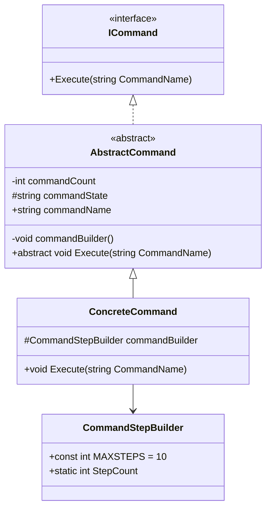
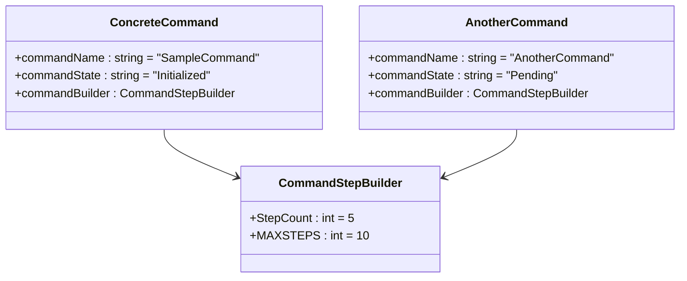
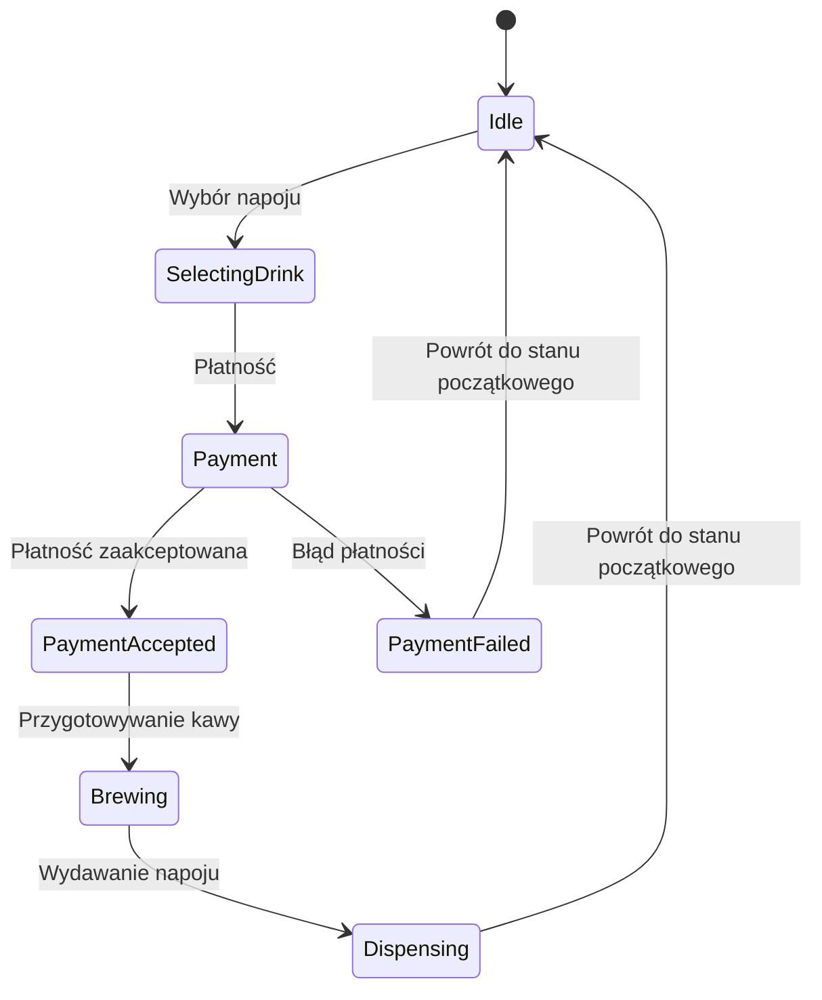
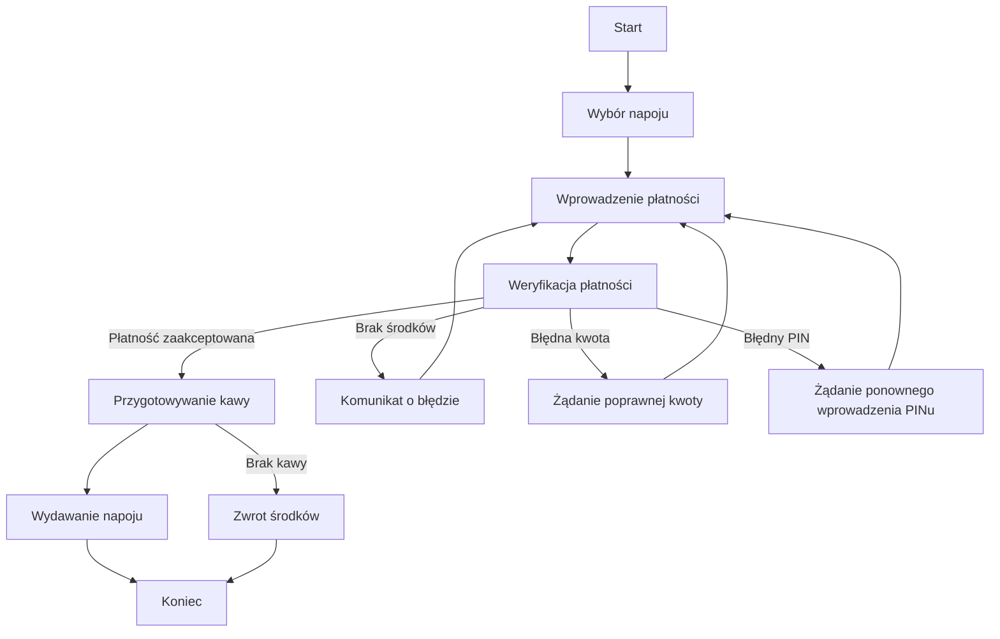
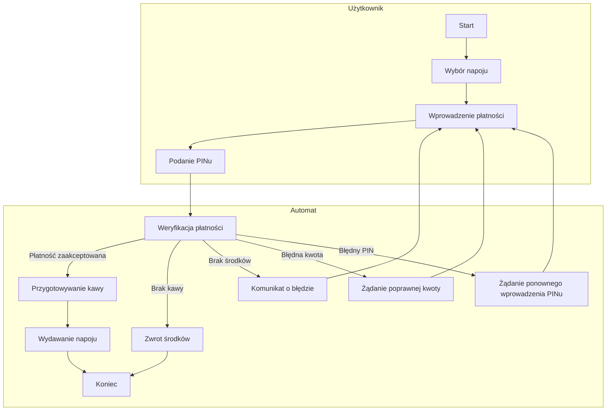
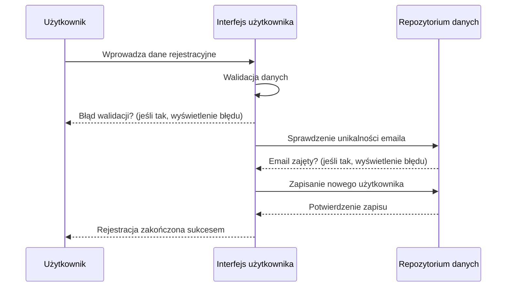
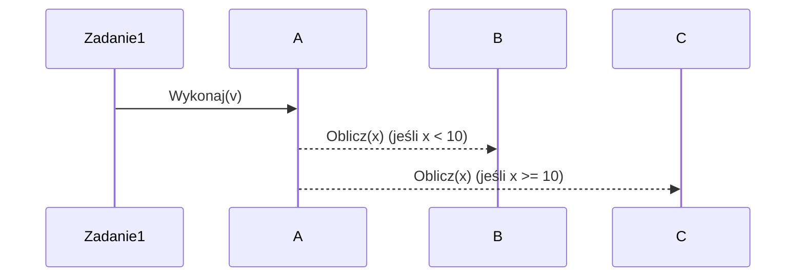

# List 2

| 1 | 2 | 3 | 4 | 5 | 6 | 7 | 8 |
|---|---|---|---|---|---|---|---|
| X | X | X | X | X | X | X | X |


## Zad 1



## Zad 2



## Zad 3



## Zad 4
### Diagram bez paryycji


### Diagram z partycjami


## Zad 5



## Zad 6


### czy można narysować jednoznaczny diagram?
można narysować częściowo jednoznacznie – można pokazać kolejność wywołań, ale nie określić pełnego przepływu danych i efektów działania metod  

## Zad 7
```cpp
class Student {
    void show() {
        userWebPage.getStudentGradeInfo();
    }
}

class UserWebPage {
    void getStudentGradeInfo() {
        gradeController.getCourses();
        for each course in courses {
            mark = course.getMark(student);
            mark.getValue();
        }
        pageLayout();
    }
}

class GradeController {
    List<Course> getCourses() {
        return student.getCourses();
    }
}

class Student {
    List<Course> getCourses() {
        return enrolledCourses;
    }
}

class Course {
    Mark getMark(Student student) {
        return student.getMark(this);
    }
}

class Mark {
    int getValue() {
        return value;
    }
}
```

### czy można to zrobić jednoznacznie?
* nie ma określonej struktury klasy `Mark` – zakładamy, że przechowuje ocenę jako _int_
* nie wiadomo, czy `getCourses()` zwraca kursy konkretnego studenta – domyślamy się że pobiera je z obiektu `Student`
* nie ma informacji, jak działa `pageLayout()` – zakładamy, że kończy proces wyświetlania ocen
* nie widać obsługi błędów – co się dzieje gdy student nie ma kursów
