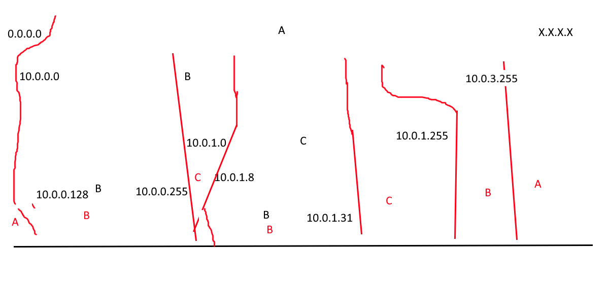
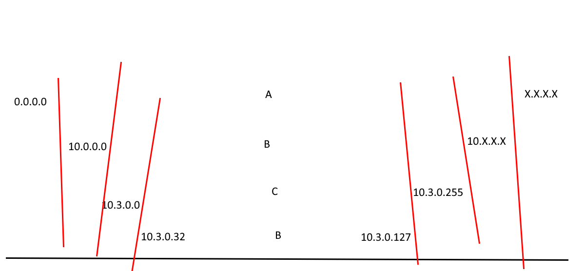
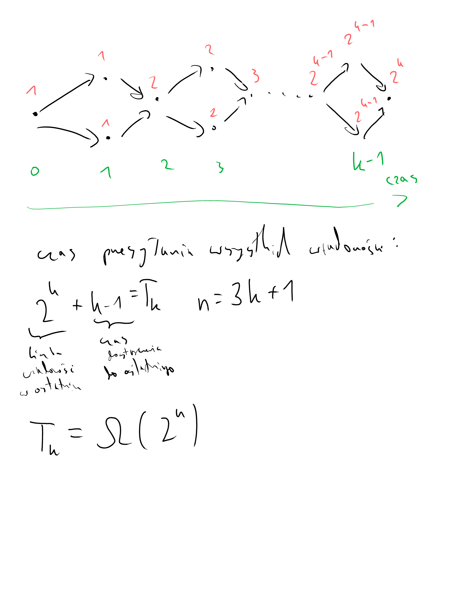

# Ćwiczenia 1
## Zadanie 1
które: adres sieci, adres rozgłoszeniowy czy też adres komputera  
wyznacz odpowiadający mu adres sieci, rozgłoszeniowy i adres innego komputera w tej samej sieci  
- 10.1.2.3/8  
jest to adres komputera  
> 255.0.0.0  

adres sieci: 10.0.0.0/8  
adres rozgłoszeniowy: 10.255.255.255/8  
adres innego komputera: 10.1.2.4/8  

- 156.17.0.0/16  
jest to adres sieci  
> 255.255.0.0  

adres sieci: 156.17.0.0/16  
adres rozgłoszeniowy: 156.17.255.255/16    
adres innego komputera: 156.17.0.1/16  

- 99.99.99.99/27    
> 255.255.255.11100000  
>    99.99.99.01100011   

jest to adres komputera  
adres sieci: 99.99.99.96/27  
adres rozgłoszeniowy: 99.99.99.127/27  
adres innego komputera: 99.99.99.100/27  

- 156.17.64.4/30  
jest to adres sieci  
> 255.255.255.11111100  
>   156.17.64.00000100

adres sieci: 156.17.64.4/30  
adres rozgłoszeniowy: 156.17.64.7/30  
adres innego komputera: 156.17.64.5/30

- 123.123.123.123/32  
jest to adres komputera (jeden konkretny adres IP)   
> 255.255.255.11111111  
> 123.123.123.01111011

### fun fact
sieć /31 jest wyjątkiem i ma po prostu 2 komputery  


## Zadanie 2
> 10.10.0.0/16  
> 00001010.00001010.00000000.00000000  
> 11111111.11111111.00000000.00000000  

> podmaska /19:   
> 11111111.11111111.11100000.00000000  

> podmaska /17:   
> 11111111.11111111.10000000.00000000  

podsieci:  
- 10.10.0.0/19
- 10.10.32.0/19
- 10.10.64.0/19
- 10.10.96.0/19
- 10.10.128.0/17

stara liczba komputerów w sieci: $2^{16}-2 = 65534$  
nowa liczba komputerów w sieci: $4*{2^{13}-2} + 2^{15}-2 = 65526$  
straciliśmy 8 adresów komputerów, ale zyskaliśmy 4 podsieci  


spróbujmy uzyskać jak najmniejszą podsieć:  
- 10.10.0.0/17 <=> 10.10.0.0 - 10.10.127.255  
- 10.10.128.0/18 <=> 10.10.128.0 - 10.10.191.255
- 10.10.192.0/19 <=> 10.10.192.0 - 10.10.223.255 
- 10.10.224.0/20 <=> 10.10.224.0 - 10.10.239.255
- 10.10.240.0/20 <=> 10.10.240.0 - 10.10.255.255

wtedy adresy /20 będą miały $2^12 - 2$ adresów 

## Zadanie 3
- 0.0.0.0 - 255.255.255.255 (/0) → do routera A
- 10.0.0.0 - 10.0.1.255 (/23) → do routera B
- 10.0.2.0 - 10.0.2.255 (/24) → do routera B
- 10.0.3.0 - 10.0.3.255 (/24) → do routera B
- 10.0.1.0 - 10.0.1.255 (/24) → do routera C
- 10.0.0.128 - 10.0.0.255 (/25) → do routera B
- 10.0.1.8 - 10.0.1.15 (/29) → do routera B
- 10.0.1.16 - 10.0.1.23 (/29) → do routera B
- 10.0.1.24 - 10.0.1.31 (/29) → do routera B

> 29 -> +7  
> 25 -> +127    
> 24 -> +255  
> 23 -> +511  

  

równoważnie:
- 0.0.0.0/0 -> A
- 10.0.0.0/22 -> B
- 10.0.1.0/24 -> C
- 10.0.1.8/29 -> B
- 10.0.1.16/28 -> B


## Zadanie 4
- 0.0.0.0 - 255.255.255.255 (/0) → do routera A
- 10.0.0.0 - 10.255.255.255 (/8) → do routera B
- 10.3.0.0 - 10.3.0.255 (/24) → do routera C
- 10.3.0.32 - 10.3.0.63 (/27) → do routera B
- 10.3.0.64 - 10.3.0.95 (/27) → do routera B
- 10.3.0.96 - 10.3.0.127 (/27) → do routera B

> 32 = .00100000

  

równowaznie:  
- 0.0.0.0/0 -> A
- 10.0.0.0/8 -> B
- 10.3.0.0/24 -> C
- 10.3.0.32/27 -> B
- 10.3.0.64/26 -> B


## Zadanie 5
Zasada najlepszego dopasowania - wybieramy najdłuższy prefiks, który pasuje do adresu docelowego.  

* rozwiązanie  
Wystarczy posortować malejąco tablicę routingu według długości prefiksu (wartość CIDR malejąco) i wybrać ten, który ma najdłuższy prefiks.

* d-d  
Załóżmy że dla jakiegoś adresu docelowego wybraliśmy prefiks (metodą first match) o długości X, a w tablicy istniał pasujący prefiks o długości Y, tż X < Y.  
Wiemy że tablica jest posortwana malejąco, więc szukając metodą first match musieliśmy przejść przez prefiks o długości Y.  
Sprzeczność - jeżeli przeszliśmy przez ten prefiks, a jest on pasujący, to musiałby być wybrany.

## Zadanie 6
puste pola są równoważne z nieskończonością

### krok 0
wszystkie tablice routingu są puste

### krok 1
routery wpisują do swoich tablic routingu sieci bezpośrednio podłączone do nich

|   | A | B | C | D | E |
|---|---|---|---|---|---|
| U | 1 | 1 |   |   |   |
| W |   | 1 |   | 1 |   |
| X |   | 1 | 1 |   |   |
| Y |   |   |   | 1 | 1 |
| Z |   |   | 1 | 1 |   |


### krok 2
routery rozgłaszają swoje tablice routingu do sąsiadów, a sąsiedzi aktualizują swoje tablice

|   | A | B | C | D | E |
|---|---|---|---|---|---|
| U | 1 | 1 |2 B|2 B|   |
| W |2 B| 1 |2 B| 1 |2 D|
| X |2 B| 1 | 1 |2 B|   |
| Y |   |2 D|2 D| 1 | 1 |
| Z |   |2 C| 1 | 1 |2 D|

### krok 3
ponownie routery rozgłaszają swoje tablice routingu do sąsiadów, a sąsiedzi aktualizują swoje tablice  

|   | A | B | C | D | E |
|---|---|---|---|---|---|
| U | 1 | 1 |2 B|2 B|3 D|
| W |2 B| 1 |2 B| 1 |2 D|
| X |2 B| 1 | 1 |2 B|3 D|
| Y |3 B|2 D|2 D| 1 | 1 |
| Z |3 B|2 C| 1 | 1 |2 D|


## Zadanie 7
Po dodaniu sieci $S_Q$ routery $A$ oraz $E$ zobaczą ją i zmienią swoje tablice routingu. Tablice rozstaną rozgłoszone do sieci $B$ oraz $D$, które adekwatnie zmienią swoje tablice routingu i rozgłoszą je dalej. 

### krok 1
|   | A | B | C | D | E |
|---|---|---|---|---|---|
| U | 1 | 1 |2 B|2 B|3 D|
| W |2 B| 1 |2 B| 1 |2 D|
| X |2 B| 1 | 1 |2 B|3 D|
| Y |3 B|2 D|2 D| 1 | 1 |
| Z |3 B|2 C| 1 | 1 |2 D|
| Q | 1 |   |   |   | 1 |

### krok 2
|   | A | B | C | D | E |
|---|---|---|---|---|---|
| U | 1 | 1 |2 B|2 B|2 A|
| W |2 B| 1 |2 B| 1 |2 D|
| X |2 B| 1 | 1 |2 B|3 D|
| Y |2 E|2 D|2 D| 1 | 1 |
| Z |3 B|2 C| 1 | 1 |2 D|
| Q | 1 |2 A|   |2 E| 1 |

### krok 3
|   | A | B | C | D | E |
|---|---|---|---|---|---|
| U | 1 | 1 |2 B|2 B|2 A|
| W |2 B| 1 |2 B| 1 |2 D|
| X |2 B| 1 | 1 |2 B|3 D|
| Y |2 E|2 D|2 D| 1 | 1 |
| Z |3 B|2 C| 1 | 1 |2 D|
| Q | 1 |2 A|3 B|2 E| 1 |

## Zadanie 8

### wersja bez wag
* czas = 0 - tak sieć wygląda przed awarią
* czas = 1 - psuje się łącze między D i E, D ustawia odległość na nieskończoność, rozgłasza to do sąsiadów ("mam do SX ścieżkę nieskończoną")
* czas = 2 - router A nadal ma zapisaną trasę do E, nie wie że prowadzi ona przez D, więc nie zmienia tablicy routingu
* czas = 3 - A rozgłasza swoją tablicę do sąsiadów, wartość nie zaktualizowana w B bo przez nie idzie (poison reverse)
* C,D rozgłasza
* ...

| trasa do $S_X$ | A | B | C | D |
|----------------|---|---|---|---|
| czas = 0       |3 B|2 D|2 D| 1 |
| czas = 1       |3 B|2 D|2 D|$\infty$|
| czas = 2       |3 B|$\infty$|$\infty$|$\infty$|
| czas = 3       |3 B|$\infty$|4 A|$\infty$|
| czas = 4       |3 B|$\infty$|4 A|5 B|
| czas = 5       |3 B|6 A|4 A|5 B|
| czas = 6       |7 B|6 A|4 A|5 B|


### wersja z wagami
* załóżmy że router C znalazł najszybszą trasę do E: C->A->B->D->E (połączenie C->D jest powolne)  
* wtedy poison reverse nie zadziała na C, ponieważ routuje się on przez A, a nie przez D  
* wtedy D znajdzie alternatywną trasę do E przez C
* ...

| trasa do $S_X$ | A | B | C | D |
|----------------|---|---|---|---|
| czas = 0       |3 B|2 D|4 A| 1 |
| czas = 1       |3 B|2 D|4 A|$\infty$|
| czas = 2       |3 B|$\infty$|4 A|$\infty$|
| czas = 3       |3 B|$\infty$|4 A|5 C|
| czas = 4       |5 B|6 D|4 A|5 C|


## Zadanie 9
sieć poniżej, wagi w nawiasach (domyślnie 1)

```
D <--- C
|      | (10)
\/     |
A ---> B

z punktu widzenia C:
D <--- C
|      | (10)
|      |
A ---- B

z punktu widzenia D:
D ---> C
|      | (10)
|      |
A      B
```

połącznie się psuje, A zacznie wysyłać do B przez D (powstaje cykl A-D)
```
D <--- C
|      | (10)
|      |
A -x-> B
```

D zacznie wysyłać do B przez C (powstaje cykl D-C)
```
D ---- C
/\     | (10)
|      |
A -x-> B
```


## Zadanie 10
wysyłamy wiadomość z wierzchołka po lewej, liczba wiadomości będzie się podwajała po przejściu przez każdy 'moduł' (fakt że przesyłamy max 1 wiadomość na krawędź nie przeszkodzi w tym)  
liczba wiadomości będzie więc rosła wykładniczo wraz z liczbą modułów, a każdy moduł zajmuje 3 dodatkowe routery  

  

