- [Notatki - zdjęcia](#notatki---zdjęcia)
  - [Schemat warstwowego modelu](#schemat-warstwowego-modelu)
  - [Warstwowy model z szyfrowaniem TCP](#warstwowy-model-z-szyfrowaniem-tcp)
  - [Konstrukcja wysyłanych danych](#konstrukcja-wysyłanych-danych)
    - [IP](#ip)
    - [IPv6](#ipv6)
    - [UDP](#udp)
    - [TCP](#tcp)
    - [ICMP](#icmp)
    - [Fragmentacja](#fragmentacja)
    - [Ethernet](#ethernet)
  - [Filtry](#filtry)
  - [Stany TCP](#stany-tcp)
- [Notatki - podsumowania](#notatki---podsumowania)
  - [Jednostki](#jednostki)
  - [Skrótologia](#skrótologia)
- [Zagadnienia](#zagadnienia)
  - [Wykład 1](#wykład-1)
  - [Wykład 2](#wykład-2)
  - [Wykład 3](#wykład-3)
  - [Wykład 4](#wykład-4)
  - [Wykład 5](#wykład-5)
  - [Wykład 6](#wykład-6)
  - [Wykład 7](#wykład-7)
  - [Wykład 8](#wykład-8)
  - [Wykład 9](#wykład-9)
  - [Wykład 10](#wykład-10)
  - [Wykład 11](#wykład-11)
  - [Wykład 12](#wykład-12)
  - [Wykład 13](#wykład-13)

# Notatki - zdjęcia
## Schemat warstwowego modelu
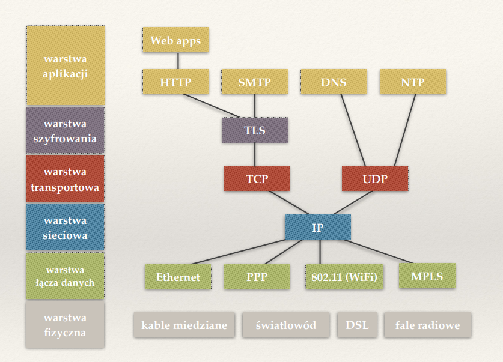
## Warstwowy model z szyfrowaniem TCP
Wersja bez po prostu nie ma warstwy TCP  
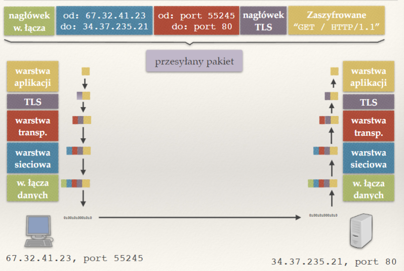

## Konstrukcja wysyłanych danych
### IP
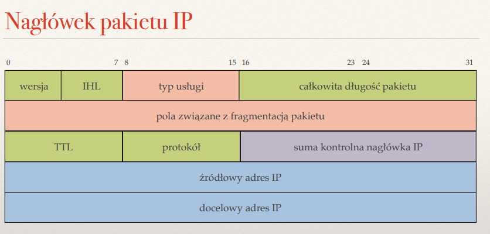

### IPv6
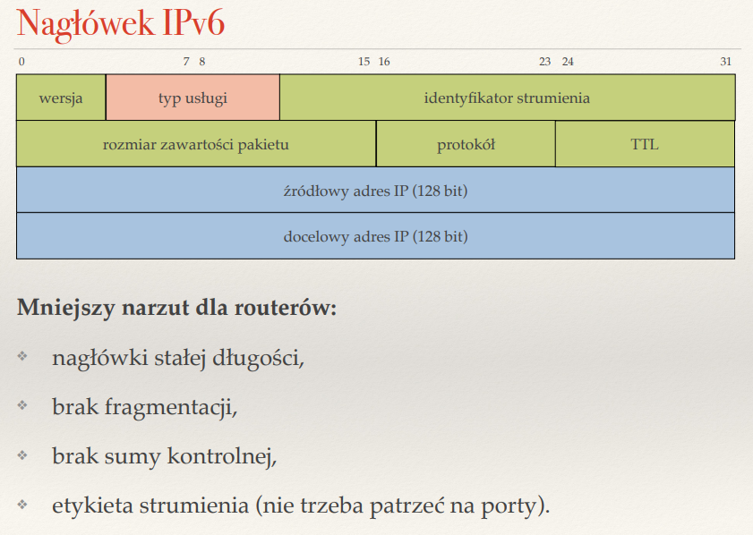

### UDP
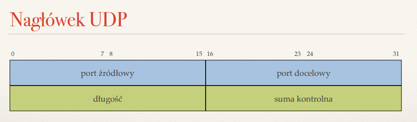

### TCP
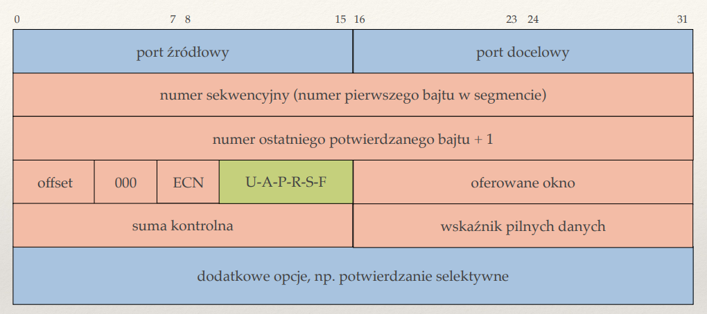

### ICMP
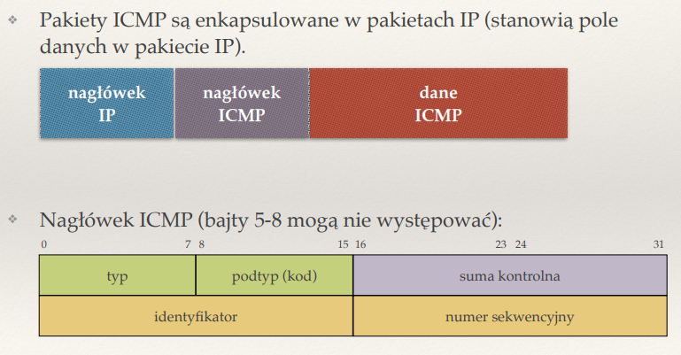

### Fragmentacja
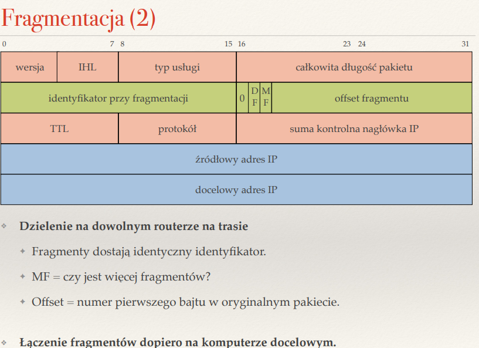

### Ethernet
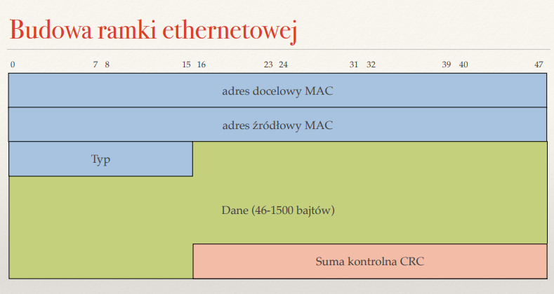

## Filtry
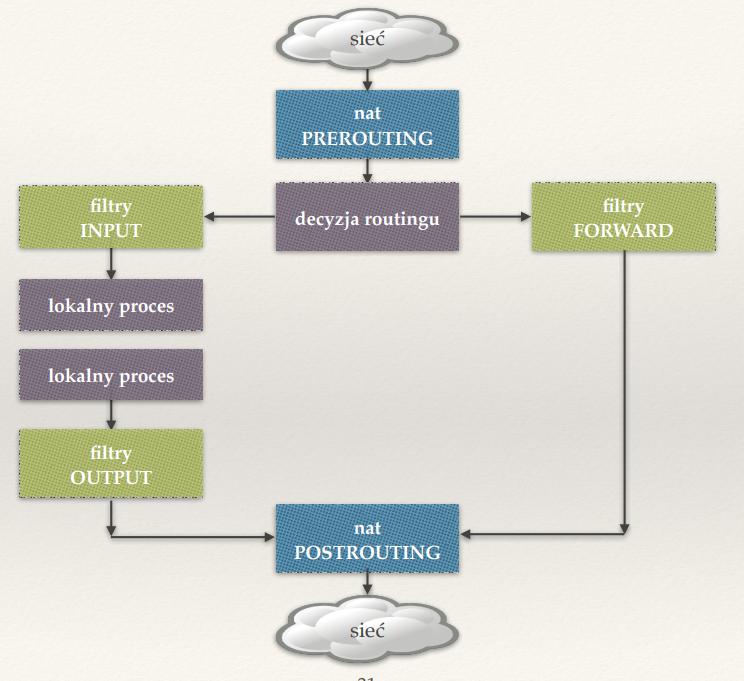

## Stany TCP
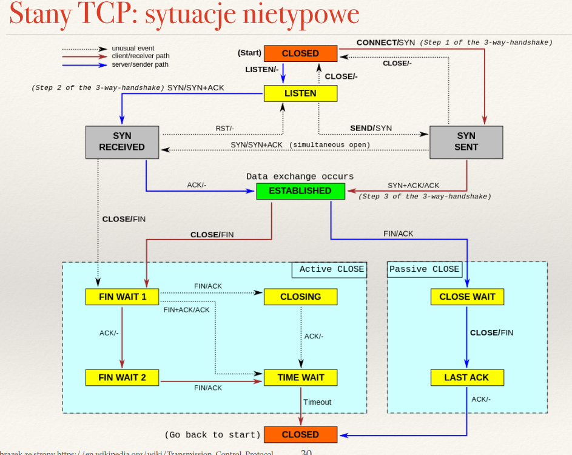 

# Notatki - podsumowania
## Jednostki
- aplikacja: dane
- transportowa: TPDU (Transport Protocol Data Unit) / segment (TCP) / datagram (UDP)
- sieciowa: pakiet (IP)
- łącza danych: ramka
- fizyczna: bity

## Skrótologia 
| Skrót | Rozwinięcie | Wytłumaczenie |
| --- | ---- | --- |
| DNS | Domain Name System | System nazw domenowych (IP <-> nazwa) |
| RIP | Routing Information Protocol | Prosty protokół routingu |
| ARP | Address Resolution Protocol | Protokół do odwzorowania adresów IP -> MAC |
| RARP | Reverse ARP | Protokół do odwzorowania MAC -> adres IP |
| DHCP | Dynamic Host Configuration Protocol | Pobieranie adresu IP oraz konfiguracji |
| HTTP | Hypertext Transfer Protocol | Protokół oparty na TCP do przesyłania danych | 
| SMTP | Simple Mail Transfer Protocol | Protokół do przekazywania poczty |
| IMAP | Internet Message Access Protocol | Protokół umożliwiający dostęp do poczty |
||||
| SSL | Secure Sockets Layer | Protokół sieciowy, który zapewnia bezpieczne połączenia internetowe |
| TLS | Transport Layer Security | Warstwa zapewniająca szyfrowanie oraz uwierzytelnianie danych, następca SSL |
||||
| TCP | Transmission Control Protocol | Protokół transportowy zapewniający niezawodność |
| UDP | User Datagram Protocol | Protokół bezpołączeniowe |
| ICMP | Internet Control Message Protocol | Protokół kontrolny (np ping) |
| QUIC | Quick UDP Internet Connections | Protokół warstwy transportowej, celujący w szybkość i poprawę niezawodności połączeń (przykryty pod warstwą UDP) |
||||
| IP | Internet Protocol | Protokół warstwy sieci (adresacja i routing) |
||||
| TDM | Time Division Multiplexing | Metoda multiplesacji, gdzie dzielimy łącze na kawałki czasu |
| FDM | Frequency Division Multiplexing | Metoda multipleksacji, gdzie dzielimy częstotliwość |
| APIPA | Automatic Private IP Addressing | Mechanizm do samoistnego przypisania sobie adresu IP  w sieci lokalnej, gdy nie ma dostępu do DHCP |
| CIDR | Classles Inter-Domain Routing | Reprezentacja adresów IP i ich prefiksów sieciowych |
| RTT | Round Trip Time | Czas obiegu pakietu |
| RTO | Retransmission TimeOut | Czas oczekiwania na potwierdzenie, po którym następuje retransmisja  |
| BDP | Bandwith-Delay Product | Przepustowość * opóźnienie - ile danych może być "w locie" |
| MSS | Maximum Segment Size | Maksymalny rozmiar segmentu TCP |
| MTU | Maximum Transmission Unit | Maksymalny rozmiar pakietu na łączu |
| TTL | Time To Live | Pozostała liczba przeskoków pakietu IP |
| DT | Dont Fragment | Flaga pakietu, po jej ustawieniu pakiet nie będzie fragmentowany tylko zwróci ICMP _destination unreachable, can't fragment_ |
| LSA | Link State Advertisement | Informacja wysyłana przy stanie łącza, zawiera źródło i numer sekwencyjny |
| AS | Autonomic System | AS to zbiór rouerów pod pewną administracją, stosujący jednolitą politykę routingu |
| CDN | Content Distribution Networks | Jak AS, ale celem jest dostarczanie treści jak najbliżej użytkowników końcowych (utrzymuje proxy oraz serwery DNS) |
| IXP | Internet Exchange Point | Punkt wymiany ruchu, łączy ze sobą wiele routerów brzegowych, często w relacji peering |
| BGP | Border Gateway Protocol | Algorytm routingu pomiędzy AS | 
| OSPF | Open Shortest Path First | Dynamiczny protokół routingu typu "link-state", który jest używany do wymiany informacji o trasach w sieciach IP |
| LPM | Longest Prefix Match | Metoda wybierania prefiksu (kolejnego skoku) do routowania pakietu |
| TCAM | Ternary Content Addressable Memory | Pamięć trzymająca pary (prefix, maska) i zwracająca hardware'owo LPM |
| CSMA/CD | Carrier Sense Multiple Access with Collision Detection | (Eth) Po wykryciu kolizji przestajemy nadawać |
| CSMA/CA | Carrier Sense Multiple Access with Collision Avoidance | (Wifi) Brak wykrywania kolizji, próba jej uniknięcia |
| VLAN  | Virtual Local Area Network | Logiczny odpowiednik fizycznego podziału na sieci lokalne |
| MAC | Message Authentication Code | Zapewnia integralnośc i uwierzytelnienie wiadomości |
| HMAC | Hash-based MAC | MAC oparty o funkcję skrótu i tajny klucz |
| MAC address | Media Access Control | Adres sprzętowy karty sieciowej (6 bajtów, pierwsze 3 nadaje IEEE, pozostałe producent) |
| URL | Uniform Resource Locator | \<schemat\>:\<część zależna od schematu/rodzaju zasobu\> |
| TLD | Top Level Domains | Nazwy domen o wysokości 1 od korzenia (.com .pl) |
| CNAME | Canonical Name | Typ rekordu DNS, zawiara alias oraz główną nazwę domeny |
| MX | Mail Exchanger | Typ rekordu DNS, odpowiada za adres serwera pocztowego |
| PTR | Pointer Record | W systemie DNS służy do odwrotnego tłumaczenia adresu IP na nazwę domeny |
| CRC | Cyclic Redundancy Check | Kody detekcyjne opartne na dzieleniu wielomianów |
| ECB | Electronic Codeblock | Każdy blok wiadomości szyfrowany niezależnie |
| CBC | Cipher Block Chaining | Klucz inicjalizacyjny + kolejna wiadomość szyfrowana wynikiem poprzedniej |
| CA | Certificate Authority | Urząd certyfikacji - wydający certyfikaty |
| SSH | Secure SHell | Bezpieczny dostęp do powłoki na zdalnym komupterze |
| VPN | Virtual Private Network | Logiczna sieć utworzona z wielu rozłącznych sieci |
| RSA | Rivest-Shamir-Adleman | Algorytm asymetrycznego szyfrowania |
| AES | Advanced Encryption Standard | Symetryczny szyfr blokowy |
| DoS | Denial of Service | Atak zmuszający serwer do nieobsługiwania klientów |
| DDoS | Distributed DoS | Atak DoS przeprowadzony z wielu komputerów |
| MIM | Man-In-the-Middle | Typ ataku |
| SWS | Sender Window Size | Rozmiar okna na komputerze wysyłającym metodą TCP |
| RWS | Receiver Window Size | Rozmiar okna na komputerze odbierającym TCP |
| NAT | Network Address Translation |  |
| SNAT | Source NAT ||
| DNAT | Destination NAT ||
| CAM | Content Addressable Memory | Pamięć adresowana zawartością (stosowana np w przełącznikach) |
| AIMD | Additive Increase / Multiplicative Decrease | Algorytm kontroli przeciążenia TCP |
| cwnd | congestion window | Rozmiar okna przeciążeniowego (czyli tego które jest na łączy między komputerami) |
| ssthresh | slow start threshold | Poziom do którego ma działać slow start |
| RED | Random Early Detection | Losowe wyrzucanie pakietów z ppb ~ rozmiar kolejki |
| ECN | Explicit Congestion Notification | Router zaznacza w pakiecie możliwe przeciążenie |
||||
| ACK || Flaga TCP potwierdzająca odbiór danych |
| SYN || Flaga TCP rozpoczynająca połączenie |
| RST || Flaga TCP resetująca połączenie (wymuszone zakończenie) |
| FIN || Flaga TCP kończąca połączenie |
| RTS | Request To Send | WiFi, do unikania kolizji |
| CTS | Clear To Send | WiFi, do unikania kolizji |

# Zagadnienia
## Wykład 1
- Co to jest protokół komunikacyjny? Dlaczego wprowadza się warsty protokołów?  

Aplikacje definiują protokół komunikacji określający, jak wygląda przesyłany strumień danych.  
Modularność: możliwość wymiany jednej implementacji warstwy na inną.  

- Wymień warstwy internetowego modelu warstwowego. Jakie są zadania każdej z nich?  
    - Aplikacji - odpowiada za komunikację (dane) aplikacji
    - Transportowa - dostarcza dane pomiędzy aplikacjami
    - Sieciowa - dostarcza dane pomiędzy komputerami (gloablnie)
    - Łącza danych - dostarcza dane pomiędzy komputerami (lokalnie)

- Jakie warstwy są zaimplementowane na komputerach a jakie na routerach?  

na komputerach wszystkie warstwy, na routerach łącza danych i sieciowa

- Czym różni się model warstwowy TCP/IP od OSI?  

Model TCP/IP: sklejona warstwa 1 (fizyczna) i 2 (łącza danych).

Model OSI: dodatkowe warstwy sesji i prezentacji pomiędzy
warstwą 4 (transportowa) i 5 (aplikacji).

- Co jest potrzebne do zbudowania dwukierunkowego niezawodnego kanału?  
<!-- TODO: idk -->

- Porównaj wady i zalety przełączania obwodów i przełączania pakietów.  
    - przełączanie obwodów (multipleksowanie):
        - gwarantowana stała szybkość
        - marnowanie łącza gdy nic nie wysyłamy
    - przełączanie pakietów:
        - pakiety przesyłane niezależnie
        - prostota implementacji routerów
        - może dojść do utraty pakietu/zła trasa etc
        - łącze dzielone na wielu klientów - brak gwarantowanej przepustowości

- Jakie znasz rodzaje multipleksowania? Po co i kiedy się je stosuje?  
    - TDM - gdy mamy kanał którym można przesłać jedną informację na raz 
        - np przewód miedziany
    - FDM - gdy mamy kanał którym można przesłać wiele informacji na raz
        - np fale radiowe

- Porównaj ze sobą rodzaje routingu.  
    - Routing źródłowy - Nagłówek pakietu zawiera całą trasę do celu
    - Wykorzystujący tablice routingu - Zbiór reguł typu „jeśli adres docelowy pasuje do wzorca A, przekaż pakiet do sąsiedniego routera X“.
    - Wirtualne przełączanie obwodów - Nadawca najpierw wysyła pakiet(y) kontrolny ustanawiający ścieżkę do celu i konfigurujący routery, czasem rezerwujący część łącza.

- Co to jest komunikacja pełnodupleksowa, półdupleksowa i simpleksowa?  
    - pełnodupleksowa - komunikacja w obie strony osobnymi kanałami (2 strony mogą nadawać jednocześnie)
    - półdupleksowa - komunikacja w obie strony, ale tylko jedna może nadawać na raz
    - simpleksowa - komunikacja jednostronna (tylko jedna strona nadaje)

- Do czego służy polecenie traceroute? Co pokazuje?  

polecenie to pokazuje ścieżkę (adresy routerów) pokonaną przez pakiety wysłane do jakiegoś adresu (oraz ich rtt)

- Po co stosuje się bufory w routerach? Co to jest przeciążenie?  

bufor przetrzymuje pakiety przychodzące, gdy interfejs wyjściowy jest zajęty, a przeciążenie polega na jego przepełnieniu (co prowadzi do utraty pakietów)

- Jakie są przyczyny opóźnień pakietów?  
    - czas czekania w kolejce (buforze)
    - rozmiar pakietu/przepustowość (ile możemy zapisać do kanału na jednostkę czasu)
    - czas propagacji (ile czasu podróżuje sygnał między końcami kanału)

- Co to jest BDP? Co to jest czas propagacji?  
    - BDP (bandwith-delay product) - iloczyn przepustowości i RTT = "ile możemy wysłać zanim dostaniemy odpowiedź od odbiorcy"
    - czas propagacji - ile czasu podróżuje sygnał między końcami kanału

- Wyjaśnij pojęcia: komunikacja simpleksowa, półdupleksowa, pełnodupleksowa.  

tego już nie było?!

- Co umożliwia protokół IP? Co to znaczy, że protokół realizuje zasadę best effort?  
    - protokół IP (*tldr; odpowiada za adresowanie i przesyłanie pakietów między sieciami*)
        - jest zaimplementowany na każdym urządzeniu
        - definiuje adresy urządzeń
        - definiuje zawodną, bezpołączeniową usługę do przesłania pakietu między dwoma dowolnymi urządzeniami w sieci
    - zasada best effort - zasada dołożenia wszelkich starań dostarczenia pakietu (brak gwarancji dostarczenia, ale pakiety nie będą gubione celowo)

- Jakie są zalety i wady zasady end-to-end?  

Wszystkie dodatkowe cechy (np. niezawodne przesyłanie danych) implementowane w urządzeniach końcowych (komputerach) → łatwa ewolucja, niski koszt innowacyjności.

- Po co wprowadza się porty?  

Jak rozróżnić różne przeglądarki działające na tym samym komputerze? → identyfikatory aplikacji (porty).

- Wyjaśnij pojęcie enkapsulacji i dekapsulacji.  

Enkapsulacja/dekapsulacja: proces dodawania/usuwania nagłówka przy przechodzeniu przez kolejną warstwę.

## Wykład 2
- Z czego wynika hierarchia adresów IP? Jaki ma wpływ na konstrukcję tablic routingu?  

hierarchia jest zbudowana tak, że pod jakimś korzeniem o prefiksie np X.Y. * . * znajdują się wszystkie adresy z takim prefiksem  
dzięki temu łatwiej routować pakiety, bo wiemy do jakiego korzenia pójść żeby trafić do szukanego adresu  

- Notacja CIDR.  

CIDR (Classless Inter-Domain Routing) - opisuje zakres adresów IP posiadających wspólny prefiks za pomocą pary (pierwszy adres z zakresu, długość prefiksu).

- Co to jest adres rozgłoszeniowy?  

jest to ostatni adres z dostępnej puli w podsieci, pakiet wysłany na adres rozgłoszeniowy dotrze do wszystkich adresów IP z zakresu  

- Co to jest maska podsieci  

maska podsieci mówi które bity podanego adresu są przeznaczone dla podsieci (niezapalone), a które są współdzielone dla wszystkich urządzeń w podsieci (zapalone bity)

- Opisz sieci IP klasy A, B i C.  

są to rozmiary podsieci, klasa A to /8 czyli 2^24 adresów, klasa B to /16 czyli 2^16 adresów oraz klasa C to /24 czyli 2^8 adresów  

- Co to jest pętla lokalna (loopback)?  

jest to adres do którego zapytania są od razu kierowane do tego samego komputera   

- Do czego służy pole TTL w pakiecie IP? Do czego służy pole protokół?  

TTL (time to live) to pole odliczające np ile razy jeszcze pakiet może zostać przesłany dalej, jeżeli ttl osiągnie 0 to pakiet 'umiera' czyli jest wyrzucany - służy to zapobieganiu krążenia pakietów w nieskończoność w cyklach  
pole protokół mówi jakiego protokołu używa pakiet (icmp, tcp, udp)  

- Jakie reguły zawierają tablice routingu?  
    - jeżeli adres docelowy pakietu zaczyna się od prefiksu A, to wyślij pakiet do X
    - pakiet niepasujący do żadnej reguły jest wyrzucany
    - reguła najdłużeszgo pasującego prefiksu - jeżeli wiele prefiksów pasuje do pakietu, to wygrywa ten dłuższy

- Na czym polega reguła najdłuższego pasującego prefiksu?  

jeżeli wiele prefiksów pasuje do adresu pakietu, to wygrywa reguła z najdłuższym prefiksem

- Co to jest trasa domyślna?  

jest to wpis w tablicy routingu z adresem 0.0.0.0/0 który pasuje do wszystkich pakietów, więc jeżeli router nie ma pasującego innego wpisu, to jest wybierany ten (który zarazem ma najkrótszy pasujący prefiks)

- Do czego służy protokół ICMP? Jakie znasz typy komunikatów ICMP?  

ICMP - internet control message protocol, czyli protokół służący do wysyłania wiadomości diagnostycznych
    - ping
    - echo reply

- Jak działa polecenie ping?  

zapytanie wysyłane do komputera, który powinien wysłać odpowiedź zwrotną z ICMP id = 0 (pong/echo reply) 

- Jak działa polecenie traceroute?  

seria zapytań ping wysyłana do komputera z rosnącym ttl, jeżeli pakiet traceroute umarł w routerze, to router powinien wysłać odpowiedź zwrotną informującą o tym gdzie umarł

- Dlaczego do tworzenia gniazd surowych wymagane są uprawnienia administratora?  

inaczej możnaby łatwo podsłuchiwać inne aplikacje na gniazdach

- Co to jest sieciowa kolejność bajtów?  

mamy 2 kolejności: 
    - *big endian* -  'normalna' czyli najbradziej znaczący jest najbardziej 'po lewo'
    - *little endian* - 'odwrócona' czlyi najbardzije znaczący jest najbardziej 'po prawo'

sieciowa to *big endian* i jest ona w nagłówkach pakietów

- Co robią funkcje socket(), recvfrom() i sendto()?  

    - socket - tworzy gniazdo surowe
    - recvfrom - odbiera pakiet z gniazda
    - sendto - wysyła pakiet przez gniazdo

- Jakie informacje zawiera struktura adresowa sockaddr_in?  
    - port
    - adres 
    - rodzina adresu

- Co to jest tryb blokujący i nieblokujący? Co to jest aktywne czekanie?  
    - tryb blokujący - działanie kodu jest zatrzymywane, w oczekiwaniu na jakieś wydarzenie (np recvfrom chce odebrać pakiet z gniazda, ale nie ma żadnego, więc czeka na jakiś wstrzymując działanie programu)
    - tryb nieblokujące - działanie programu nie jest wstrzymywane, bez względu na wydarzenie (np recvfrom nie czeka na pakie jeżeli nie ma żadnego, tylko o tym 'informuje')
    - aktywne czekanie - czekanie na jakieś wydarzenie, bez oddawania kontroli np do jądra - program sam 'symuluje' oczekiwanie, zużywając przy tym dużą część zasobów

- Jakie jest działanie funkcji select()?  

pozwala na monitorowanie wielu deskryptorów, czekając na to aż jakieś wejście/wyjście będzie dostępne

## Wykład 3
- Co to jest cykl w routingu? Co go powoduje?  

cykl w routingu to taka możliwa ścieżka pakietów, która jest w stanie odwiedzić jakiś router wielokrotnie  
powoduje on możliwość krążenia w kółko pakietów

- Czym różni się tablica routingu od tablicy przekazywania?  
    - tablica przekazywania - kolejny router na trasie
    - tablica routingu - zawiera informację o całych trasach, oraz np alternatywne/zapasowe trasy routingu

- Dlaczego w algorytmach routingu dynamicznego obliczamy najkrótsze ścieżki?  
chcemy minimalizować odległość do celu, aby nie marnować dodatkowych zasobów na przekazywanie pakietów oraz przyspieszyć ich samo przekazywanie

- Co to jest metryka? Jakie metryki mają sens?  
metryka to sposób na liczenie odległości, w tym przypadku definiowanie wartości na krawędziach. metryki odległości routertów:
    - czas propagacji -> jeżeli chcemy aby pakiety szły jak najszybciej
    - koszt pieniężny -> jeżeli chcemy zoptymalizować koszt przekazywania pakietów, i np preferujemy tanie łącza
    - odległość routera (wszędzie 1) -> bez sensu bo marnujemy dodatkową możliwą informację/heurę; doddatkowo mamy pewność że nie gwarantuje to sensownego porównywania odległości routerów; zaletą może być mninimalne wykorzystanie rtt

- Czym różnią się algorytmy wektora odległości od algorytmów stanów łączy?  
    - wektor odległości - routery przechowują wektory odległości do innych routerów i co jakiś czas wysyłają je do sąsiadów, którzy na tej podstawie przeliczają własne wektory odległości; tablica routingu to połączenie wektora odległości oraz informacji z tablicy przekazywania
    - stanów łączy - router powiadamia o wszystkich sieciach, do których jest podłączony bezpośrednio, a na podstawie otrzymanych informacji buduje graf całej sieci i liczy sobie lokalnie najkrótsze ścieżki (wtedy nie będzie cykli)

- Jak router może stwierdzić, że bezpośrednio podłączona sieć jest nieosiągalna?  
    - wysyłane pakiety do tej sieci nie docierają
    - sieć się nie odzywa od dłuższego czasu

- Co to znaczy, że stan tablic routingu jest stabilny?  

jeżeli stan tablic routingu się nie zmienia od pewnego czasu, mimo otrzymywanych nowych informacji o sieci od innych routerów

- Jak zalewać sieć informacją? Co to są komunikaty LSA?  
    - zalewanie sieci informacją - jeżeli mamy regułę "po odebraniu pakietu od X wyślij pakiet do wszystkich sąsiadów poza X" to mając cykl pakiety te będzie się zwielokrotniać bardzo łatwo (co najmniej co każde okrążenie cyklu)
    - LSA (Link State Advertisement) - informacja wysyłana przy stanie łącza, zawiera źródło i numer sekwencyjny

- Co wchodzi w skład wektora odległości?  

wektor odległości dla jakiegoś routera to spis odległości wraz z następnym skokiem dla każdej podsieci

- W jaki sposób podczas działania algorytmu routingu dynamicznego może powstać cykl w routingu?  

np gdy nagle umrze jakaś podsieć koło routera X, to ten router X będzie szukać dla niej alternatywnej drogi - może się zdarzyć tak, że będzie chciał iść do tego routera X przez router Y, który twierdzi że zna drogę, ale tak na prawdę ta droga prowadzi przez X, wiec powstał nam cykl

- Co to jest problem zliczania do nieskończoności? Kiedy występuje?  

jak w powyższym przypadku, jeżeli stworzy się w efekcie śmierci podsieci jakiś cykl do niej prowadzący (teoretycznie, bo w praktycnie do niej nie dochodzi bo jest to stara trasa) to liczone odległości będą ciągle rosnąć - za każdym razem okazuje się że router o najmniejszym dystansie może dojść do tej podsieci tylko przez routery z większymi odległościami, wiec zwiększy on swój dystans, i bedzie się to działo w nieskończoność

- Na czym polega technika zatruwania ścieżki zwrotnej (poison reverse)?  

jeżeli router X jest na ścieżce do S, to nie informujemy go o tym jaki my policzyliśmy dystans do S, tylko mówimy że jest on nieskończony, tak aby X nie routować się do S przez nas

- Po co w algorytmach wektora odległości definiuje się największą odległość w sieci (16 w protokole RIPv1)?  

aby jeżeli dojdzie do takiego odliczania w nieskończoność, to aby się ono 'naprawiło' po doliczeniu do nieskończoności

- Po co stosuje się przyspieszone uaktualnienia?  

aby natychmiast przekazać informację o istotnej zmianie

- Co to jest system autonomiczny (AS)? Jakie znasz typy AS?  
AS to zbiór rouerów pod pewną administracją, stosujący jednolitą politykę routingu, typy:  
    - AS z jednym wyjściem
    - AS z wieloma wyjściami
    - AS tranzytowy

- Czym różnią się połączenia dostawca-klient pomiędzy systemami autonomicznymi od łącz partnerskich (peering)?  

klient może wysyłać cały ruch, bo nam płaci  
peering - bezpłatna wymiana tylko lokalnego ruchu, bez przekazywania danych do dalszych AS

- Dlaczego w routingu pomiędzy systemami autonomicznymi nie stosuje się najkrótszych ścieżek?  

bo liczy się polityka routingu, a nie odległość - koszty umów, bezpieczeństwo, umowy handlowe

- Które trasy w BGP warto rozgłaszać i komu? A które wybierać?  

    - rozgłaszamy zawartość AS aby dało się do nas trafić
    - trasy do klientów, bo klient płaci i chce przesyłać dane, a trzeba jakoś do nich trafić (szczególnie chcemy je rozgłaszać od partnetów, bo za ten ruch nie płacimy)
    - trasy do dostawców tylko klientom, nie chcemy aby inni wysyłali ruch przez nasz AS do naszego dostawcy
    - trasy do partnerów klientom

- Jak BGP może współpracować z algorytmami routingu wewnątrz AS?  

zazwyczaj wybór najkrótszej trasy (liczby AS), częsta polityka:  
    - wybierz trasę przez swojego klienta
    - potem przez partnera
    - na końcu przez dostawcę

## Wykład 4
- Co to są prywatne adresy IP? Jakie pule adresów są zarezerwowane na takie adresy?  

są to adresy nieprzekazywane przez routery, składają się na nie:
    - 10.0.0.0/8
    - 172.16.0.0/12
    - 192.168.0.0/16

- Co robi funkcja bind()?  

związuje serwer z danym portem

- Czym różnią się porty o numerach mniejszych niż 1024 od innych?  

 do wiązania z <= 1024 potrzebne są uprawnienia administratora; przyjęto że na <= 1024 są ważne aplikacje (http, smtp, etc)

- Jakie są zadania procesora routingu, portu wejściowego, portu wyjściowego i struktury przełączającej?  
    - procesor routingu - otrzymuje niektóre pakiety, wylicza tablicę przekazywania i wysyła ją do portów wejściowych
    - port wejściowy - odbiera wchodzące pakiety, uaktualnia nagłówek i sprawdza do którego portu go przekazać; buforuje pakiety
    - port wyjściowy - wysyła dane, buforuje pakiety
    - struktura przełączająca - umożliwia szybkie przekazywanie pakietów (docelowo z prędkością łącza)

- Czym się różni przełączanie pakietów w routerze za pomocą RAM od przełączania za pomocą struktury przełączającej?  

procesor zawsze wykonuje całą robotę, proces składa się z przekopiowania pakiety z wejścia do ram do wyjścia

- Jakie są pożądane cechy struktury przełączającej w routerze?  

przekazywanie z prędkością łącza

- Gdzie w routerze stosuje się buforowanie? Po co?  
    - na wejściu - jeżeli nie wyrabia router z przełączaniem lub kolejka wyjściowa jest zapchana
    - na wyjścio - zapobiega utracie pakietów przy czasowym zwiększeniu liczby pakietów

- Po co w portach wyjściowych klasyfikuje się pakiety?  

żeby przydzielić je do odpowiedniego strumienia/priorytetu/etc

- Co to jest blokowanie początku kolejki? Gdzie występuje? Jak się go rozwiązuje?  

kiedy kolejka wyjściowa blokuje kolejkę wejściową

- Rozwiń skrót LPM.  

longest prefix match

- Jakie znasz struktury danych implementujące LPM? Porównaj je.  
    - lista prefiksów: pamięć O(n), lookup O(n), insert O(1), delete O(n)
    - tablica hashująca: pamięć O(n), lookup O(w) oczekiwany, insert delete O(1) oczekiwany
    - trie: pamięć O(nw), lookup O(w), insert delete O(w)
    - trie z dodatkowymi krawędziami skracającymi: lookup O(log w), insert delete O(n) lub O(log w)
    - rozwiązanie sprzętowe TCAM (ternary content addressable memory)

- Co to jest pamięć TCAM? Jak można ją zastosować do implementacji LPM?  

ternary content addressable memory, przechowuje pary (prefix, maska); dla danego adresu równolegle znajduje wszystkie pasujące prefixy i sprzętowo wybiera najdłuższy z nich

- Na czym polega fragmentacja IP? Gdzie się ją stosuje i dlaczego? Gdzie łączy się fragmenty?  

jeśli rozmiar pakietu jest większy niż MTU, to pakiet jest dzielony na fragmenty; dzielenie może zajść na dowolnym routerze na trasie, a łączenie dzieje się na komputerze docelowym

- Co to jest MTU? Na czym polega technika wykrywania wartości MTU dla ścieżki?  

maximum transmission unit, jest to max rozmiar pakietu jaki może zostać przesłany przez łącze  
wykrywanie polega na ustawieniu bitu 'dont fragment', wtedy router odeśle nam ICMP gdy pakiet będzie za duży, zmniejszymy wtedy rozmiar pakietu i wyślemy ponownie

- Jak działa szeregowanie pakietów w buforze wyjściowym routera?  

przypisujemy pakiety do strumieni, na podstawie adresu i portów, pakiety są szeregowane w zależności od strumienia

- Jakie są różnice pomiędzy nagłówkami IPv4 i IPv6?  
w ipv6 mamy:  
    - stałą długość nagłówka
    - brak fragmentacji
    - brak sumy kontrolnej
    - etykietę strumienia (zamiast portów)

- Zapisz adres IPv6 0321:0000:0000:0123:0000:0000:0000:0001 w najkrótszej możliwej postaci.  

321:0:0:123::1

- Co to jest tunelowanie 6in4?  

jest to sposób na przesyłanie pakietów ipv6 za pomocą ipv4, dzieje się to za pomocą dodania specjalnego nagłówka ipv4

- Na czym polega NAT i po co się go stosuje? Jakie są jego zalety i wady?  

nat pozwala wielu komputerom korzystać z tego samego adresu ip do wysyłania pakietów

- Jaki stan musi przechowywać router z funkcją NAT?  

przypisanie oryginalnego adresu i portu, docelowego adresu do portu oraz zmienionego portu

## Wykład 5
- Jakie są zadania warstwy łącza danych a jakie warstwy fizycznej?  
    - łącza danych 
        - komunikacja między sąsiadującymi urządzeniami
        - zapewnia zawodną usługę wysyłania ramek
        - współdzielony kanał komunikacyjny
        - radzi sobie z błędami transmisji
    - fizyczna
        - szczegóły przesyłania pojedynczych bitów

- Czym różni się koncentrator od przełącznika sieciowego?  

koncentrator zbiera każdy sygnał i wysyła do wszystkich innych podłączonych urządzeń  
przełącznik sieciowy przesyła pakiety do odbiorcy  

- Jak działa algorytm rundowy i bezrundowy ALOHA?  

w algorytmie rundowym czas jest podzielony na rundy, a w każdej rundzie każde urzączenie wysyła pakiet z ppb p   
w algorytmie bezrundowym każdy komputer ma własne runkdy (dzieje się to asynchronicznie)

- Jak działa algorytm odczekiwania wykładniczego?  

algorytm asynchroniczny - każdy symuluje własne rundy, po nieudanym wysłaniu zmieniszamy ppb wysłania ramki (losowany czas odczekiwania może być do 2 razy dłuższy niż mógł być)

- Wyjaśnij skróty CSMA/CD i CSMA/CA.  
    - CSMA/CD (Carrier Sense Multiple Access with Collision Detection) - stosowany w Ethernecie, jeżeli zauważymy kolizję przestajemy nadawać ramkę
    - CSMA/CS (Carrier Sense Multiple Access with Collision Avoidance) - stosowane w Wifi, brak wykrywania kolizji, ramki zawsze wysyłane do końca

- Opisz budowę ramki Ethernetowej.  
    - adres źródłowy i docelowy MAC
    - Typ (protokół, np IP)
    - Dane
    - Suma kontrolna

- Co to jest adres MAC?  

6 bajtowy unikatowy ciąg, przypisany do karty sieciowej (pierwsze 3 bajty przyznaje IEEE producentowi, a trzy kolejne nadaje producent) - służy do indentyfikacji urządzeń w sieci

- Do czego służy tryb nasłuchu (promiscuous mode)?  

karta sieciowa w trybie nasłuchu przekazuje do systemu wszystkie odebrane ramki

- Po co w Ethernecie definiuje się minimalną długość ramki?  

po to aby jeżeli miałoby dojść do kolizji, to została ona wykrywa (gdyby ramka była krótsza to moglibyśmy wysłać pakiet, mimo tego że za chwile skoliduje on na łączu)

- Do czego służą protokoły ARP i DHCP?  
    - ARP (Address Resolution Protocol) - protokół służący do znajdywania urządzenia o danym adresie IP, wysyłany jest na adres rozgłoszeniowy MAC, jeden komputer odpowiada, wszyscy słyszą odpowiedź i ją zapisują
    - DHCP (Dynamic Host Configuration Protocol) - protokół służący do pobierania adresu IP (np na podstawie MAC), umożliwia też wysyłanie konfiguracji (brama, maska, DNS)

- Czym różni się łączenie dwóch sieci za pomocą mostu od łączenia ich za pomocą routera?  

most - przełącznik z dwoma portami, łączy dwie sieci  
jest szybszy, bo nie zagląda do warstwy sieciowej, ale nie rozumie IP (np niemożliwa fragmentacja)

- Jak warstwa łącza danych realizuje rozgłaszanie?  

za pomocą adresu odbiorcy FF:FF:FF:FF:FF

- Na czym polega tryb uczenia się w przełączniku sieciowym?  

przełącznik uczy się do jakich portów są podpięte jakie adresy MAC, tak aby wysyłać pakiety tylko tam (inaczej wysyła je wszędzie i patrzy skąd ma odpowiedź)

- Po co w przełączanym Ethernecie stosuje się algorytm drzewa spinającego?  

po to aby mieć trasy do każdego miejsca, w których nie ma cykli

- Co to jest sieć VLAN? Po co się ją stosuje?  

VLAN (Virtual Local Area Network) - jest to logiczny (sprzętowy) odpowiednik fizycznego podziału na sieci lokalne, stosuje się ją to po aby w wysyłanych ramkach podając numer vlanu wysyłać ramki tylko w jego obrębie

- Wyjaśnij zjawisko ukrytej stacji.  

jeżeli pomiędzy komputerami jest stacja nadająca sygnał, to te komputery nie będą słyszeć sibie nawzajem jeżeli będą nadawać na raz i sobie przeszkadzać

- Na czym polega rezerwowanie łącza za pomocą RTS i CTS?  

rozwiązanie problemu ukrytej stacji: przed wysłaniem komputer wysyła RTS (Request To Send), jeżeli AP odeśle CTS (Clear To Send) to komputer może nadawać - inny komputer również słyszy CTS, więc będzie milczeć

## Wykład 6
- Co może stać się z przesyłanym ciągiem pakietów IP podczas zawodnego i niezawodnego transportu?  
    - zawodny (UDP)
        - uszkodzenie
        - zgubienie
        - opóźnienie
        - zmiana kolejności
        - zduplikowanie
    - niezawodny (TCP)
        - to samo co z zawodnym, tylko że przy utracie pakietu zostanie on wysłany ponownie, a duplikaty zostaną wykryte
        - opóźnienie dostarczenia danych

- Co to jest kontrola przepływu?  

nadawca powinien dostosowywać prędkość transmisji do szybkości odbiorcy

- Czym różnią się protokoły UDP i TCP? Podaj zastosowania każdego z nich.  

    - UDP - zawodny protokół wysyłania datagramów (samodzielnie pociętych kawałków przesyłanych danych)
        - gdy potrzebujemy szybkiego sposobu na przesłanie danych, mimo możliwej jej utraty - np komunikacja między routerami w sieci
    - TCP - niezawodny protokół przesyłania danych za pomocą segmentów (automatycznie pociętych kawałków danych)
        - używane wszędzie gdzie chcemy mieć pewność że dostarczymy wiadomość, np HTTP

- Co to jest segmentacja? Dlaczego segmenty mają ograniczoną wielkość? Rozwiń skrót MSS.  

segmentacja - dzielenie danych automatczynie w warstwie łącza (TCP) na kawałki, które zostaną przesłane do odbiorcy  
mają one ograniczoną wielkość, aby przyspieszyć przesyłanie daynch, np w wypadku utraty pakietu tracimy ograniczoną ilość informcji (dodatkowo mniejsze pakiety szybciej dojdą do odbiorcy, mają większy priorytet w kolekach routerów)  
MSS - maximum segment size  

- Jak nazywają się jednostki danych przesyłane w kolejnych warstwach?  
    - aplikacja: dane
    - transportowa: segment (TCP) / datagram (UDP)
    - sieciowa: pakiet (IP)
    - łącza danych: ramka
    - fizyczna: bity

- Jak małe pakiety zmniejszają opóźnienie przesyłania danych?  

małe pakiety są szybciej przetwarzane i wysyłane w routerach (dodatkowo analizując niezawodny protokół, mają one mniejszą szansę na uszkodzenie w trakcie transportu)

- Wytłumacz znaczenie skrótów RTT i RTO. Na jakiej podstawie ustalana jest wartość RTO?  

RTT - round trip time, czyli czas podróży pakietu od adresata, do odbiorcy + odpowiedzi zwrotnej od odbiorcy do adresata  
RTO - retransmission timeout = 2\*RTT_mean + 2\*RTT_timeout; czas oczekiwania na ACK przed retransmisją

- Jak protokoły niezawodnego transportu wykrywają duplikaty pakietów i potwierdzeń?  

dzięki numerom pakietów i numerom potwierdzeń

- Opisz algorytm Stop-and-Wait. Jakie są jego wady i zalety?  

nadawca wysyła 1 pakiet i czeka na ACK  
zalety: prosty algorytm  
wady: niewydajny (obie strony długo czekają nic nie robiąc)

- Do czego służą numery sekwencyjne w niezawodnym protokole transportowym?  

pozwalają odtworzyć kolejność danych, wykryć duplikaty i zgubione pakiety

- Opisz algorytm okna przesuwnego.  

nadawca może wysłać wiele pakietów przed otrzymaniem ACK, okno ustala ile i jakie pakiety może wysłać

- Jaki jest związek między rozmiarem okna a BDP (bandwidth-delay product)?  

BDP = przepustowość \* opóźnienie  
aby w pełni wykorzystać łącze rozmiar okna powienien być $\geq$ BDP

- Opisz i porównaj następujące mechanizmy potwierdzania: Go-Back-N, potwierdzanie selektywne, potwierdzanie   skumulowane.
    - Go-back-N - retransmisja wszystkich pakietów, zaczynając od zgubionego (niewydajne, bo np zawsze gubi się wczesny pakiet z okna; ale wydajne pamięciowo)
    - potwierdzanie selektywne - retransmisja brakujących pakietów; wydajne, ale nie oszczędne pamięciowo
    - potwierdzenie skumulowane - potwierdzany jest najdłuższy możliwy prefiks składający się z ACK (taki blok); oszczędne pamięciowo, ale mniej wydajne

- Dlaczego istotne jest potwierdzanie odbioru duplikatów segmentów?  

w wypadku gdyby poprzedni ACK zgninął

- Co to jest okno oferowane? Jak pomaga w kontroli przepływu?  

rozmiar bufora odbiorcy, pomaga nadawcy dostosować prędkość nadawania

- Jakie mechanizmy niezawodnego transportu i kontroli przepływu implementowane są w protokole TCP?  
    - numeracja sekwencyjna
    - ACK
    - retransmicja (RTO)
    - kontrola przepływu (okno oferowane)
    - kontrola przeciążenia (slow start, etc)

- Na czym polega opóźnione wysyłanie ACK w protokole TCP?  

odbiorca może chwilę poczekać z wysłaniem ACK, aby po odebraniu innych pakietów wysłać w jednym pakiecie wszystkie ACK

- Na czym polega mechanizm Nagle'a? Kiedy nie należy go stosować?  

jeżeli aplikacja generuje dane mniejsze miż MSS to TCP łączy je w jeden większy i dopiero wtedy wysyła, nie jest to stosowane w aplikacjach interaktywnych

- Co oznaczają pola ,,numer sekwencyjny'' i ,,numer potwierdzenia'' w nagłówku TCP?  
    - numer sekwencyjny - pierwszy bajt danych w tym segmencie (+ jakiś ustalony offset)
    - numer potwierdzenia - numer pierwszego bajtu, którego odbiorca oczekuje jako następny (+ jakiś offset)

- Czy warstwa transportowa implementowana jest na routerach? Dlaczego?  

nie, routery operują na warstwie IP, więc nie analizują warstwy transportowej (TCP/UDP) (chociaż czasem się to już zdarza w bardziej zaawansowanych routerach, np przy firewallu)

- Sformułuj słabą i silną zasadę end-to-end.  
    - słaba wersja - niezawodne przesyłanie danych musi być realizowane na urządzeniach końcowych, ale **warstwy niższe mogą pomagać**
    - silna wersja - niezawodne przesyłanie danych musi być realizowane na urządzeniach końcowych, **warstwy niższe nie powinny w to ingerować**

## Wykład 7
- Co to jest gniazdo?  

interfejs programowy umożliwiający komunikację między procesami (aplikacjami), lokalnie lub przez sieć; gniazdo to połączenie adresu IP oraz portu

- Czym różni się gniazdo nasłuchujące od gniazda połączonego? Czy w protokole UDP mamy gniazda  
połączone?
    - gniazdo nasłuchujące - dla serwera, tylko do nawiązywania połączeń
    - gniazdo połączone - tworzone dla klienta i serwera po połączeniu, służy do przesyłania danych w aktywnym połączeniu
    - w UDP mamy gniazda bezstanowe (ale związane z konkretnym procesem)

- Co robią funkcję jądra bind(), listen(), accept(), connect()?  
    - bind() - przypisuje gniazdu adres IP oraz port
    - listen() - oznacza gniazdo jako nasłuchujące
    - accept() - odbiera połączenie przychodzące, tworzy nowe gniazdo połączeniowe
    - connect() - ustanawia połączenie z serwerem

- Czym różni się komunikacja bezpołączeniowa od połączeniowej?  
    - bezpołączeniowa - nie wymaga wcześniejszego ustalenia połączenia, jest bezstanowa (w sensie przesyłania danych, nie analizując tego co robi aplikacja)
    - połączeniowa - wymaga wcześniejszego nawiązania połączenia

- Czym różni się otwarcie bierne od otwarcia aktywnego? Czy serwer może wykonać otwarcie aktywne?  
    - otwarcie bierne - przejście do stanu LISTEN, nie wysyła pakietu, wykonuje serewer TCP
    - otwarcie czynne - przejście do stanu SYN_SENT, wysyła segment SYN, wykonuje klient TCP

- Do czego służą flagi SYN, ACK, FIN i RST stosowane w protokole TCP?  
    - SYN - żądanie nawiązania połączenia
    - ACK - potwierdzenie odbioru segmentu
    - FIN - żądanie zamknięcia połączenia
    - RST - natychmiastowe zamknięcie połączenia (w wypadku jakiegoś błędu)

- Opisz trójstopniowe nawiązywanie połączenia w TCP. Jakie informacje są przesyłane w trakcie takiego   połączenia?
    - SYN klient -> serwer z numerem sekwencyjnym (losowa liczba, dodatkowe zabezpieczenie)
    - SYN,ACK serwer -> klient; SYN z tym samym numerem, ACK z numerem o 1 większym
    - ACK klient -> serwer z przesyłanym numerem ACK (czyli o 1 większym niż wylosowana liczba)

- Dlaczego przesyłanych bajtów nie numeruje się od zera?  

w celach bezpieczeństwa, jeżeli ktoś chciałby wcisnąć w naszą komunikację swój zfałszowany pakiet, to musiałby wiedzieć jaką liczbę wylosowaliśmy  
dodatkowo pozwala to na rozróżnienie pakietów z różnych sesji

- Jakie segmenty są wymieniane podczas zamykania połączenia w protokole TCP?  

FIN M; ACK M+1

- Co zwraca funkcja recv() wywołana na gnieździe w blokującym i nieblokującym trybie?  
    - blokującym - czeka na dane i zwraca je
    - nieblokującym  - jeżeli są to zwraca dane, wpp 0 gdy połączenie jest zakończone i błąd jeżeli nie ma danych

- Po co wprowadzono stan TIME_WAIT?  

jeżeli jedna strona nie otrzymała ACK z kończenia połączenia, to wyśle ponownie FIN i chcielibyśmy taką sytuację obsłużyć

- Na podstawie diagramu stanów TCP opisz możliwe scenariusze nawiązywania i kończenia połączenia.  

    - nawiązywanie:
        - CLOSED, SYN_SENT, ESTABLISHED
        - LISTEN, SYN_RECEIVED, ESTABLISHED
    - zamykanie:
        - ESTABLISHED, FIN_WAIT_1, FIN_WAIT_2, TIME_WAIT, CLOSED
        - ESTABLISHED, CLOSE_WAIT, LAST_ACK, CLOSED

## Wykład 8
- Opisz budowę adresu URL. Opisz budowę adresu URL w przypadku schematu http.  

URL (Uniform Resource Locator) - \<schemat\>:\<część zależna od schematu/rodzaju zasobu\>  
dla http: http://\<nazwa serwera www\>\<:port (opcjonalnie)\>/\<identyfikator zasobu wewnątrz serwera (hirerachiczny)\>

- W jakim celu serwer WWW ustawia typ MIME dla wysyłanej zawartości? Podaj kilka przykładów typów MIME.  

informuje przeglądarkę jak interpretować zawartość, przykłady: text/html, text/css, image/png

- Po co w nagłówku żądania HTTP/1.1 podaje się pole Host?  

HTTP/1.1 pozwala osługiwać wiele domen na jednym IP, pole Host informuje której domeny dotyczy żądanie

- Do czego służą pola Accept, Accept-Language, User-Agent, Server, Content-Length, Content-  Type w nagłówku HTTP?
    - Accept - typt MIME, które klient akceptuje
    - Accept-Language - preferowany język
    - User-Agent - identyfikator przeglądarki/systemu
    - Server (odpoweidź) - identyfikator serwera
    - Content-Length - długość treści w bajtach
    - Content-Type - typ danych wysyłany przez przeglądarkę/serwer

- Jak implementuje się przechowywanie stanu w komunikacji HTTP?  

HTTP jest protokołem bezstanowym, więc wysyłane zapytanie musi zawierać wszystkie potrzebne informacje  
więc aby przekazać informacje o stanie można skorzystać z: informacji przesłanych w URL, ciasteczek (w tym np identyfikator sesji/użytkownika), zapytań POST

- Jak wygląda warunkowe zapytanie GET protokołu HTTP?  

są to znaczniki w Headerze (np If-Modified-Since), które pozwalają oszczędzić zsoby nie wysyłając ponownie strony która nie uległa zmianie, a korzystając z zapisanej lokalnie jej wersji

- Jakie znasz kody odpowiedzi protokołu HTTP?  
    - 1xx - informacyjne
    - 2xx - sukces
        - 200 ok
    - 3xx - przekierowania
        - 301 moved
        - 304 nod modified
    - 4xx - błąd klienta
        - 400 bad request
        - 403 forbidden
        - 404 not found
    - 5xx - błąd serwera
        - 500 internal server error

- Na czym polegają połączenia trwałe w HTTP/1.1? Do czego służy opcja Connection: close w nagłówku HTTP?  

domyślnie HTTP/1.1 utrzymuje jedno połaczenie TCP dla wielu żądań (keep-alive), `Connection: close` wymusza zerwanie połączenia po odpowiedzi

- Po co stosuje się metodę POST?  
    - przesyłanie danych na serwer
    - dane trafiają do body zapytania

- Co to jest technologia REST?  

styl architektury API oparty o HTTP (Representional State Transfer), wykorzystuje metody GET, PUT, POST, DELETE

- Do czego służą serwery proxy?  
    - przeglądarka wysyła zapytanie HTTP do serwera proxy
    - proxy w razie potrzeby łączy się z serwerem HTTP
    - serwer proxy odpowiada na żądanie korzsystając stron zapisanych w pamięci podręcznej
    - w razie potrzeby przeglądarka może wymusić pominięcie proxy

- Co to jest odwrotne proxy? Co to jest CDN?  
    - wykorzystywane przez dostawców sieci
    - zmniejszają obciążenie serwera www
    - mogą być obsługiwane przez osobną organizację
    - CDN (Content Distribution Networks) utrzymuje proxy oraz serwery DNS - co umożliwia wybranie możliwie bliskiego serwera proxy

- Jak skłonić klienta, żeby łączył się z serwerem proxy a nie bezpośrednio ze stroną WWW?  
     - kiedyś - strona www którą otrzymywał klient miała wbudowane odnośniki do serwera proxy
     - HTTP redirect - zamiast strony www klient otrzymuje przekierowanie do serwera proxy
     - współcześniej - za pomocą serwerów DNS klient od razu otrzymuje adres IP serwera proxy

- Jakie informacje dołączane są przez serwer proxy do zapytania?  

serwer proxy może dołączyć `X-Forwarded-For` oraz `Via` czyli adresy serwera www oraz serwera proxy, ale niektóre mogą anonimizować te dane (i ich nie podawać)

- Co to są anonimowe serwery proxy?  

nie podają one nagłówków informujących o naszym serwerze www

- W jakim celu powstał protokół QUIC? Jakie funkcje spełnia?  

ma on zintegrowane szyfrowanie oraz nie wymaga nawiązania połączenia tak jak TCP; dodatkowo jest on zaimplementowany w przestrzeni użytkownika (jądrze)

## Wykład 9
- Jaki jest cel systemu nazw DNS?  

DNS (Domain Name System) - łatwiejsze do zapamiętania dla ludzi, możliwość zmiany adresu IP serwera

- Do czego służy plik /etc/hosts?  

przechowuje on przypisania domena -> adres IP

- Rozwiń skrót TLD (kontekst: DNS), podaj parę przykładów.  

TLD - Top Level Domains są to nazwy domen o wysokości 1 od korzenia, np .com .pl

- Czym są strefy i delegacje DNS?  

strefy to spójny fragment drzewa hierarhi nazw  
delegacje odsyłają do innego serwera nazw, który odpowie na pytanie do kogo należy dana nazwa

- Czym różni się rekurencyjne odpytywanie serwerów DNS od iteracyjnego?  
    - rekurencyjne - pytamy resolver dns, a on za nas przechodzi przez drzewo
    - iteracyjne - kilent osobiście przechodzi przez drzewo

- Jak działa odwrotny DNS? Jaki typ rekordów i jaką domenę wykorzystuje?  

odwrócony adres zaczyna się od in-addr.arpa. do którego doklejany jest adres IP (w odpowiedniej kolejnosci), a wynikiem takiego zapytania jest nazwa domeny

- Jakie znasz typy rekordów DNS? Co to jest rekord CNAME? 
    - A - adresy IPv4
    - AAAA - adresy IPv6
    - CNAME (Canonical Name) - zawiara alias oraz główną nazwę domeny

- Do czego służy protokół SMTP a do czego IMAP?  
    - SMTP (Simple Mail Transfer Protocol) - protokół do przekazywania poczty
    - IMAP (Internet Message Access Protocol) - protokół umożliwiający dostęp do poczty z różnych urządzeń

- Co to są przekaźniki SMTP (relays)?  

są to serwery które odbierają naszą wiadomość żeby przekazać ją dalej gdy tylko odbiorca będzie dostępny

- Jaki rekord DNS jest sprawdzany przed wysłaniem poczty do danej domeny?  

MX - Mail Exchanger

- Wymień parę popularnych pól w nagłówku maila. Do czego służą pola Received i Bcc?  

`MAIL FROM`, `RCPT TO`  
Received - data odebrania wiadomości  
Bcc - ślepa kopia  

- Co umożliwia standard MIME?  

określa typ zawartości pliku/danych  

- Co to jest spam? Jakie znasz metody walki ze spamem?  

spam to niechciane wiadomości pocztowe  
metody walki:
    - statystykla, ML
    - blokowanie adresów IP
    - spowalnianie połączeń
    - zabezpiecznia przed podszywaniem, takie jak SPF

- Na czym polega mechanizm SPF?  

SPF definiuje jakie komputery są uprawnione do wysyłania poczty z danym polem `From`

- Jaka jest rola trackera w sieci Bittorrent?  

tracker to serwer który zna wszystkich członków sieci i udostępnia niektórych adresy - jest to taki koordynator

- Po co w plikach .torrent stosuje się funkcje skrótu?  

aby się upewnić że pobraliśmy poprawny plik/bez błędów

- Jakie są różnice w postępowaniu seedera i leechera w sieci BitTorrent?  
    - seeder posiada cały plik i go rozsyła  
    - leecher ma tylko niektóre fragmenty  

- Na czym polegają połączenia odwrócone? Jak stosuje się je w protokole FTP?  

jest to połączenie do komputera, który jest za NAT; np za pomocą pośrednika  
gdy mamy NAT to wykonujemy FTP w trybie pasywnym, czyli komputer który jest za NAT wysyła kanałem komunikacyjnym informację "chcę pobrać plik i słucham na tym porcie"  

- Opisz podobieństwa i różnice asymetrycznych (cone) NAT (pełnego i ograniczonego) i symetrycznych NAT.  
    - full cone - dowolny zewnętrzny komputer może wysłać pakiet do komputera za NAT o ile zna jego IP i port
    - restricted cone - zewnętrzny komputer może wysłać pakiet, ale tylko jeżeli kiedyś nasz komputer się z nim komunikował i to jego portem
    - symetryczny - przypisany port naszego komputera zależy od adresu i portu nadawcy i odbiorcy

- Opisz technikę wybijania dziur (hole punching) w NAT. Po co konieczny jest serwer pośredniczący?  

oboje klienci łączą się z serwerem pośredniczącym, który rejestruje ich adresy i porty, po czym odsyła im te dane  
klienci wysyłają do siebie nawazajem pakiety, pierwszy zostanie odrzucony, ale drugi zostanie już uznany za odpowiedź zwrotną i zaakceptowany  
w tern sposób stworzyliśmy dziurę  

## Wykład 10
- Jakie znasz typy kodów detekcyjnych? Do czego służą i jakie są między nimi różnice?  

    - sumy kontrolne - suma słów w przesyłanej wiadomości, nie wykrywa zmian słów ale sa efektywnie obliczane
    - bit parzystości - dodajemy tak bit, aby dla danego zakresu (np wszystkich) bitów suma zapalonych była parzysta; wykrywa przekłamania parzystej liczby bitów
    - CRC (Cyclic Redundancy Check) - opartne na dzieleniu wielomianów, efektywnie obliczane sprzętowo

- Jakie rodzaje błędów mają wykrywać kody detekcyjne? Z czego biorą się błędy przy przesyłaniu danych?

kody detekcyjne mają wykryć błędy polegające na przekłąmaniu bitów  
przekłamania bitów powstają w skutek błędów transmisji

- Jak działa algorytm obliczania sum kontrolnych CRC?  

ustalany jest wielomian *G* o stopniu _r_ znany obu stronom transmisji  
do wiadomości doklejamy 'z prawej' taki wielomian, aby wynikowy był podzielny przez *G*

- W jaki sposób działa wykrywanie błędów przy sumie kontrolnej CRC?  

odbiorca dzieli dane przez ustalony wielomian, w wyniku otrzumuje resztę (suma CRC)  
jeżeli reszta nie jest zerowa to wykryto błąd

- Jakie znasz metody korygowania błędów w transmisji?  

kody Hamminga ; (7,4)-kod (3,1)-kod

- Co to jest (a,b)-kod? Podaj przykład.  

a - liczba przesyłanych bitów  
b - liczba bitów na dane  
przykład to (3,1) kod który ma 1 bit danych powtórzony 3 razy   

- Co to jest odległość Hamminga? Jak wpływa na możliwość detekcji i korekcji błędów?  

odległość hamminga to najmniejsza liczba bitów jaką musimy zmienić żeby zrobić z liczby a liczbę b  
do detekcji **k** błędów potrzebna jest odległość co najmniej **k+1** między dwoma kodami  
do korekcji **k** błędów potrzebna jest odległość co najmniej **2k+1** między dwoma kodami

- Do czego służą kody MAC? Co to jest HMAC?  

    - MAC (Message Authentication Code) - zapewnia integralnośc i uwierzytelnienie wiadomości
    - HMAC (Hash-based MAC) - oparty o funkcję skrótu i tajny klucz

- Jakie własności powinna mieć kryptograficzna funkcja skrótu?  

    - szybko obliczalna
    - znalezienie kolizji dla danej wartości powinno być obliczeniowo trudne

- Czym różni się poufność od integralności?  

    - poufność - dane nie mogą zostać odczytane przez niuprawnione osoby
    - integralnośc - dane nie zostały zmienione w nieautoryzowany sposób

- Co to są szyfry monoalfabetyczne? Dlaczego łatwo je złamać?  

są to szyfry stosujące jakieś podmienienie liter, łatwo je złamać np znając częstość występowania lister w danym korpusie

- Na czym polegają ataki z wybranym tekstem jawnym, znanym tekstem jawnym i znanym  
szyfrogramem?
    - atak z wybranym tekstem jawnym - adwersarz wybiera tekst i otrzymuje jego szyfrogram
    - atak ze znanym tekstem jawnym - adwersarz zna fragment tekstu i jego szyfrogram
    - atak ze znanym szyfrogramem - adwersarz zna szyfrogram

- Co to jest szyfrowanie one-time pad?  

szyfrowanie symetryczne, klucz tak samo długi jak tekst jawny, zakodowanie wiadomości to xor wiadomości i klucza

- Na czym polega szyfrowanie blokowe? Czym różni się tryb ECB od CBC?  
    - szyfrowanie blokowe dzieli dane na bloki i każdy blok szyfruje osobno
    - ECB (Electronic Codeblock) - każdy blok szyfrowany niezależnie, może być szyfrowany z wygenerowanym bitem losowości dla każdego bitu wiadomości
    - CBC (Cipher Block Chaining) - mamy wektor inicjalizacyjny, pierwszy blok jest szyfrowany tak jak w ECB, potem wynik szyfrowania jest używany do szyfrowania kolejnej wiadomości

## Wykład 11
- Czym szyfrowanie symetryczne różni się od asymetrycznego?  

w szyfrowaniu symetrycznym obie strony muszą znać ten sam klucz, mogą zarówno szyforwać jak i deszyforować wiadomości  
w szyfrowaniu asymetrycznym do zaszyfrowania i odszyfrowania wiadomości używa się dwóch różnych kluczy (publiczny i prywatny), więc np tylko jedna strona może odczytać zaszyfrowaną wiadomość  

- Na czym polega bezpieczeństwo przy szyfrowaniu asymetrycznym?  

klucz deszyfrujący może zostać u odbiorcy - nie ma problemu z tym jak go przekazać, a klucz szyfrujący może być publiczny tak aby każdy mógł zaszyfrować wiadomość do odbiorcy

- Opisz algorytm RSA.  
    - wybieramy dwie duże różne liczby pierwsze *p* oraz *q*   
    - niech n = p\*q
    - wybieramy liczbę *e* względnie pierwszą z $\Phi(n) = (p-1) * (q-1)$
    - znajdujemy takie *d* że d\*e mod $\Phi(n) = 1$
    - klucz publiczny to (e, n) a prywatny to (d, p, q)

- Czy różni się szyfrowanie od uwierzytelniania?  

szyfrowanie zapewnia poufność wiadomości, a uwierzytelnianie zapewnia tożsamość nadawcy  

- Co to jest atak powtórzeniowy?  

polega on na przechwyceniu zaszyfrowanej wiadomości po to, aby ją później nadać ponownie podszywając się pod nadającego

- Czy w szyfrowaniu asymetrycznym szyfrujemy kluczem publicznym czy prywatnym?  

szyfrujemy kluczem publicznym, a odszyfrowujemy kluczem prywatnym

- Na czym polega podpisywanie wiadomości? Jakim kluczem to robimy?

podpisujemy wiadomość kluczem prywatnym, aby każdy mógł ją zweryfikować kluczem publicznym kto ją podpisał (czyli ma dostęp do klucza prywatnego) - dowodzi to że nadawca wiadomości ma poprawny klucz prywatny do klucza publicznego

- Jak można wykorzystać podpisy cyfrowe do uwierzytelniania?  

jeżeli podpis cyfrowy jest poprawny i został zweryfikowany kluczem publicznym danej osoby, to wiadomo że podpisała go ta osoba, bo tylko ona miała klucz prywatny

- Czy HMAC można wykorzystać do uwierzytelniania? Czy HMAC jest podpisem cyfrowym?  

HMAC można wykorzystać do zapewnienia integralności oraz znajomości sekretu _s_  
ale HMAC nie jest podpisem cyfrowym bo może go wykorzystać każda osoba znająca _s_, a zweryfikować tylko ta znająca _s_

- Dlaczego lepiej podpisywać funkcję skrótu wiadomości niż samą wiadomość? Z jakim ryzykiem się to wiąże?  

gdybyśmy podpisywali wiadomość to nasz podpis byłby tak samo długi jak wiadomość, a po zastosowaniu funkcji skrótu mamy krótszą wiadomość do podpisania (więc nie marnujemy przepustowości łącza)  
wiąże się to z ryzykiem kolizji - funkcja skrótu jest znana każdemu więc można np przeprowadzić atak urodzinowy  

- Co to są certyfikaty? Co to jest ścieżka certyfikacji?  

certyfikat to dokument cyfrowy, który potwierdza tożsamość właściciela klucza publicznego, podpisany przez Urząd Certyfikacji (CA)  
ścieżka certyfikacji to ciąg certyfikatów od serwera do zaufanego CA  

- Co to jest urząd certyfikacji (CA)?  

zaufany urząd generujący certyfikaty i poświadcza tożsamość  

- Jak TLS zapewnia bezpieczeństwo połączenia?  
    - TLS (Transport Layer Security) to dodatkowa warstwa między aplikacji a transportową
    - zapewnia szyfrowanie oraz uwierzytelnianie danych

- W jaki sposób w TLS następuje uwierzytelnienie serwera, z którym się łączymy?  

przeglądarka weryfikuje certyfikat serwera z podpisem CA

- Co to są klucze sesji? Po co się je stosuje?  

symetryczne klucze ustanawiane po nawiązaniu połączenia TLS do szyfrowania danych - jest to wydajeniejsza i nadal bezpieczna metoda komunikacji, która jest szybsza od szyfrowania asymetrycznego

- Co to są kolizje kryptograficznej funkcji skrótu?  

gdy dwie wiadomości mają taki sam skrót to mamy kolizję

- Na czym polega atak urodzinowy?  

znalezienie wiadomości m' dla danej wiadomości m, o takim samym skrócie jest 2-krotnie cięższe niż znalezienie takich dwóch wiadomości m i m', które mają ten sam skrót (atakujący więc może wtedy łatwo poprosić o podpisanie wiadomości m, a wysłać wiadomość m')

## Wykład 12
- Co to jest pamięć CAM i jak stosuje się ją w przełącznikach? Jak można ją przepełnić?

CAM (Content Addressable Memory) - pamięć w przełączniku z przypisaniem adres MAC -> port

- Opisz atak typu ARP spoofing.

atakujący wysyła zfałszowane odpowiedzi ARP, przypisując swój MAC do cudzego IP - wtedy wiadomości wysłane do ofirary trafiają do atakującego

- Co oznacza termin IP spoofing? Na czym polega metoda weryfikacji tak zmodyfikowanych pakietów (ingress filtering)?

IP spoofing - fałszowanie źródłowego adresu IP w pakiecie   
Ingress filtering - technika stosowana w routerach, która weryfikuje czy podany adres źródłowy jest poprawny 

- Na czym polega atak RIP spoofing?

RIPv1 nie ma uwierzytelniania, więc wystarczy rozgłaszać trasy do różnych sieci o małym koszcie

- Na czym polega zatruwanie pamięci podręcznej serwera DNS?

polega na podszywaniu się pod serwer DNS - kiedyś można było podając adres do swojej domeny, podać też adres do dowolnej innej, teraz po prostu po zadaniu pytania atakujący wysyła podrobione odpowiedzi DNS (które mają 16-bitowe ID identyfikujące odpowiedź, ale możemy wysłać 2^16 odpowiedzi i trafić w poprawne)  

- Jak wygląda uwierzytelnianie serwera SSH?

po pierwszym połączeniu się serwer wysyła nam swój klucz publiczny - powinniśmy zerwyfikować funkcję skrótu  
po pierwszym połączeniu klucz publiczny jest zapisywany  

- Na czym polega uwierzytelnianie użytkownika przez SSH z wykorzystaniem kluczy RSA?

serwer ma zapisany klucz publiczny użytkownika, po połączeniu się z nim wysyła użytkownikowi dane do podpisania, a użytkownik zwarca mu podpisane dane do weryfikacji

- Podaj przykłady tunelowania.

tunelowanie - przesyłanie pewnych usług sieciowych za pomocą innych usług sieciowych  
przykład: tunelowanie ssh pozwala na przekazywanie w zaszyfrowany sposób segmentów TCP; lub tunelowanie IPv6 za pomocą IPv4  

- Rozwiń skrót VPN. Do czego służy?

VPN (Virtual Private Network) - mamy 2 sieci połączone z internetem i chcemy z nich zrobić jedną logiczną sieć; transmisja lokalna jest bezpieczna, ale w internecie nie  

- Porównaj wady i zalety filtrów pakietów: prostych, stanowych i działających w warstwie aplikacji.
        - proste: analizują tylko nagłówki IP i porty - są tanie i szybkie  
        - stanowe: analizują też warstwę transportową - śledzą połączenia TCP i pamiętają jego stan
        - w warstwie aplikacji: analizują zawartość segmentów i datagramów

im bardziej zaawansowany filtr, tym droższy/wolniejszy ale zarazem daje on większe możliwości na rozbudowanie firewalla i zwiększenie bezpieczeństwa/kontroli

- Do czego służą moduły input, output, forward w filtrze Netfilter/nftables?

    - input - dzieje się po routingu ale przed dostarczeniem do procesu/komputera
    - output - dzieje się po zakończeniu procesu/wyjściu z komputera ale przed routingiem
    - forward - dzieje się po routingu i służy do przekierowania pakietu (a nie dostarczenia do lokalnej sieci)

- W jakich łańcuchach zapory Linuksa wykonywany jest źródłowy a w jakich docelowy NAT?

    - SNAT (source NAT): w łańcuchu postrouting
    - DNAT (destination NAT): w łańcuchu prerouting lub output

- Przedstaw przykładowe ataki wykorzystujące brak sprawdzania poprawności wprowadzanych danych.

    - SQL Injection - atakujący podaje zapytanie do aplikacji, która przeszuka bazę danych i zwróci znaleziony wynik, ale po podaniu odpowiedniego zapytania atakujący jest w stanie przekazać dowolne zapytanie do bazy danych
    - przepełnienie bufora - gdy atakujący jest w stanie podać na tyle dużo danych do aplikacji, które zosatną umieszczone na stosie, że przepełni się on

- Wyjaśnij pojęcia: robak internetowy, botnet.

    - robak internetowy - samopowielający się program, rozprzestrzeniający się przez sieć
    - botnet - sieć zainfekowanych urządzeń sterowanych zdalnie przez atakującego

- Na czym polega phishing?

technika ataku na człowieka, podszywając się pod inną osobę/instytucję próbując wyłudzić dane

- Co to jest skanowanie portów? Po co się je wykonuje?

sprawdzenie które porty na hoście są otwarte (i np jak reagują na jakie zapytania), służy do identyfikacji usług i szukaniu podatności

- Co to są ataki DoS i DDoS?

DoS (Denial of Service), DDoS (Distributed DoS) - ataki polegające na przeciążenie usługi ofiary w taki sposób, aby nie była ona w stanie obsłużyć klientów, atak rozproszony jest wykonywany z wielu komputerów (np z botnetu)

- Na czym polega atak typu odbity (reflected) DoS?

zapytanie z adresem źródłowym ofiary, wysyłane do serwera DNS (odpowiedź może być znacznie większa niż zapytanie); taki atak ciężej wyśledzić

## Wykład 13

- Czym różni się kontrola przepływu od kontroli przeciążenia?  
    - kontrola przepływu - nie chcemy zalać odbiorcy danymi
    - kontrola przeciążenia - nie chcemy zalać sieci danymi

- Co to jest przeciążenie?  

przepełnienie bufora w routerze

- Na czym polega mechanizm opóźnionych potwierdzeń?  

zamiast wysyłać osobne ACK na każdy odebrany segment, wysyłamy kumulacyjne ACK raz na jakiś czas potwierdzając wszystkie odebrane segmenty

- Jaka jest zależność między rozmiarem okna nadawcy a prędkością transmisji?  

dane wysyłane są ze średnią prędkością SWS/RTT  
okno powinno być większe od BDP = przepustowość \* RTT aby w pełni wykorzystać łącze

- Czy nieskończone bufory rozwiązałyby problem przeciążenia?  

nie, ponieważ przepustowość zostaje ta sama, dodatkowo większe kolejki to większe opóźnienia

- Jak zależy średni rozmiar kolejki od średniej prędkości nadchodzenia pakietów?  

przy zbliżaniu się do pojemności łącza rozmiar kolejki rośnie gwałtownie

- Jakie są cele kontroli przeciążenia?  
    - wysokie wykorzystanie łączy (szybkie wysyłanie danych)
    - sprawiedliwy podział łącza
    - rozproszony algorytm
    - szybko reaguje na zmianę warunków

- Jak można definiować sprawiedliwy podział łącza? Co to jest max-min fairness?  

możemy zdefiniować sprawiedliwy podział łącza jako taki, w którym nie można zwiększyć szybkości żadnego strumienia bez zmniejszenia prędkości nieszybszego strumienia - jest to właśnie zasada max-min fairness  
(maksymalizuj minimalną przepustowość)

- Na jakiej podstawie zmienia się rozmiar okna przeciążenia?  
    - odebrane ACK
    - utracone pakiety

- Kiedy TCP wnioskuje, że pakiet zaginął?  
    - przekroczony timeout
    - podwójne potwierdzenie

- Opisz algorytm ustalania rozmiaru okna przeciążenia  
    - za każde ACK cwnd += 1/cwnd (czyli co RTT cwnd+=1)
    - przy zbubieniu pakiety cwnd /= 2

- Rozwiń skrót AIMD. Czego dotyczy?  

AIMD (Additive Increase Multiplicative Decrease) - metoda aktualizacji okna przeciążenia w TCP

- W jaki sposób AIMD gwarantuje sprawiedliwy podział łącza?  

jeżeli mamy wielu nadawców używających AIMD to ich przepustowości zbiegają do tej samej wartości 

- Opisz fazy unikania przeciążenia i wolnego startu w TCP.  
    - za każde ACK pakietu zwiększamy cwnd o MSS * MSS/cwnd (czyli co RTT zwiększamy cwnd o MSS)
    - jeżeli wystąpi utrata cwnd zmiejszamy dwukrotnie
    - mamy jeszcze fazę wolnego startu 
        - zaczynamy od cwnd = MSS
        - po każdym ACK zwiększamy cwnd o MSS (co RTT cwnd rośnie dwukrotnie)
        - faza trwa do utraty pierwszego pakietu lub przekroczenia ssthresh
        - ssthresh = końcowe cwnd / 2

- Opisz mechanizm szybkiej retransmisji i szybkiego przywracania.  
    - szybka retransmisja - wysyłamy brakujący segment bez czekania na timeout (po 3-krotnym odebraniu ACK)
    - szybkie przywracanie - pomijamy fazę krótkiego startu (ssthresh = cwnd / 2; cwnd = ssthresh)

- Na czym polega mechanizm RED?  

RED (Random Early Detection) - router losowo wyrzuca pakiety z ppb ~ rozmiarowi kolejki

- Opisz działanie mechanizmu ECN (explicit congestion notification).  

zaznacza on w przechodzących pakietach, jeżeli istnieje ryzyko że za chwilę ulegnie on przeciążeniu (wtedy informacja ta jest wysyłana do odbiorcy, który zachowuje się tak jakby utracił pakiet)

- Jaka jest relacja w AIMD między przepustowością a traconymi pakietami?  

liczba utraconych segmetów to $p = 8/3 (1/W^2)$ gdzie W to max przepustowość

- Jakie modyfikacje wprowadza FastTCP do AIMD? Dlaczego?  

FastTCP zastępuje klasyczne AIMD bardziej precyzyjną kontrolą opartą na pomiarze opóźnień RTT, co pozwala lepiej wykrywać przeciążenia i szybciej odzyskiwać przepustowość w sieciach o dużym opóźnieniu

