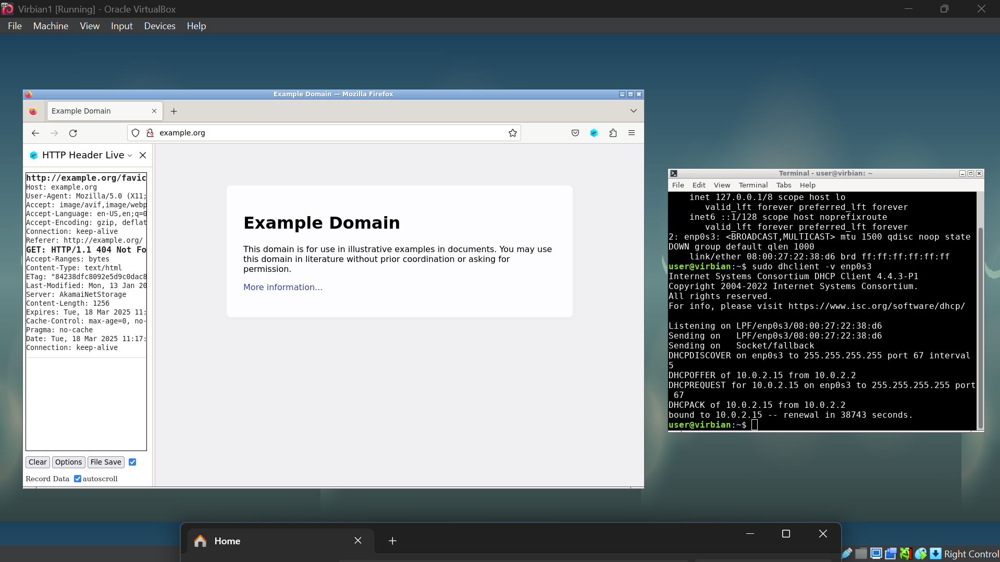
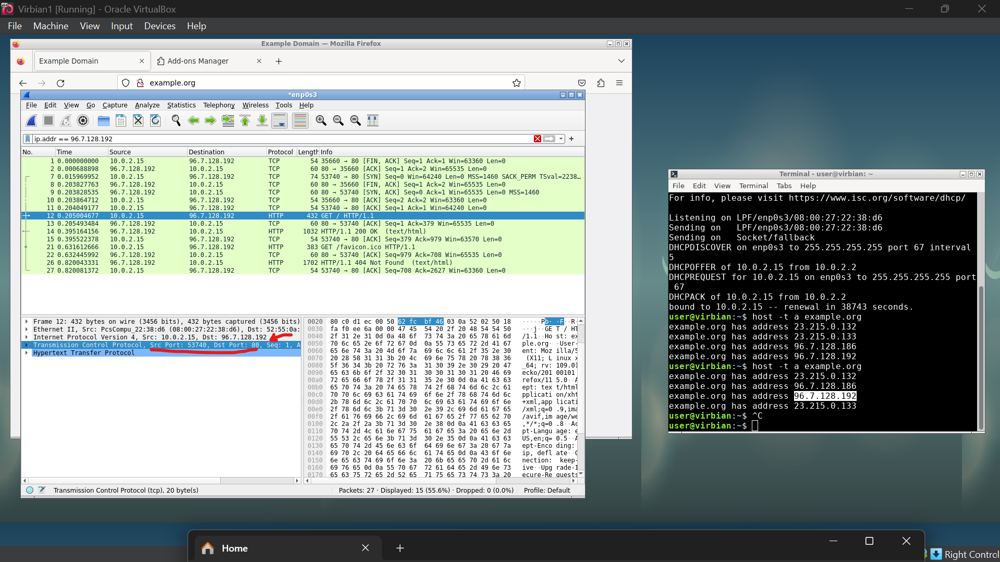
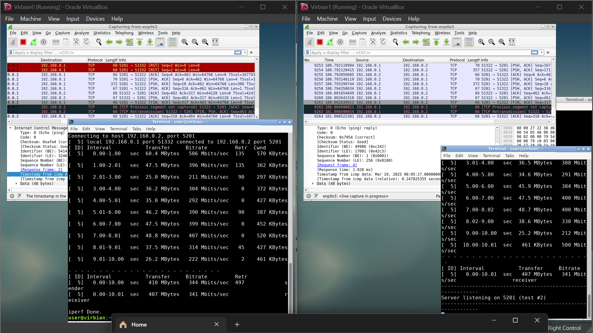
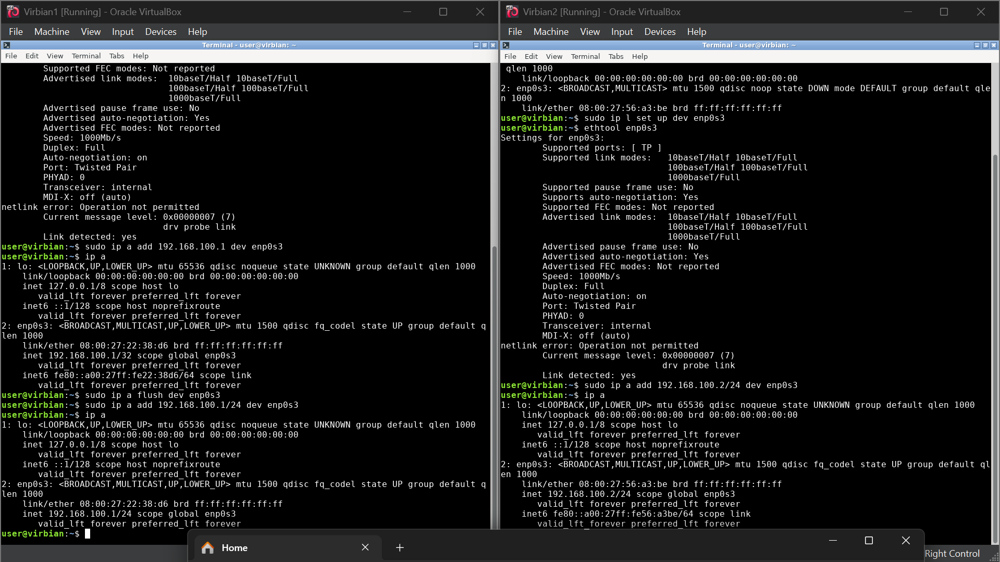

# Lista 1
## Podsumowanie/notatki

* aktywowanie kart:
```bash
sudo ip link set up dev enp0s3
```

* sprawdzanie stanu kart:
```bash
ethtool enp0s3
```

* przypisanie adresu IP:
```bash
sudo ip addr add 192.168.0.1/24 dev enp0s3
```

* pingowanie
```bash
ping 192.168.0.1
```

* testowanie przepustowości łącza
```bash
VM1 $> iperf3 -s
VM2 $> iperf3 -c 192.168.0.1
```

* łączenie się z serwerem echa innej maszyny
```bash
telnet 192.168.0.2 7
```

* dekonfiugracja karty
```bash
sudo ip link set down dev enp0s3
sudo ip addr flush dev enp0s3
```


## Tutorial 1







## Tutorial 2




## Wyzwanie 1




