# List 2

## Tutorial 1
### Zmiana nazwy karty sieciowej z `AAA` na `BBB`:
```bash
ip link set AAA name BBB
```

### Wyświetlanie tablicy routingu
```bash
ip route
ip route list table local
```

(ewentualnie starszym poleceniem `route -n`)  

## Tutorial 2

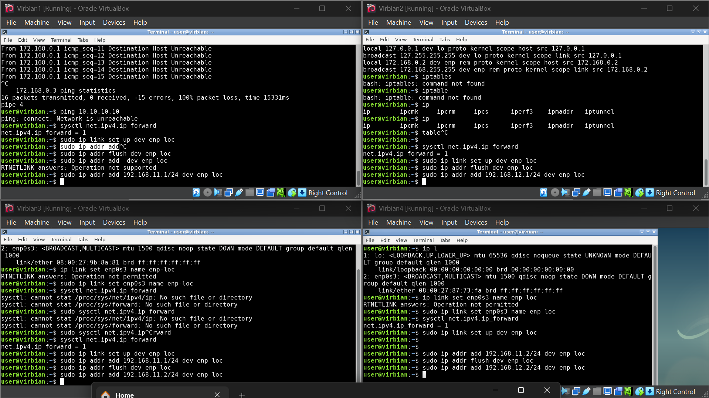
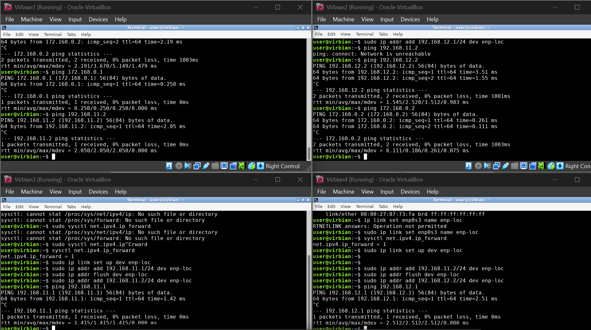
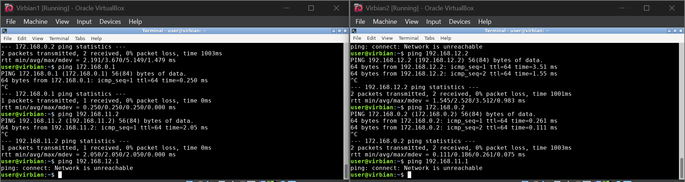
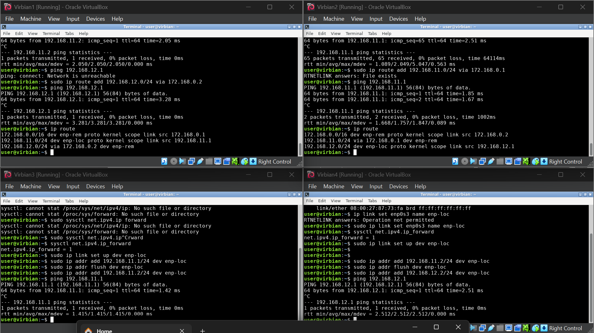

_____

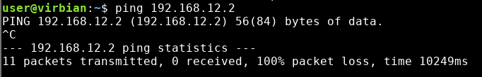
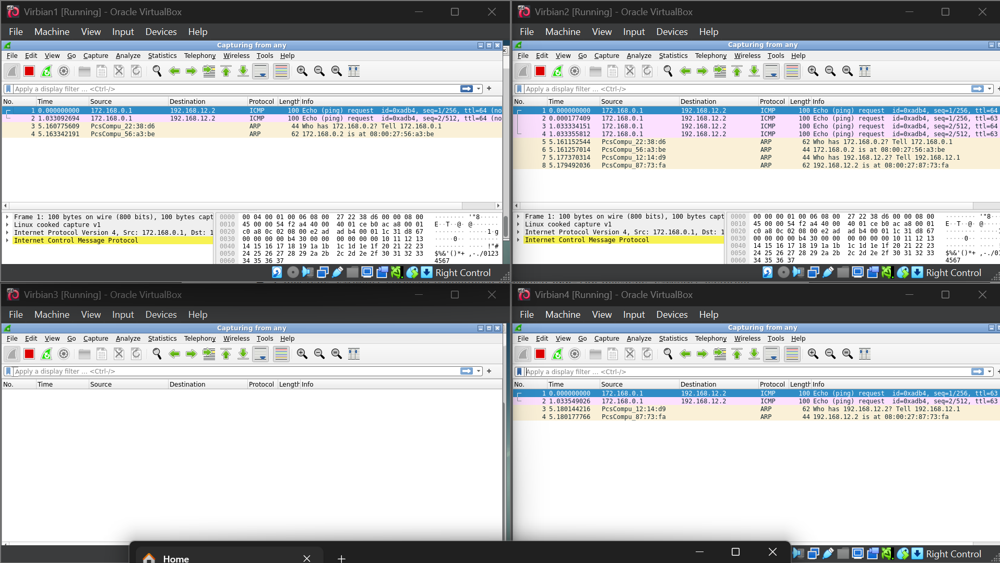

virbian4 nie wie jak zroutować odpowiedź zwrotną pingu

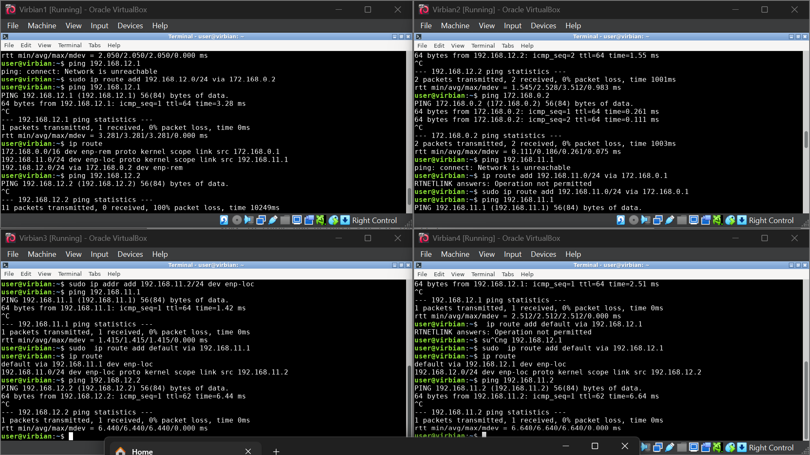
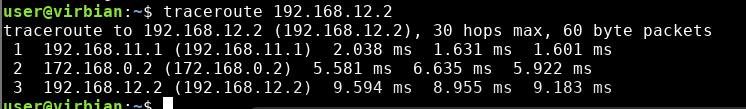


## Wyzwanie 1

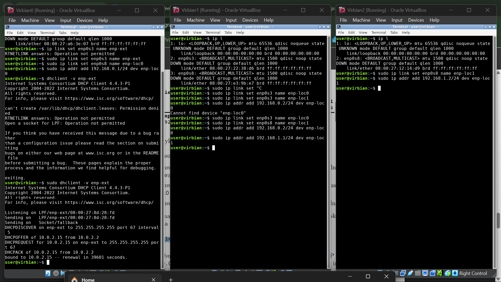
oraz `ip link set ENPDEV up`

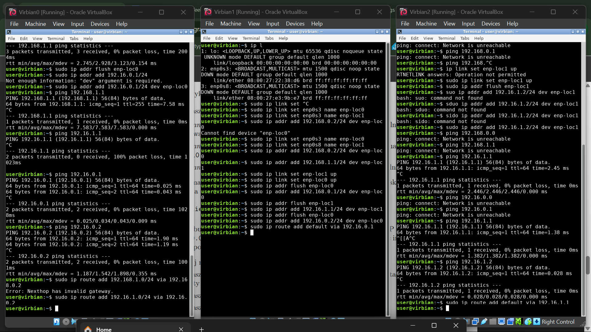
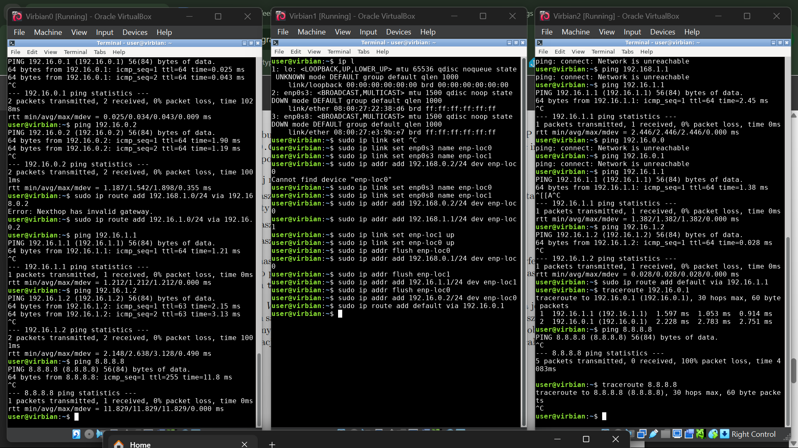
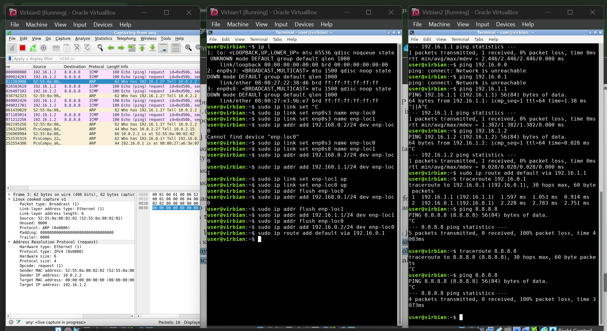

Virbian0 nie wie że powinien kierować odpowiedź zwrotną pingu od 8.8.8.8 do Virbian2 przez Virbian1


