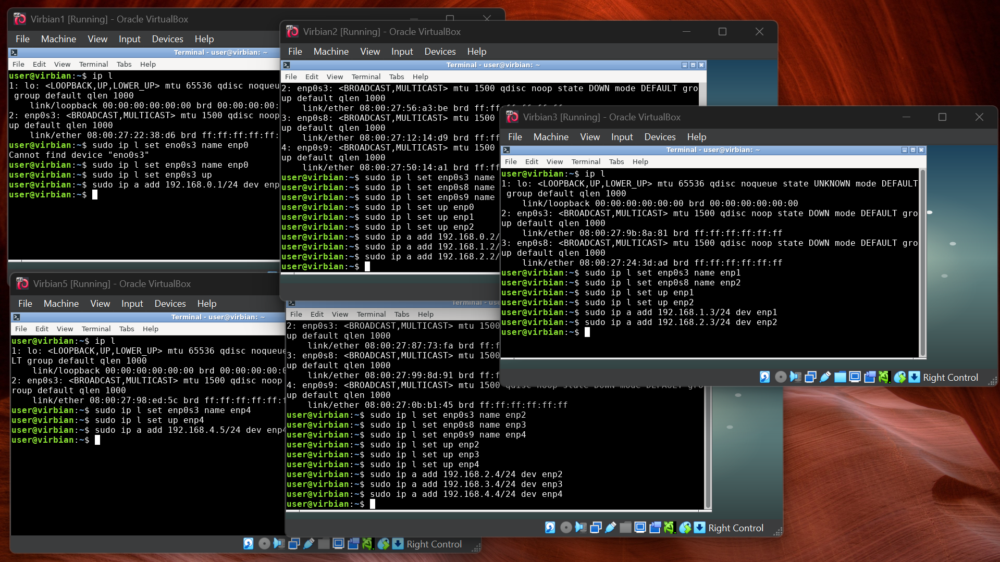
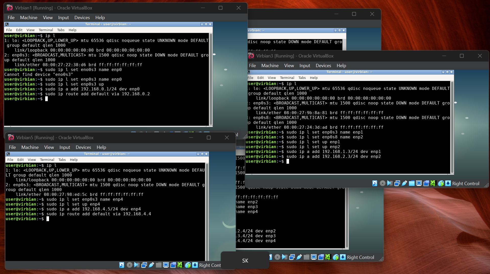
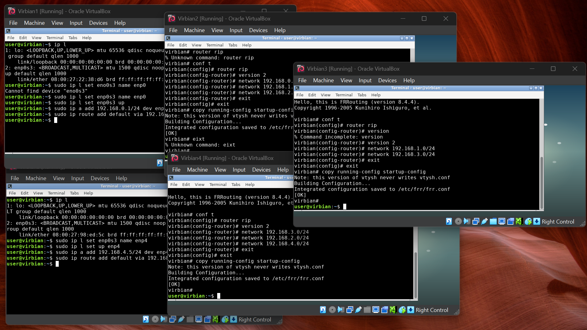
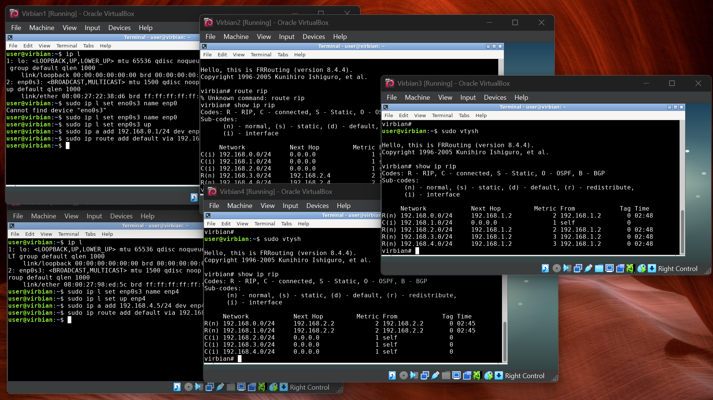
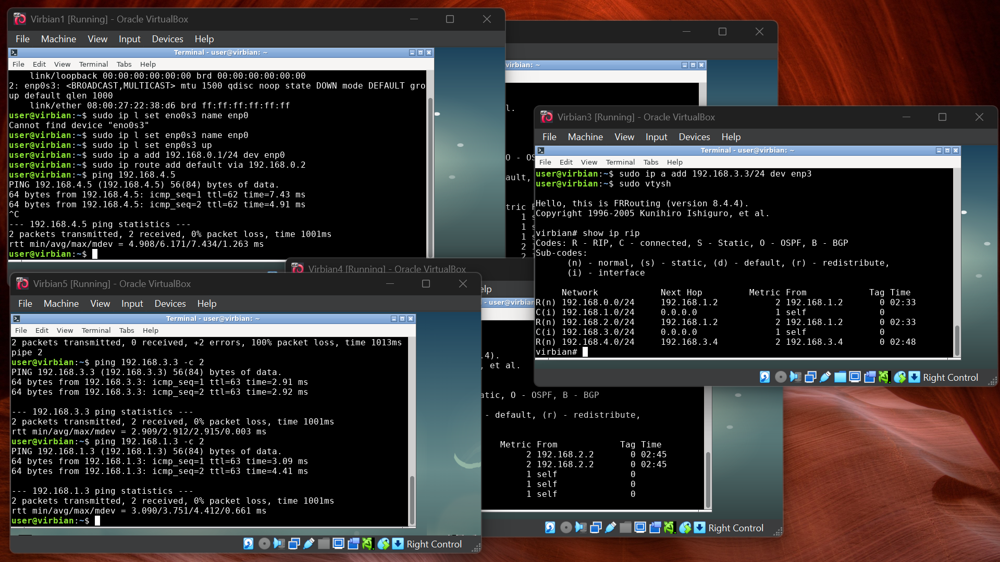

# Lista 3
## QiA
- odnośnie tej konfiguracji routera - jak ona się porównuje z innymi routerami (np edgerouterx, tak bez powodu ;> )

## Konfiguracja początkowa

- Sprawdź, co dzieje się, jeśli z maszyny Virbian1 pingasz adres 192.168.3.3. Jaką odpo-
wiedź dostajesz, od jakiej maszyny i dlaczego od niej?

odpowiedź dostajemy z V2 bo jest ona ustawiona na bramę domyślną więc V1 polega na niej przy rezolucji tego adresu  


## Tutorial 1
### konfiguracja RIP
w pliku `/etc/frr/daemons/` ustawiamy wiersz `ripd=yes` oraz uruchamiamy daemona `sudo systemctl start frr`  
wchodzimy do trybu kofiguracyjnego za pomocą `sudo vtysh` (wchodząc do konsoli routera) a potem `configure terminal` (lub po prostu `conf t`)  
następnie aby włączyć RIP wpisujemy:  

```bash
router rip
version 2
network 192.168.1.0/24
network 192.168.2.0/24
```

(aby usunąć sieć wpisujemy w trakcie konfiguracji routera `no network [adres sieci]`)  

zapisujemy zmiany za pomocą `copy running-config startup-config`

aby wyświetliś skonfigurowane trasuy wpisujemy `show ip rip`


## Tutorial 2


## Wyzwanie 1




