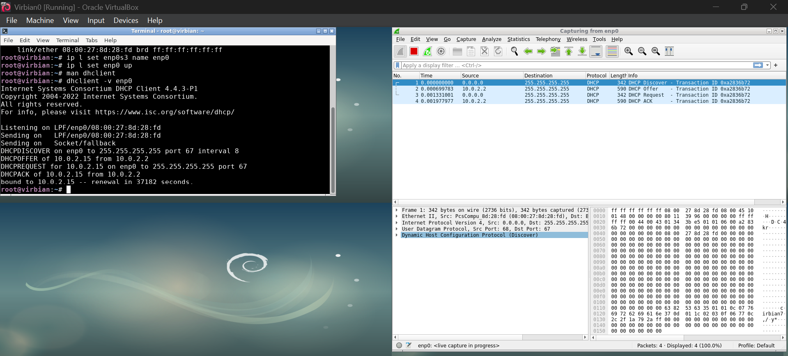
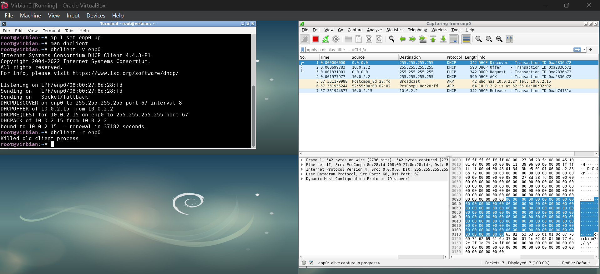
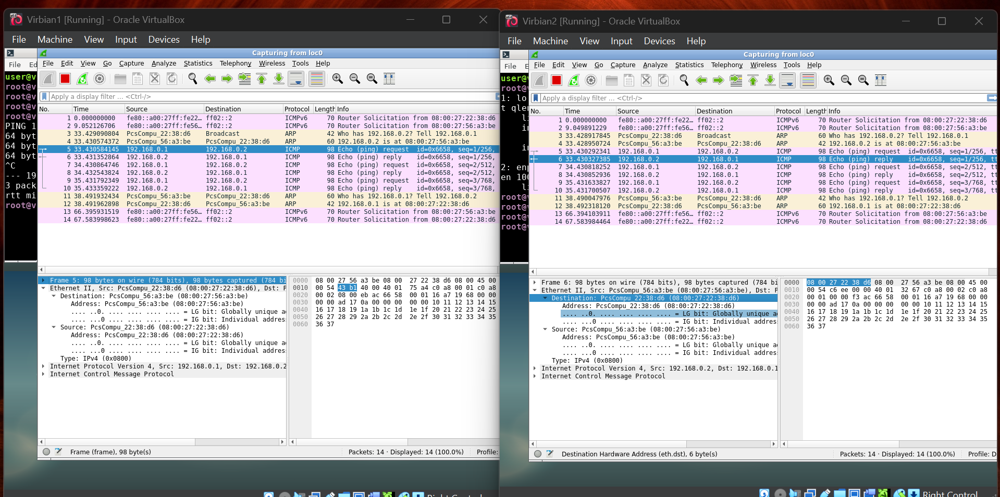
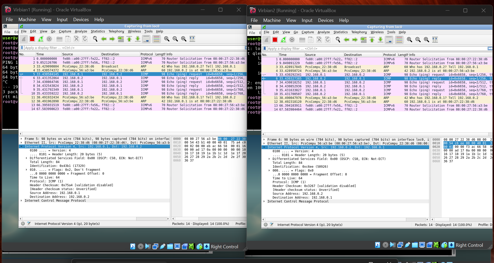
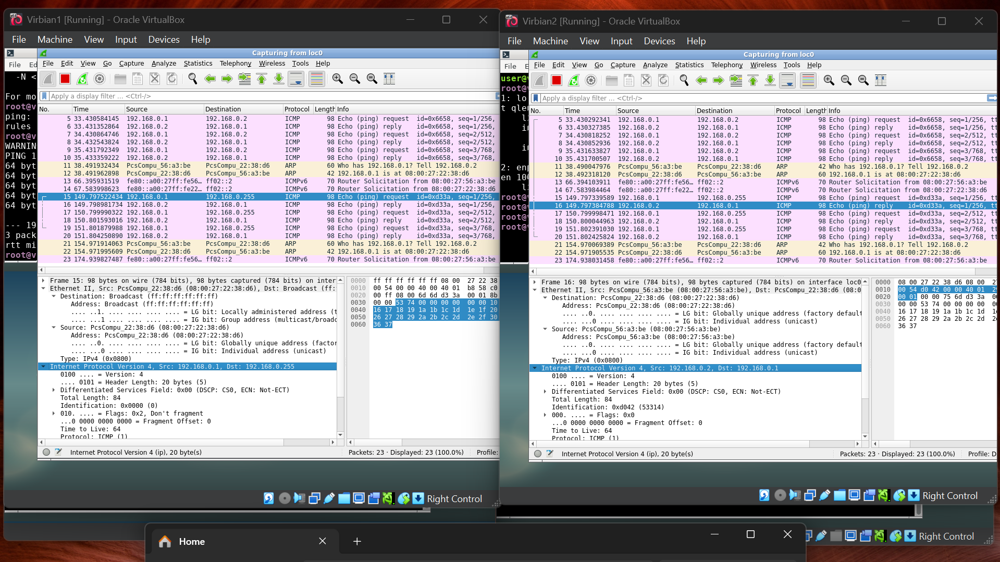
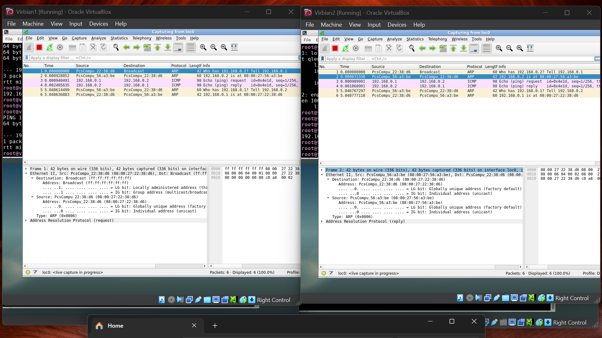
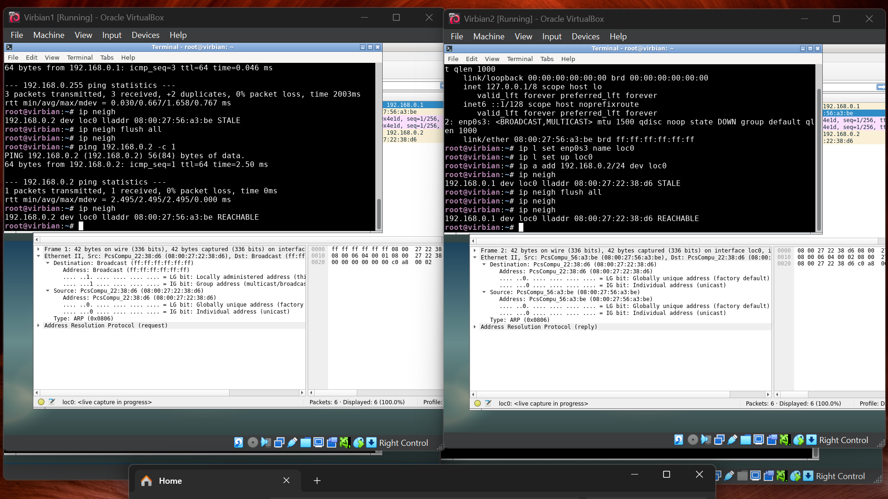
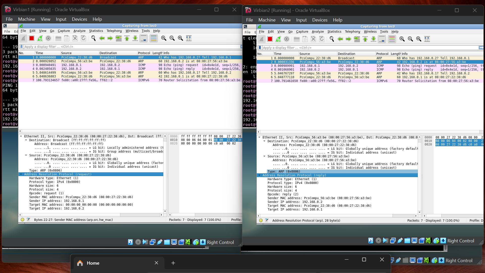
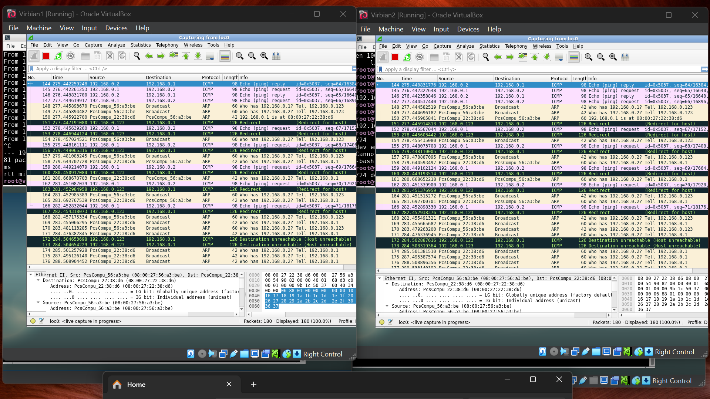
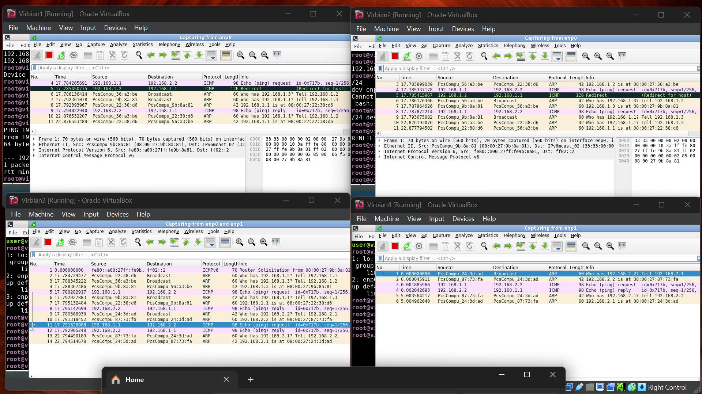

# List 5
## Tutorial 1

## Tutorial 2

## Tutorial 3

## Wyzwanie 1

- Jaka jest sugerowana przez maszynę Virbian2 modyfikacja tablicy routingu na maszynie Virbian1?
Zmiana bramy domyślnej na maszynę Virbian3

- Dlaczego taka zmiana ma sens?
Ponieważ są w tej samej podsiecie, to Virbian1 widzi Virbian3. Natomiast Virbian2 ma ustawioną bramę domyślną na Virbian3, więc bez sensu żeby Virbian1 przechodziły przez Virbian2 do Virbian3

- W jaki sposób maszyna Virbian2 mogła wykryć powyższy problem?
Mogła zauważyć że sama ma ustawioną bramę domyślną na komputer w tej samej podsieci, z której przyszło zapytanie Virbian1 - więc poinformowała maszynę Virbian1 że dla jego zapytania bramą był komputer Virbian3.

