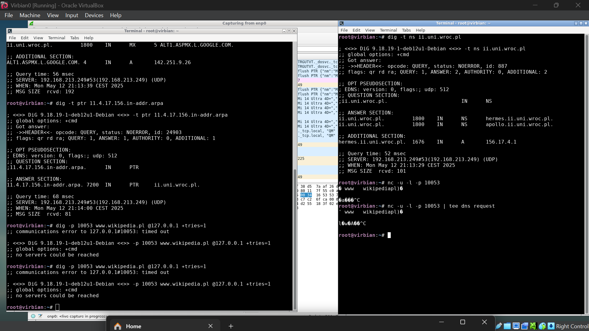

# List 7

## Tutorial 1

> 130.89.148.77  
> (while true; do netstat -tan | grep 130.89.148.77 ; done) | tee tcp log  
> wget http://130.89.148.77/   
> trickle -d 10 wget http://130.89.148.77  

w tcp_log jest tylko TIME_WAIT, SYN_SENT, ESTABLISHED, FIN_WAIT

otwarcie aktywne - klient  
zamknięcie pasywne - klient

## Tutorial 2

## Tutorial 3

## Wyzwanie 1

ponieważ nasz serwer proxy nie robi niczego dalej z otrzymanym pakietem  

