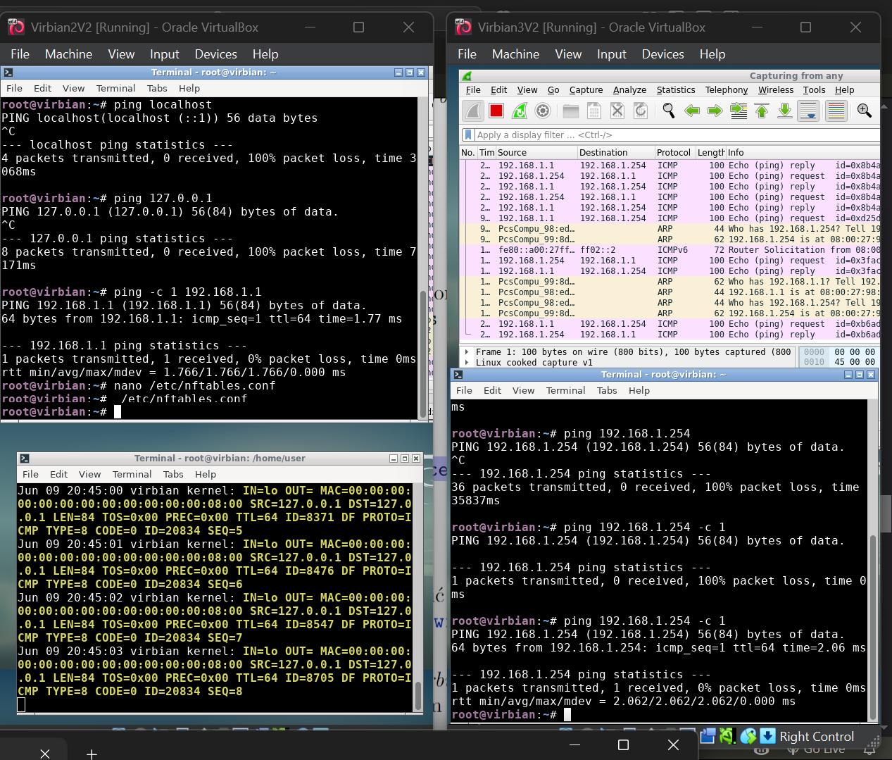

# Lista 8
## Tutorial 1


```
root@virbian:~# ssh -v user@192.168.1.254
OpenSSH_9.2p1 Debian-2+deb12u2, OpenSSL 3.0.11 19 Sep 2023
debug1: Reading configuration data /etc/ssh/ssh_config
debug1: /etc/ssh/ssh_config line 19: include /etc/ssh/ssh_config.d/*.conf matched no files
debug1: /etc/ssh/ssh_config line 21: Applying options for *
debug1: Connecting to 192.168.1.254 [192.168.1.254] port 22.
debug1: Connection established.
debug1: identity file /root/.ssh/id_rsa type 0
debug1: identity file /root/.ssh/id_rsa-cert type -1
debug1: identity file /root/.ssh/id_ecdsa type -1
debug1: identity file /root/.ssh/id_ecdsa-cert type -1
debug1: identity file /root/.ssh/id_ecdsa_sk type -1
debug1: identity file /root/.ssh/id_ecdsa_sk-cert type -1
debug1: identity file /root/.ssh/id_ed25519 type -1
debug1: identity file /root/.ssh/id_ed25519-cert type -1
debug1: identity file /root/.ssh/id_ed25519_sk type -1
debug1: identity file /root/.ssh/id_ed25519_sk-cert type -1
debug1: identity file /root/.ssh/id_xmss type -1
debug1: identity file /root/.ssh/id_xmss-cert type -1
debug1: identity file /root/.ssh/id_dsa type -1
debug1: identity file /root/.ssh/id_dsa-cert type -1
debug1: Local version string SSH-2.0-OpenSSH_9.2p1 Debian-2+deb12u2
debug1: Remote protocol version 2.0, remote software version OpenSSH_9.2p1 Debian-2+deb12u2
debug1: compat_banner: match: OpenSSH_9.2p1 Debian-2+deb12u2 pat OpenSSH* compat 0x04000000
debug1: Authenticating to 192.168.1.254:22 as 'user'
debug1: load_hostkeys: fopen /root/.ssh/known_hosts2: No such file or directory
debug1: load_hostkeys: fopen /etc/ssh/ssh_known_hosts: No such file or directory
debug1: load_hostkeys: fopen /etc/ssh/ssh_known_hosts2: No such file or directory
debug1: SSH2_MSG_KEXINIT sent
debug1: SSH2_MSG_KEXINIT received
debug1: kex: algorithm: sntrup761x25519-sha512@openssh.com
debug1: kex: host key algorithm: ssh-ed25519
debug1: kex: server->client cipher: chacha20-poly1305@openssh.com MAC: <implicit> compression: none
debug1: kex: client->server cipher: chacha20-poly1305@openssh.com MAC: <implicit> compression: none
debug1: expecting SSH2_MSG_KEX_ECDH_REPLY
debug1: SSH2_MSG_KEX_ECDH_REPLY received
debug1: Server host key: ssh-ed25519 SHA256:/SOpYr7hLHxMVYcmWp/iuBzW5TG8p1ugp9lHkGaHRQ8
debug1: load_hostkeys: fopen /root/.ssh/known_hosts2: No such file or directory
debug1: load_hostkeys: fopen /etc/ssh/ssh_known_hosts: No such file or directory
debug1: load_hostkeys: fopen /etc/ssh/ssh_known_hosts2: No such file or directory
debug1: Host '192.168.1.254' is known and matches the ED25519 host key.
debug1: Found key in /root/.ssh/known_hosts:1
debug1: ssh_packet_send2_wrapped: resetting send seqnr 3
debug1: rekey out after 134217728 blocks
debug1: SSH2_MSG_NEWKEYS sent
debug1: expecting SSH2_MSG_NEWKEYS
debug1: ssh_packet_read_poll2: resetting read seqnr 3
debug1: SSH2_MSG_NEWKEYS received
debug1: rekey in after 134217728 blocks
debug1: Will attempt key: /root/.ssh/id_rsa RSA SHA256:cEoVstoWGC04cM1TDSIZnOIqwa6cXpbClss2KcUOCUg
debug1: Will attempt key: /root/.ssh/id_ecdsa 
debug1: Will attempt key: /root/.ssh/id_ecdsa_sk 
debug1: Will attempt key: /root/.ssh/id_ed25519 
debug1: Will attempt key: /root/.ssh/id_ed25519_sk 
debug1: Will attempt key: /root/.ssh/id_xmss 
debug1: Will attempt key: /root/.ssh/id_dsa 
debug1: SSH2_MSG_EXT_INFO received
debug1: kex_input_ext_info: server-sig-algs=<ssh-ed25519,sk-ssh-ed25519@openssh.com,ecdsa-sha2-nistp256,ecdsa-sha2-nistp384,ecdsa-sha2-nistp521,sk-ecdsa-sha2-nistp256@openssh.com,webauthn-sk-ecdsa-sha2-nistp256@openssh.com,ssh-dss,ssh-rsa,rsa-sha2-256,rsa-sha2-512>
debug1: kex_input_ext_info: publickey-hostbound@openssh.com=<0>
debug1: SSH2_MSG_SERVICE_ACCEPT received
debug1: Authentications that can continue: publickey,password
debug1: Next authentication method: publickey
debug1: Offering public key: /root/.ssh/id_rsa RSA SHA256:cEoVstoWGC04cM1TDSIZnOIqwa6cXpbClss2KcUOCUg
debug1: Server accepts key: /root/.ssh/id_rsa RSA SHA256:cEoVstoWGC04cM1TDSIZnOIqwa6cXpbClss2KcUOCUg
Authenticated to 192.168.1.254 ([192.168.1.254]:22) using "publickey".
debug1: channel 0: new session [client-session] (inactive timeout: 0)
debug1: Requesting no-more-sessions@openssh.com
debug1: Entering interactive session.
debug1: pledge: filesystem
debug1: client_input_global_request: rtype hostkeys-00@openssh.com want_reply 0
debug1: client_input_hostkeys: searching /root/.ssh/known_hosts for 192.168.1.254 / (none)
debug1: client_input_hostkeys: searching /root/.ssh/known_hosts2 for 192.168.1.254 / (none)
debug1: client_input_hostkeys: hostkeys file /root/.ssh/known_hosts2 does not exist
debug1: client_input_hostkeys: no new or deprecated keys from server
debug1: Remote: /home/user/.ssh/authorized_keys:1: key options: agent-forwarding port-forwarding pty user-rc x11-forwarding
debug1: Remote: /home/user/.ssh/authorized_keys:1: key options: agent-forwarding port-forwarding pty user-rc x11-forwarding
debug1: Sending environment.
debug1: channel 0: setting env LANG = "C"
debug1: pledge: fork
Linux virbian 6.1.0-18-amd64 #1 SMP PREEMPT_DYNAMIC Debian 6.1.76-1 (2024-02-01) x86_64

The programs included with the Debian GNU/Linux system are free software;
the exact distribution terms for each program are described in the
individual files in /usr/share/doc/*/copyright.

Debian GNU/Linux comes with ABSOLUTELY NO WARRANTY, to the extent
permitted by applicable law.
Last login: Mon Jun  9 20:21:53 2025 from 192.168.1.1
[REMOTE] user@virbian:~$ 
```


## Tutorial 2





## Wyzwanie 1


