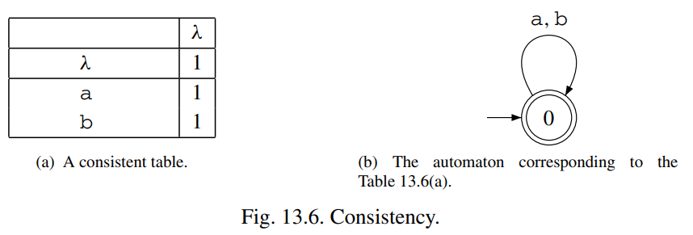
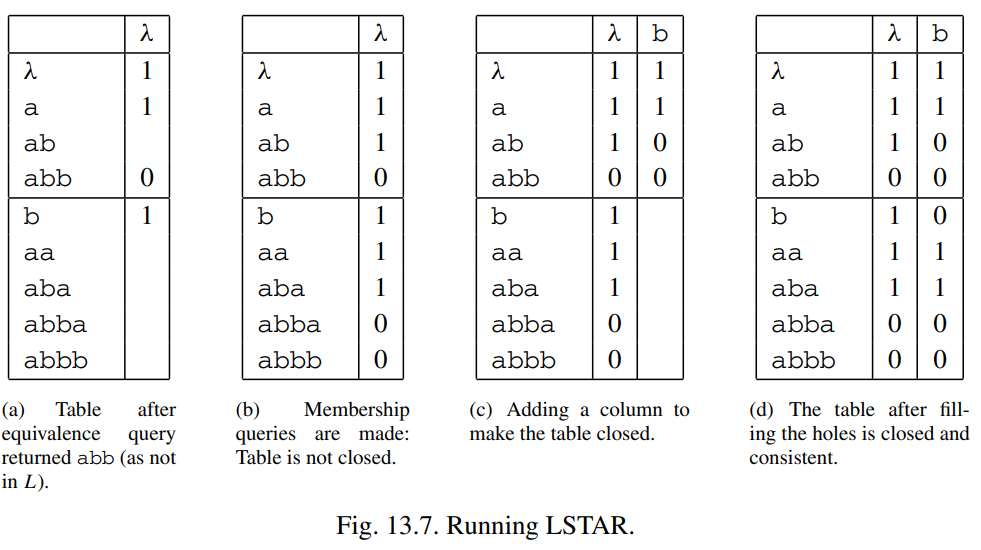
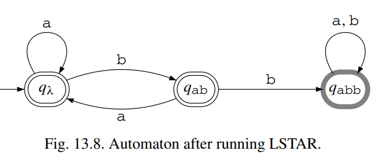
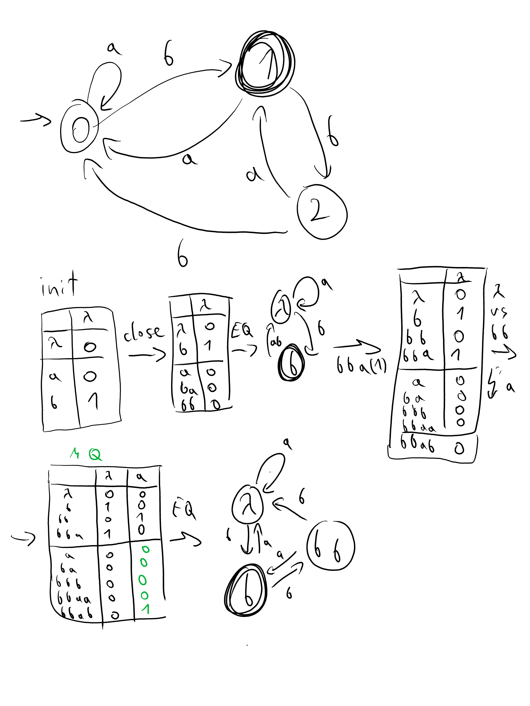

## MAT
przypomnienie co to znaczy  
o konstrukcji, ciężko z **blackboxem**

## concept
opowiedzieć o każdym kroku

## DEF OT
EXERC: niech spróbują zgadnąć związek OT z DFA  
wytłumacz mnw jak DFA został wyliczony z OT

### def
intuicja - jaki element OT jest czym  
TABLICA

## dziury
wytłumacz dlaczego dziury to problem  
narysuj dziurawy automat

## zamkniętość
rzędy równoważne <=> nie można ich odróżnić na podstawie ekseprymentów  
intuicja: zamknięta <=> niebieskie są niepotrzebne (na razie)

### jak zamknąć
dla pewnych prefiksów i tego samego suffiksu niebieski jest rozróżnialny od wszystkich czerwonych <=> te prefiksy mogą i muszą prowadzić do różnych stanów  

## build DFA
def prefix-closed: każdy stan ze STA musi mieć wszystkie swoje prefiksy w STA  

podaj intuicję do każdego z wymagań:  
* pref/suff closed - chcemy znać jakąś drogę do każdego z naszych stanów (wpp moglibyśmy nie wiedzieć jak do jakiegoś dojść)  
* jak wcześniej: inaczej nie wiemy jak zkonstruować automat
* chcemy zagwarantować że w red mamy wszystkie potrzebne stany

## spójność
intuicja: na miarę naszej aktualnej wiedzy, stany równoważne w red faktycznie powinny być równoważne w automacie  
jeżeli to nie prawda, to mamy dowód ich nierównoważności

## koncept
mamy tabelę:  
* bez dziur
* niebieskie stany są niepotrzebne
* równoważne stany czerwone są tym samym stanem   

## explain algorithm

## alg example
show automata and solve example

## proof
* how to prove
* każdy reg lang ma uni DFA (n stanów)
* nasz DFA ma tyle stanów co uni Red
* co dodaje uni Red => każda iteracja EQ

## złożoność
## probl implem
## przykład
