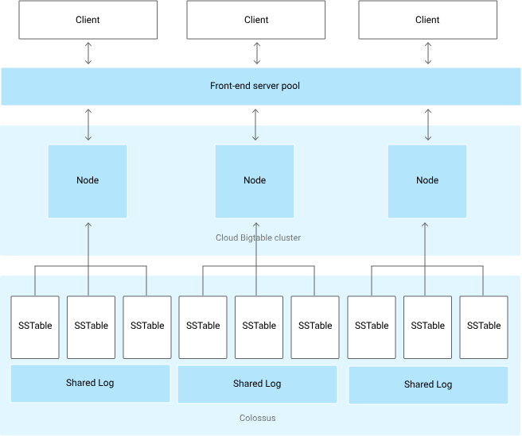

# Lista 0

| 1 | 2 | 3 | 4 | 5 | 6 | 7 | 8 | 9 |
|---|---|---|---|---|---|---|---|---|
| X | X | X | X | X | X | X | X | X |

## Zadanie 1
**Wyjaśnij, czemu możemy chcieć uruchamiać testy:**
- **w losowej kolejności,**

testy mogą wpywać na siebie nawzajem - więc uruchamianie ich w losowej kolejności pozwala wykryć takie zależności  
(np poprzedni test zostawił jakiś niezresetowany stan, tylko jeden inny test na to zareaguje)

- **kilkukrotnie z wymogiem, że muszą przejść co najmniej raz,**

testy mogą być niestabilne - (np niestabilne środowisko) więc możemy oczekiwać jakiegokolwiek przejścia testu

- **kilkukrotnie z wymogiem, że muszą przejść za każdym razem.**

testy mogą być niestabilne - (np zależne od czasu, zasobów sieciowych itp) ale chcemy żeby testy przechodziły niezależnie (testujemy stabilność serwisu)

przykładowa biblioteka w Java: `Mockito`

## Zadanie 2
**Jesteś częścią zespołu DevOps w korporacji. Musisz przygotować predykcję zużycia zasobów obliczeniowych w prywatnej chmurze firmy na przyszły rok, tak by można było odpowiednio zaplanować koszty. Zastanów się jakich informacji będziesz w tym celu potrzebował i przygotuj listę pytań, która pozwoli Ci te informacje zdobyć.**

- Musimy przeanalizować historyczne zużycie zasobów:
  - Jakie zasoby (CPU, GPU, RAM, dysk, sieć) i w jakim stopniu były wykorzystywane w przeszłości?
  - Czy były okresy szczytowego zużycia? Kiedy, jak często i czy wiadomo dlaczego?
  - Na jakiej technologii jest postawiony serwis? (np czy używamy kontenerów, VM, bare metal - w jakim frameworku jest napisany)
- Warto też wiedzieć czy spodziewamy się zmian tych trendów - czy spodziewamy się wzrostu liczby użytkowników, spowodowanych np dodatkowym marketingiem?
- Jakie zmainy mamy zaplanowane (w infrastrukturze, kodzie serwisowym)?

## Zadanie 3
**Przedstaw składnię formatu YAML i omów problemy, które w niej występują.**

[Dokumentacja](https://yaml.org/spec/1.2.2/)

### [składnia](https://yaml.org/spec/1.2.2/#chapter-2-language-overview:~:text=basic%20YAML%20schemas.-,Chapter%202.%20Language%20Overview,-This%20section%20provides):  
- wcięcia definiują strukturę (podobnie jak w Pythonie)
- listy definiujemy przez `- ` na początku linii
- słowniki definiujemy przez `klucz: wartość`
- wartości mogą być różnego typu: string, liczby, boolean, null, listy
- stringi mogą być definiowane bez cudzysłowów
- komentarze zaczynają się od `#`
- wieloliniowe stringi można definiować przez `|` lub `>` na końcu linii

### problemy:  
- wcięcia są wrażliwe na spacje i tabulatory, co może prowadzić do błędów
- brak wymuszenia typu danych może prowadzić do niejednoznaczności

## Zadanie 4
**Wybierz jedną z bibliotek: jinja2 bądź jsonnet i opisz czym jest oraz jakie ma zastosowanie.**

### Jinja2
[Dokumentacja](https://jinja.palletsprojects.com/en/stable/)  
> "Jinja2 to szybki, ekspresyjny i rozszerzalny silnik szablonów. Specjalne zako w szablonie pozwalają pisać kod zbliżony do składni Pythona. Następnie do szablonu przekazywane są dane, aby wygenerować końcowy dokument."  

Jinja (Jinja2 to jego nowsza wersja) to silnik szablonów (biblioteka w Pythonie), pozwala tworzyć szablony dokumentów (np HTML, XML, YAML, JSON itp)

### Zastosowanie:
- pliki konfiguracyjne (np HomeAssistant 😉)
- tworzenie dynamicznych stron HTML (Flask)

## Zadanie 5
- **Załóżmy, że Twój program uruchamia się niezawodnie w 99,99% przypadków. To dużo, czy mało?**

Zależy (np od skali - użytkownik indywidualny vs firma wieloma pracownikami)  

- **Teraz wyobraź sobie, że Twoim klientem jest firma z 100 000 pracowników i każdy z nich zaczyna pracę od uruchomienia Twojego programu. Ilu pracowników będzie miało codziennie problem z Twoim programem?**

Liczba pracowników z problemem = $100000 * 0.0001 = 10$

## Zadanie 6
**Opisz jak działa struktura Bigtable**  
Fay Chang i in. 'Bigtable: A Distributed Storage System for Structured Data'. W: 7th USENIX
Symposium on Operating Systems Design and Implementation (OSDI). 2006, s. 205–218.

[paper](https://static.googleusercontent.com/media/research.google.com/pl//archive/bigtable-osdi06.pdf)   
[google cloud docs](https://cloud.google.com/bigtable/docs/overview)

Bigtable to rozproszona, kolumnowo zorientowana baza NoSQL od Google, zaprojektowana do przechowywania bardzo dużych zbiorów danych (miliardy wierszy, tysiące kolumn).  

Przechowywana jest tablica z wersjonowanymi komórkami - posortowana mapa klucz-wartość, gdzie wiersze są indeksowane pojedynczym kluczem, a kolumny grupowane w rodziny i przypisaną nazwą (unikatową w rodzinie). Każda komórka może mieć wiele wersji oznaczonych timestampem.  
Zaptanie od użytkownika jest kierowane do któregoś z wierzchołków, co zrównolegla obsługę zapytań.  
Bigtable jest podzielona na tablety (bloki spójnych wierszy), każdy tablet przypisany do jednego wierzchołka. Dodatkowo wszystkie operacje zapisu są zapisywane we współdzielonym logu.  
Nad wszystkim panuje główny proces, który powiela tablety ze zwiększonym ruchem, oraz skleja tablety ze zbyt małym ruchem.  
Aby zwiększyć wydajność chcemy aby zapytania były rozłożone równomiernie na wierzchołki (dobry dobór kluczy wierszy) oraz aby powiązane wiersze były blisko siebie.

## Zadanie 7
**Twój zespół został przypisany do zaimplementowania nowej funkcjonalności, a Ty zostałeś/zostałaś wybrana do przeprowadzenia analizy i zaplanowania pracy. Zastanów się jakie pytania potrzebujesz zadać/jakie informacje uzyskać, by dobrze zaplanować pracę.**

- Kto będzie użytkownikiem tej funkcjonalności? 
- Jaki problem ma ta funkcjonalność rozwiązać?
- Jaki mamy budżet oraz deadline?
- Jakie funkcjonalności są już zaimplementowane? (jeżeli nowa funkcjonalność jest rozszerzeniem istniejącej, lub podobna do innej)
- Jaki jest dokładny zakres funkcjonalności? Czy są jakieś wymagania niefunkcjonalne (np zmiany w architekturze, wydajność, bezpieczeństwo)?

## Zadanie 8
**Załóżmy, że nadzorujesz aplikację w architekturze mikroserwisów. Większość zapytań Twój backend obsługuje z opóźnieniem 100ms, ale jedno zapytanie na 10 000 ma opóźnienie (ang. latency) 1s. Wyobraź sobie, że klient wysyła zapytanie, ono powoduje wysłanie 20 zapytań do mikroserwisów w backendzie, a jeden z mikroserwisów wysyła kolejne 20 zapytań. Jakie są możliwe opóźnienia odpowiedzi na zapytanie obserwowane przez klienta? Z jakim prawdopodobieństwem klient zaobserwuje wartości większe niż 200ms?**

Łączna liczba zapytań = $1 + 20*20 = 401$  
Opóźnienie 100ms, 1/10000 opóźnienie 1s   
Możliwe opóźnienia:  
- prawdopodobne jest nie wystąpnienie opóźnienia 1s - wtedy opóźnienie wynosi $2 * 100ms = 200ms$
- prawdopodobne jest wystąpnieie opóźnienia 1s za każdym razem - wtedy opóźnienie wynosi $2 * 1s = 2s$
- możliwa jest też każda wartość pomiędzy, z dokładnością do $100ms$  

Żeby klient zaobserwował opóźnienie **nie** większe niż $200ms$, każde zapytanie musi mieć opóźnienie $100ms$. PPB = $(9999/10000)^{401} \approx 0.9608$  
Prawdopodobieństwo, że klient zdaobserwuje opóźnienie większe $1 - 0.9608 = 0.0392$  

## Zadanie 9
**Zaprezentuj etckeeper. Czemu możemy chcieć go używać?**

[docs](https://wiki.archlinux.org/title/Etckeeper)

`etckeeper` wersjonuje folder `/etc` (z konfiguracją systemu),  np za pomocą git, przy każdej aktualizacji pakietów.  
Jeżeli jakaś aktualizacja popsuje konfigurację, można łatwo wrócić do poprzedniej wersji.  

