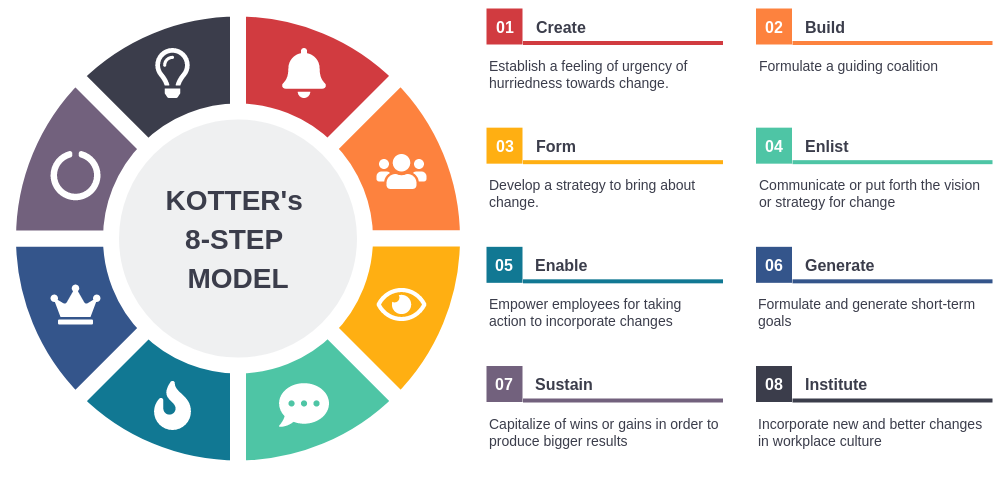

[(back)](../)

# Lista 1
| 1 | 2 | 3 | 4 | 5 | 6 | 7 |
|---|---|---|---|---|---|---|
|   |   | x | x | x | x | x |

## Zadanie 2
warto do obliczeń dodać bufor bezpieczeństwa (np 20%)

## Zadanie 3
**Metryki oraz wskaźniki są podstawą pracy DevOps i ogółem korporacji, trzeba jednak pamiętać, by je dobrze sformułować, bowiem zła formuła może spowodować, że będziemy optymalizowali coś czego optymalizować nie chcemy (zgodnie z zasadą ”Optymalizujesz dokładnie to, co mierzysz.”). Dla poniższych przykładów wskaźników wymyśl, w jaki sposób najłatwiej je zoptymalizować:**

- liczba zgłoszonych błędów (minimalizacja),
    - wprowadzenie dodatkowych **testów** jednostkowych, integracyjnych - aby wykryć błędy wcześniej
    - dodanie sekcji typu **FAQ**, aby użytkownicy mogli samodzielnie rozwiązywać najprostsze problemy
    - można **zniechęcić** użytkowników do zgłaszania błędów, np utrudniając zgłoszenie błędu, etc (kiepski pomysł, ale metryka poprawiona)

- liczba zgłoszonych elementów potencjalnie zagrażających BHP  (maksymalizacja),
    - **zachęcenie** użytkowników do zgłaszania - np poprzez nagrody
    - **szerzenie świadomości** na temat BHP, jakie błędy mogą się pojawić i jak je zgłaszać
    - **karanie** użytkowników za niezgłaszanie błędów BHP - np gdy użytkownik jest odpowiedzialny za pewien obszar, a w tym obszarze pojawi się błąd BHP, to użytkownik ponosi odpowiedzialność
    - wielokrotne zgłaszanie
    - zgłaszanie wszystkiego jako zagrożenie

- stosunek godzin poświęconych na implementację danej funkcjonalności, względem początkowej estymaty (optymalizacja w kierunku 1.0)
    - **zapisywać czas pracy** oraz estymaty dla każdej funkcjonalności (aby później móc analizować i lepiej szacować)
    - **dokładniejsze planowanie** funkcjonalności, aby niespodziewane problemy nas nie zaskoczyły
    - przeprowadzać **zespołową analizę** - niech każdy oszacuje, wyjaśni swoje szacunki, a następnie wyciągnąć z tego wynik
    - jeżeli nie analizujemy estymaty, to robimy dług techniczny, byle dostarczyć

- stosunek wstępnej estymaty czasu potrzebnego na implementację do czasu z estymaty pogłębionej (optymalizacja w kierunku 1.0)
    - kopiujemy estymatę pogłębioną jako wstępną (nie ma to sensu, ale metryka będzie idealna) 
    - **zapisywać poprzednie estymaty** i czas pracy - nie trwa to długo a dużo uczy i poprawia kolejne estymaty
    - bazowanie na estymatach **bardziej doświadczonych** osób (te mniej doświadczone mogą mieć tendencję do zaniżania estymat)
    - przeprowadzać **zespołową analizę**

## Zadanie 4
[Chaos Monkey](https://netflix.github.io/chaosmonkey/) - narzędzie stworzone przez Netflixa, które losowo wyłącza maszyny w środowisku produkcyjnym. Celem jest przetestowanie odporności systemu na awarie i upewnienie się, że aplikacje mogą kontynuować działanie pomimo utraty niektórych zasobów.  

Wymusza to na inżynierach myślenie o odporności i automatyzacji, a także pomaga identyfikować słabe punkty w infrastrukturze - wiedzą że ten problem się wydarzy.  
Chcemy go używać aby wykryć potencjalne słabości w infrastrukturze przed użytkownikiem - jeżeli coś się zepsuje, to możemy to od razu naprawić - nie czekając na to aż użytkownik 'przetestuje' to za nas.

## Zadanie 5
Zarządzanie zmianami (Change Management) wprowadzone przez Kurta Lewina to trzystopniowy proces:
- **rozmrożenie** (przygotowanie do zmiany) - przygotowanie organizacji: zidentyfikowanie dlaczego zmiana jest konieczna, usuwanie barier dla tej zmiany, przygotowanie ludzi (poinformowanie, zaangażowanie)
- **zmianę** (wdrożenie nowych rozwiązań) - wprowadzenie samej zmiany: wdrożenie nowych procesów, zachowań, technologii; zapewnienie wsparcia i szkolenia
- **zamrożenie** (utrwalenie nowej sytuacji) - ustabilizowanie nowego stanu: utrwalenie zmian poprzez procedury, aktualizację dokumentacji, monitorowanie, przygotowanie 

## Zadanie 6

"John Kotter’s 8-Step Process for Leading Change" to uporządkowane podejście do zarządzania zmianą w organizacji, które pomaga skutecznie wprowadzać i utrzymywać zmiany.

Kotter proponuje 8 etapów prowadzenia zmiany:

- Create a sense of urgency: Podaj powód, **dlaczego** zmiana jest **potrezbna** - aby **zmotywować** ludzi do działania.
- Build a guiding coalition: **Stwórz odpowiednią** grupę, która ma dostateczne wpływy, aby **prowadzić proces** tworzenia zmiany.
- Form a strategic vision: **Rozwiń wizję**, która wyjaśnia, jak przyszłość będzie się różnić oraz strategię, aby tam dotrzeć.
- Communicate the change vision: Regularnie i jasno **dziel się wizją**, aby upewnić się, że wszyscy ją rozumieją i akceptują.
- Enable action by removing barriers: **Zmuś ludzi do działania**, identyfikując i usuwając przeszkody, takie jak opór przed zmianą czy przestarzałe systemy.
- Generate short-term wins: Stwórz widoczne, krótko terminowe **kamienie milowe**, aby zbudować impet i pokazać, że zmiana jest możliwa.
- Sustain acceleration: Wykorzystaj **początkowe zwycięstwa**, aby **napędzać** dalsze **zmiany**, budując na tym impet, aby stawić czoła większym wyzwaniom.
- Institute change: **Utrwal** nowe podejścia w kulturze organizacyjnej, czyniąc je stałą częścią funkcjonowania organizacji.

## Zadanie 7
SLO (Service Level Objective) to mierzalny cel jakości usługi.  
SLOs są kluczowym elementem formalnej umowy zwanej SLA (Service Level Agreement), a ich realizacja jest mierzona za pomocą SLI (Service Level Indicator), czyli konkretnej metryki służącej do śledzenia wydajności.  

Osiągnięcie 100% metryki:
- jest bardzo kosztowne
- nie pozostawia miejsca na margines błędu - cel może być nieosiągalny
- ryzyko niechcianej optymalizacji (np manipulacja pomiarem lub zmiejszenie bezpieczeństwa/monitoringu serwisu)
- blokuje eksperymenty (boją się, że coś popsują i nie spełnią SLO)
- zespół próbuje zoptymalizować wskaźnik, a nie faktyczną jakość usługi
