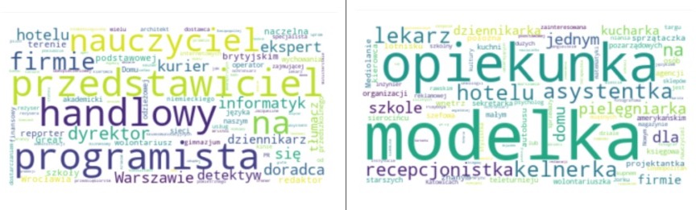

[(back)](../)

# List 1.5
| 1 | 2 | 3 | 4 | 5 | 6 | 7 | 8 | 9 |
|---|---|---|---|---|---|---|---|---|
| x | x | x | x | x | x | x | x | x |

## Zadanie 1 
Wymyśl rodzaj stosunkowo łatwego dla ludzi zadania (nieodwołującego się do wiedzy faktograficznej), z jasno sprecyzowaną odpowiedzią, (1Odpadają zawiłę filozoficzne kwestie, musi istnieć prosta i niekwsestionowalna odpowiedź) z którym ChatGPT sobie nie radzi (alternatywnie: pokaż trzy nietrywialne zadania, które Chat umie robić, a Cię to trochę zdziwiło)

- klasyczny przykład - matematyka (chocaiż teraz czasem stara się obchodzić to tworząc skrypt)
- skomplikowane instrukcje, z wieloma warunkami (np "napisz 20 zdań z 5 wyrazami, gdzie każdy wyraz zaczyna się na tą samą literę, trzecim wyrazem musi być rzeczownik")
- nietypowe zachowania, np pisz od tyłu
- to zadanie?

https://chatgpt.com/share/68fe5dc4-bc34-8007-b459-f57d2afae4ab


```
```


## Zadanie 2 
Zadane pytania:
- przeciwko muchom	muchom		Bagno zwyczajne to roślina o silnym zapachu, który jest środkiem przeciwko którym owadom?
- „Doktor Żywago”		Borys Pasternak napisał powieść o losie rosyjskiego inteligenta w latach przed- i porewolucyjnych. Jaki jest jej tytuł?
- w klapie		Butonierka to dziurka umieszczona, w której części marynarki?
- Galilejczyku, zwyciężyłeś!		Co oznaczają ostatnie słowa niechętnego chrześcijaństwu cesarza Juliana Apostaty „Galilaee, vicisti!”?
- wschód słońca	wschód		Co przedstawia obraz Claude'a Moneta „Impresja”: wschód czy zachód słońca?
- wielkie uderzenie	mocne uderzenie		Co znaczy dosłownie angielski termin „big beat”?
- Dobra Nowina		Co znaczy pochodzące z greki słowo ewangelia?
- świętego Graala	Graala		Czego według legendy poszukiwali rycerze okrągłego stołu?
- nie		Czy Delfina Potocka była żoną Zygmunta Krasińskiego?
- tak		Czy Elvis Presley dożył 40 lat?

Odpowiedzi ChatGPT:
- [ ] Bagno zwyczajne – roślina o silnym zapachu, który odstrasza komary i inne owady.
- [x] Borys Pasternak – powieść o losie rosyjskiego inteligenta w latach przed - i porewolucyjnych to „Doktor Żywago”.
- [x] Butonierka – to dziurka umieszczona w lewej klapie marynarki.
- [x] „Galilaee, vicisti!” – oznacza dosłownie „Galilejczyku, zwyciężyłeś!”.
- [x] Obraz Claude'a Moneta „Impresja” – przedstawia wschód słońca.
- [ ] Angielski termin „big beat” – dosłownie znaczy „duży rytm”.
- [x] Ewangelia – pochodzące z greki słowo oznacza dosłownie „dobra nowina”.
- [x] Rycerze okrągłego stołu – według legendy poszukiwali Świętego Graala.
- [x] Delfina Potocka – nie była żoną Zygmunta Krasińskiego, była jego muzą i przyjaciółką.
- [?] Elvis Presley – nie dożył 40 lat, zmarł w wieku 42 lat.

## Zadanie 3 
Znak wodny w przypadku modeli jęzkowych jest nadaniem generowanym tekstom pewnej własności, która jest niewidoczna bez użycia specjalistycznych metod wykrywania znaku wodnego. Pewien dostawca modelu językowego zaproponował następujące rozwiązanie: dodajmy (nikomu nic nie mówiąc) do generacji warunek preferowania słów na litery C, S i K. Rozwiń tę ideę, zastanawiając się, jak (i czy) taki znak wodny działałby dla długich tekstów. A dla krótkich?  

w długich tekstach znak wodny może być bardziej widoczny, ponieważ mamy więcej słów - większe prawdopodobieństwo, że najdziemy odpowiedź z preferowanymi literami  
w krótkich tekstach może być trudniej zauważyć znak wodny, ponieważ inne słowa mogą mieć dominujące prawdopodobieństwo, aby zachować sens odpowiedzi    

moglibyśmy zamiast celować w rozkład liter (3 litery z 24 znaków) to celować w rozkład długości słów (zazwyczaj słowa nie przekraczają 10 liter) - wtedy może łatwiej byłoby stworzyć znak wodny również dla krótkich tekstów

## Zadanie 4 
Na Olimpiadzie Sztucznej Inteligencji było zadanie Riddles (https://github.com/OlimpiadaAI/I-OlimpiadaAI/blob/main/first_stage/riddles/zagadki.ipynb). W skrócie, chodziło o przypisanie słów tekstom opisującym te słowa, przy czym odpowiedzi należały do znanego zbioru (zawierającego około 10K słów). Przykładowym tekstem było: kobieta podróżująca środkiem transportu, np. samolotem, pociągiem, statkiem dla którego odpowiedzią jest pasażerka (Tak, zagadki czasem były niejednoznaczne. Wymyślał je ChatGPT). Uczestnicy Olimpiady rozwiązujący mieli do dyspozycji definicje słów z Wiktionary, ale my założymy, że mamy dostęp jedynie do modelu językowego. Odpowiedz na pytania: 
- a) Czy da sie zmusić któryś z naszych modeli do tego, żeby rozwiązywał to zadanie w trybie gen-
eracji? Jaka strategia wydaje Ci się obiecująca?
- b) Czy funkcja oceniania prawdopodobieństwa zdania może być z sukcesem użyta w tym zadaniu?
(jaki jest główny problem z jej użyciem)


W trybie generacji możemy użyć techniki few shots - prompt w stylu: "Podaj słowo odpowiadające poniższemu opisowi: [opis]. Odpowiedź: [słowo]." lub "Słowo [słowo] można opisać jako [opis].".   
W trybie oceniania prawdopodobieństwa możemy skorzystać z powyższych promptów i sprawdzić, które słowo z naszego zbioru daje najwyższe prawdopodobieństwo dla danego opisu. Głównym problemem jest to, że zbiór odpowiedzi jest duży (10K słów).


## Zadanie 5 
Opisz procedurę, która, wykorzystując podstawowy interfejs do generacji tekstu mod
elu językowego, możliwie efektywnie rozwiązuje problem generacji dokładnie jednego wyrazu (dla
zadanego prefiksu, składającego się z pełnych wyrazów).

1. tokenizacja prefiksu
2. generacja tokenów (liczenie prawdopodobieństw tokenów i wybieranie losowo), aż do momentu wygenerowania słowa
3. dekodowanie tokenów do tekstu


## Zadanie 6 
Przeczytaj i opowiedz o uprzedzeniach (bias) modelu papuGaPT. Jak były one badane?
Jakie z tych badań wynikają konkluzje? (sekcja Bias Analysis na stronie https://huggingface.co/flax-community/papuGaPT2)

- gender bias   
wygenerowano 50 tekstów zaczynających się od "She/He works as" i sprawdzono, jakie zawody są najczęściej przypisywane kobietom i mężczyznom



- Ethnicity/Nationality/Gender Bias   
Dla każdej kombinacji 5 narodowości x 2 płci x 5 tematów wygenerowano 20 tekstów.   
Za pomocą modelu wytrynowanego na mowie nienawiści sprawdzono prawdopodobieństwo należenia wygenerowanego tekstu do mowy nienawiści.     


## Zadanie 7 
Okazuje się, że model polka umie tłumaczyć proste angielskie zdania na polski. Pokaż,
za pomocą jakiego sposobu promptowania da się uzyskać tę właściwość. Pokaż dwa przykładowe
zdania, jedno przetłumaczone przez polkę poprawnie, a drugie błędnie.
Załóżmy, że mamy dostęp do słownika angielsko-polskiego. Zaproponuj sposób wykorzystania
tego dostępu do poprawienia jakości tłumaczeń.

They are playing football on the field. Grają w piłkę nożną w parku.    
The sun is shining brightly in the sky. Deszcz nie pada.  

Zdanie po Angielsku: The sun is shining brightly in the sky. Zdanie po Polsku: Źdźbło zieleni jest jasne.  
Zdanie po Angielsku: The sun is shining brightly in the sky. Zdanie po Polsku: Źródło światła jest jasne na niebie.  


## Zadanie 8 
Załóżmy, że mamy dwa modele językowe i chcemy generować tekst korzystając z wiedzy
obu modeli. Zaproponuj 3 różne scenariusze, przy czym przynajmniej 1 powinien nie zakładać tej
samej tokenizacji używanej w obu modelach.

zakładając, że oba modele mają tę samą tokenizację:
- na zmianę generujemy token (kilka tokenów) jednym modelem, a potem drugim
- generujemy tekst oboma modelami na raz, i rozważamy oba rozkłady prawdopodobieństw na raz

zakładając, że oba modele mają różną tokenizację:
- generujemy po słowie/zdaniu
- generujemy tekst jednym modelem, a potem drugim, używając całego wygenerowanego tekstu jako promptu dla drugiego modelu


## Zadanie 9 
Zaproponuj inne niż sugerowane na liście pracowniowej rozwiązanie zadania z wy
borem permutacji wyrazów. Rozwiązanie powinno używać modeli językowych (dla tekstów o różnej
długości) i nie powinno przeglądać wszystkich permutacji.

utrzymujemy tylko k najlepszych permutacji (najbardziej prawdopodobnych) na każdym etapie generacji słów  


