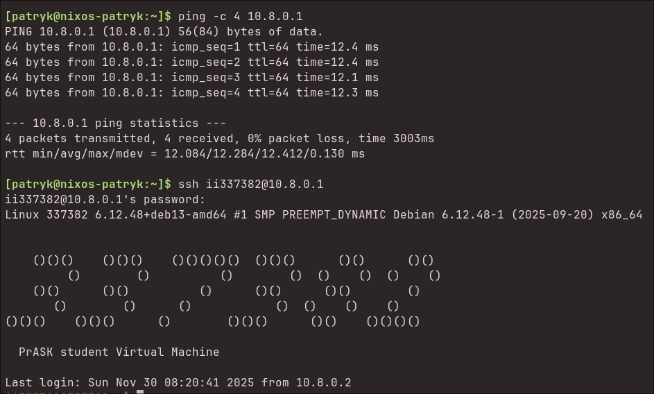
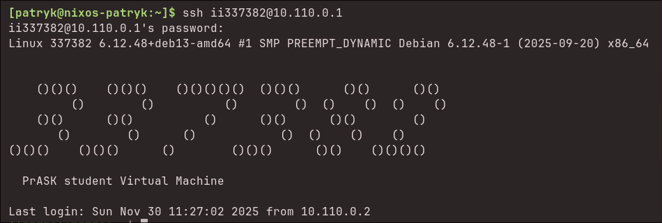

## instalacja openvpn
instalujemy [`openvpn`](https://openvpn.net/community-docs/how-to.html) oraz rekomendowaną paczkę [`easy-rsa`](https://github.com/OpenVPN/easy-rsa)

```bash
sudo apt update
sudo apt install openvpn easy-rsa
```

## konfiguracja openvpn jako serwer
### autoryzacja po kluczach ssl (nowe CA)
tworzymy nowe CA dla naszego openvpn (skorzystamy z easy-rsa):
```bash
make-cadir ~/openvpn-ca

./easyrsa init-pki
./easyrsa build-ca
```

następnie konfigurujemy serwer openvpn w `/etc/openvpn/server.conf` (możemy skorzystać z przykładowego pliku z `/usr/share/doc/openvpn/examples`):
```conf
port 1194
proto udp
dev tun

ca /etc/openvpn/server/ca.crt
cert /etc/openvpn/server/server.crt
key /etc/openvpn/server/server.key
dh /etc/openvpn/server/dh.pem

topology subnet

ifconfig-pool-persist /var/log/openvpn/ipp.txt

keepalive 10 120
persist-key
persist-tun

status /var/log/openvpn-status.log
verb 3

explicit-exit-notify 1
```

teraz tworzymy dh oraz certyfikaty dla serwera i klienta (za pomocą easyrsa):
```bash
./easyrsa gen-dh
./easyrsa build-server-full server nopass
./easyrsa build-client-full client1 nopass

sudo cp pki/ca.crt /etc/openvpn/server
sudo cp pki/dh.pem /etc/openvpn/server
sudo cp pki/issued/server.crt /etc/openvpn/server
sudo cp pki/private/server.key /etc/openvpn/server
```

na koniec, aby przetestować konfiguracę, startujemy server z folderu `/etc/openvpn/server` i jeżeli nie będzie błędów to startujemy jako daemon:
```bash
sudo openvpn /etc/openvpn/server/server.conf

sudo systemctl enable openvpn@server
sudo systemctl start openvpn@server
```


## konfiguracja z autoryzacją PAM
tworzymy analogiczny config do poprzedniego (`/etc/openvpn/server-pam.conf`):
```conf
port 1195
proto udp
dev tun1

ca /etc/openvpn/server/ca.crt
cert /etc/openvpn/server/server.crt
key /etc/openvpn/server/server.key
dh /etc/openvpn/server/dh.pem

plugin /usr/lib/openvpn/openvpn-plugin-auth-pam.so login
verify-client-cert none
username-as-common-name
```


## konfiguracja klienta
```conf
client
dev tun
proto udp
remote 91.204.161.220 1194

resolv-retry infinite
nobind

persist-key
persist-tun

ca ca.crt
cert client1.crt
key client1.key

remote-cert-tls server
verb 3
```

```bash
sudo openvpn --config client.conf
```

aby vpn startował bo boocie, konfigurujemy go jako daemona tak samo jak serewr



## konfiguracja serwera wireguard
instalujemy [wireguard'a](https://www.wireguard.com/quickstart/)
```bash
sudo apt update
sudo apt install wireguard
```

następnie generujemy klucze prywatne i publiczne:
```bash
wg genkey | tee server.key | wg pubkey > server.pub
# oraz pobieramy klucz publiczny klienta
```

następnie musimy na serwerze stworzyć interfejs (np `wg0`) typu `wireguard` z odopowiednią konfiguracją (proces ten można usprawnić za pomocą `wg-quick`):

```bash
sudo ip link add wg0 type wireguard
sudo ip address add 10.100.0.1/24 dev wg0

sudo wg set wg0 private-key ./server.key

sudo wg set wg0 peer "$(cat client.pub)" \
    allowed-ips 10.100.0.2/32 \
    endpoint 91.204.161.220:51820

sudo ip link set up dev wg0
```


aby uzyskać dostęp do internetu włączamu ip forwarding
```bash
echo 1 | sudo tee /proc/sys/net/ipv4/ip_forward
echo 1 | sudo tee /proc/sys/net/ipv6/conf/all/forwarding
```


## konfiguracja klienta wireguard

```bash
wg genkey | tee client.key | wg pubkey > client.pub
# pobieramy klucz publiczny serwera
```

```bash
sudo ip link add wg0 type wireguard

sudo ip address add 10.100.0.1/24 dev wg0

sudo wg set wg0 \
  private-key ./client.key \
  peer "$(cat server.pub)" \
  endpoint 91.204.161.220:51820 \
  allowed-ips 0.0.0.0/0

sudo ip link set up dev wg0
```


## konfiguracja za pomocą wg-quick
aby dodać NAT skorzyzstmy z masquarade

serwer:
```conf
[Interface]
Address = 10.110.0.1/24,fd00::1/8
ListenPort = 51820
PrivateKey = OIafOWSyym5fcfxrfTUoZQh1T4Aipb6x9Tuz/BB0InA=

# NAT IPv4
PostUp = iptables -t nat -A POSTROUTING -s 10.110.0.0/24 -o ens18 -j MASQUERADE
PostDown = iptables -t nat -D POSTROUTING -s 10.110.0.0/24 -o ens18 -j MASQUERADE

# NAT IPv6
PostUp = ip6tables -t nat -A POSTROUTING -s fd00::/8 -o ens18 -j MASQUERADE
PostDown = ip6tables -t nat -D POSTROUTING -s fd00::/8 -o ens18 -j MASQUERADE

# forwarding
PostUp = sysctl -w net.ipv4.ip_forward=1
PostUp = sysctl -w net.ipv6.conf.all.forwarding=1


[Peer]
PublicKey = po9vQRv3daezU44hgZaKMt6DcaXdSTk4/n8wxy0SbnM=
AllowedIPs = 10.110.0.2/32,fd00::2/128
```

```bash
sudo wg-quick up wg0
sudo systemctl enable wg-quick@wg0
```

klient:
```conf
[Interface]
Address = 10.110.0.2/24,fd00::2/8
PrivateKey = iIOsmg/qOn3Pd2Cb7gfPGmNwzeSYj95Jbs743yqnTGs=
#DNS = 1.1.1.1, 2606:4700:4700::1111

[Peer]
PublicKey = GDWAb6/Mu1EoWpPVWnNE7yMOeX3BVrtK2wtlUVs4KAY=
Endpoint = 91.204.161.220:51820
AllowedIPs = 0.0.0.0/0, ::/0
```





> aby dodać ipv6 w openvpn dodajemy konfiguraję do serwera:
> ```conf
> server-ipv6 fd00::/64
> ```


## tunel tcp over dns
serwer:
konfigurujemy bind9:
```conf
# w `named.conf.local`
zone "iodine.patrykflama.dev" {
    type forward;
    forward only;
    forwarders { 127.0.0.1 port 5353; };
};

# w `zone/db.patrykflama.dev`
iodine  IN      NS      ns1.patrykflama.dev.
```

dodajemy przekierwoanie zapytań udp o iodine zportu 53 na 5353

```bash
sudo iptables -t nat -A PREROUTING -p udp --dport 53 -j REDIRECT --to-port 5353
```

```bash
sudo apt install iodine
sudo iodined -f -c -P qwerty123 -p 5353 10.11.0.1 iodine.patrykflama.dev
```

klient:
```bash
sudo apt install iodine
sudo iodine -P qwerty123 ns.iodine.patrykflama.dev iodine.patrykflama.dev
```


