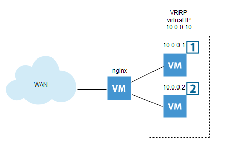

# lista 6 / list no. 6
Schemat połączeń sieci wirtualnej:



Zadania:

1. ~~Zaloguj się do hypervisora Proxmox (https://prask.czk.mk:8006) używając jako nazwy użytkownika numeru indeksu a jako hasła ostatnich 8 znaków ze swojego klucza publicznego ssh (tego fo logowania do PrASKowych vmek). Zmień hasło. [To się przyda np. gdy odetniesz się od swojej maszyny.]~~

2. Za pomocą dowolnego mechanizmu kontenerów lub wirtualizacji (np. Docker, LXC, qemu/KVM, VirtualBox, …) stwórz dwa kontenery/maszyny wirtualne z dowolną dystrybucją Linuxa lub BSD - vm1 i vm2. (2p)
- ~~Łatwiejsza do konfiguracji opcja - maszyny wirtualne qemu/kvm~~ zdania na temat co jest prostsze w konfiguracji są podzielone ;)
- Instrukcja dla Dockera: https://docs.docker.com/engine/install/debian/#install-using-the-repository
- Jak zrobić dwa kontenery z nginx? (dotyczy TYLKO Dockera)
    - `# mkdir -p /srv/www/{vm1,vm2}`
    - <to jest moment na ew. zrobienie sieci wirtualnej po swojemu> np.
    - `docker network create --subnet 10.0.0.0/24 --gateway 10.0.0.254 --driver bridge prasknet`
    - `# docker run --cap-add=NET_ADMIN --name vm1 -dv /srv/www/vm1:/usr/share/nginx/html:ro nginx`
    - `# docker run --cap-add=NET_ADMIN --name vm2 -dv /srv/www/vm2:/usr/share/nginx/html:ro nginx`
    - → NET_ADMIN capability przyda się do zadania 5.
    - → tym sposobem w katalogach vm1 i vm2, w /srv/www mamy katalog główny serwerów nginx w kontenerach “vm1” i “vm2”. własną sieć można użyć dodając parametr –network
    - → podgląd adresu IP, np.:
    docker inspect vm1 --format '{{ .NetworkSettings.IPAddress }}'
- Zmień adresację IPv4 kontenerów/maszyn wirtualnych vm1 i vm2 na dopowiednio 10.0.0.1 i 10.0.0.2 z maską CIDR /24. [adresy MOGĄ być inne (np. jeżeli używasz ich do VPN), ale poniższe zadania muszą być dostosowane do ew. zmiany]
- W przypadku konteneryzacji upewnij się, że masz dedykowaną sieć wirtualną L2 dla kontenerów [np. Docker - https://docs.docker.com/network/bridge/ ]
- Zmień (dodaj) adresację IPv6 kontenerów/maszyn wirtualnych na (odpowiednio) vm1: <Twój przydzielony prefix IPv6>.a i vm2: <Twój przydzielony prefix IPv6>.b (maska /64). Pamiętaj, że każdy interfejs IPv6 powinien mieć adresację link-local [powinna już być na tym interfejsie, automagicznie]
- Na “głównej” maszynie wirtualnej dodaj regułkę NAT:
Dla nftables:
```
nft add table nat && nft 'add chain nat postrouting { type nat hook postrouting priority 100 ; }' && nft add rule nat postrouting ip saddr 10.0.0.0/24 oif ens18 snat to <adres IP Twojej maszyny głównej>
```
Dla iptables:
```
iptables -t nat -A POSTROUTING -o ens18 -s 10.0.0.0/24 -j SNAT --to <adres IP Twojej maszyny głównej>
```
(Z racji, że iptables są już “przestarzałe” (na rzecz nftables) będzie potrzeba doistalowania iptables: apt install iptables)

- Na “głównej” maszynie włącz packet forwarding: `echo 1 > /proc/sys/net/ipv4/ip_forward`
- Na maszynach vm1 i vm2 dodaj adres domyślnej bramy na 10.0.0.254
- Twoja “główna” maszyna wirtualna ma interfejs związany z siecią wirtualną. Nadaj intefejsowi **stały adres IPv4 10.0.0.254/24, IPv6 fe80::1**
3. Sprawdź czy możesz “pingować” (po IPv4 i IPv6 - UWAGA!! Na razie TYLKO adresy Link-local - fe80::1%interface) maszny vm1 i vm2 ze swojej “głównej” vmki i odwrotnie. (2p)
4. Zainstaluj na vm1 i vm2 dowolny serwer http (np. nginx). Na “głównej” vm zainstaluj dowolny serwer reverse proxy (np. nginx, haproxy). Skonfiguruj redundantny backend na stworzonych maszynach - w przypadku problemów z jedną z nich revproxy z “głównej” ma kierować cały ruch na drugą (użyj adresów IPv4 maszyn). Jeśli obie maszyny działają ruch ma być “rozrzucany” raz na jedną raz na drugą (round-robin). Reverse proxy ma mieć frotnend (vhost) pod adresem proxy.<twojadomena.tld>. Maszyny powinny wystawiać stronę z identyfikacją po http (np. napis “cześć to ja, vm1” i “cześć to ja, vm2”) (4p)
5. Skonfiruruj na swojej “głównej” maszynie adres vrrp.twojadomena.tld i odpowiadający vhost, który kieruje ruch na adres 10.0.0.12 i/lub <Twój przydzielony prefix IPv6>.ab. Skonfiguruj na obu maszynach wirtualny adres IPv4 10.0.0.12/24, IPv6 <Twój przydzielony prefix IPv6>.ab współdzielony za pomocą protokłu VRRP pomiędzy obie maszyny - użyj do tego celu keepalived (lub carp/inny dowolnie wybrany mechanizm). Przełączenie IP ma powodować (poza działaniem vm/procesu dla VRRP) stan serwera http (jak serwer http nie działa to maszyna ma “zrzucić” adres IP, użyj do tego celu np. trywialne sprawdzanie pidof nginx). Maszyny powinny wystawiać stronę ze swoją identyfikacją, jak w zadaniu 2. (4p)


Jeżeli chcesz możesz zamienić wpisy w DNS: proxy.<twojadomena.tld> oraz vrrp.<twojadomena.tld> na ścieżki: <twojadomena.tld>/proxy i <twojadomena.tld>/vrrp. W przypadku takiej konfiguracji wystarczy tylko jeden vhost na maszynie “głównej”, ale wymaga odpowiedniego “wyłapywania” ścieżki z URL - punktacja taka sama (UWAGA! to NIE jest prostsze. Np. trzeba pamiętać o scieżkach w URL).

Sprawdzanie listy: Najchętniej na pracowni. Wchodzę na w/w URLe i odświeżam, w między czasie Państwo zostawiecie vm1 i vm2 włączone → round-robin, wyłączacie jedną vm → dalej działa (tylko na jednej). VRRP analogicznie (bez rr). Poza pracownią: chcę zobaczyć działające rr i konfguracje (nginx/haproxy/keepalived/carp) na mailu.

